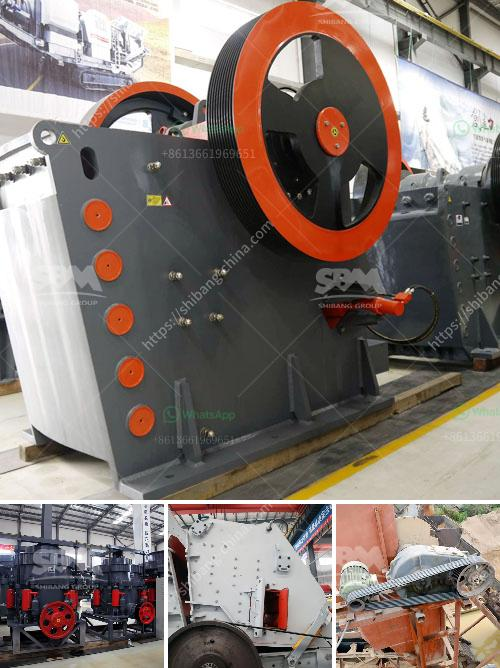

<h3>10 conveyor belt operating</h3>
Title: Enhancing Efficiency and Streamlining Manufacturing Processes: 10 Conveyor Belts You Should Consider

Conveyor belts have revolutionized the manufacturing industry by efficiently transporting materials and products throughout the production line. Over time, these systems have become increasingly sophisticated, offering improved functionality and enhanced productivity. In this article, we will explore ten conveyor belt models that are highly versatile, ensuring seamless operations in a wide range of industries.

Featuring a flat surface, this conveyor model enhances stability and works well for transporting larger and heavier items. Its versatility allows seamless integration with different manufacturing processes, accommodating various production needs.

Ideal for handling sharp-edged and heavy materials, the steel belt conveyor offers robustness and longevity in demanding conditions. This belt type is commonly used in recycling plants, mining operations, and construction sites.

When the production line involves elevation changes, an incline belt conveyor is the perfect solution. By utilizing adjustable angles, inclined conveyors facilitate the smooth transition of products between different manufacturing stages or levels.

Often utilized in the printing and packaging industry, vacuum belt conveyors securely grip lightweight and delicate products to prevent damage during transportation. These systems ensure precise positioning and optimal control in handling fragile items.

Employing a magnetic bed beneath the conveyor belt, this system effectively moves ferrous materials like metal sheets or scraps through various stages of production. Magnetic belt conveyors are widely used in automotive, metalworking, and recycling industries.

This traditional conveyor type utilizes a series of metal rollers to transport products. Roller conveyors are widely used in warehouses and distribution centers, as they offer efficient movement of various products, from boxes to pallets.

Perfect for heavy-duty applications such as assembly lines, the slat conveyor uses interlocking slats to provide a stable platform for large items or equipment. It excels at handling irregularly shaped objects and is commonly found in the automotive and bottling industries.

Utilizing a mesh-like belt, this conveyor model works wonders in industries that require air or liquid flow during transportation. Ideal for baking, cooling, or washing goods, wire mesh conveyors have wide applications in food processing and automotive sectors.

Unlike the traditional belt system, pneumatic conveyors transport bulk materials using air pressure. These systems are commonly found in industries handling powders, grains, or granular substances, offering efficient and dust-free movement.

In situations where floor space is limited, the overhead conveyor is an excellent choice. Suspended from the ceiling, this automated system allows objects to move continuously, optimizing space utilization and increasing production efficiency.

As manufacturing processes become increasingly complex, choosing the right conveyor belt system is crucial for efficient and streamlined operations. The discussed conveyor belt models, from modular plastic to overhead conveyors, provide versatile solutions for various industries. By carefully selecting the appropriate belt type, manufacturers can enhance productivity, minimize costs, and ensure a smooth production flow.
<h3>Contact us</h3><ul><li><strong>Whatsapp:&nbsp;<a href="https://wa.me/8613661969651">+8613661969651</a></strong></li><li><a href="https://swt.shibang-china.com/?git&amp;zhl&amp;10 conveyor belt operating"><strong>Online Service(chat now)</strong></a></li></ul><h3>Related</h3><ul><li><a href='fuel plant stone crusher.md'>fuel plant stone crusher</a></li><li><a href='open cast mining equipment for sale south africa.md'>open cast mining equipment for sale south africa</a></li><li><a href='limestone grinding mill china.md'>limestone grinding mill china</a></li><li><a href='quartz grinding plant.md'>quartz grinding plant</a></li><li><a href='oman marble quarry companies.md'>oman marble quarry companies</a></li></ul>