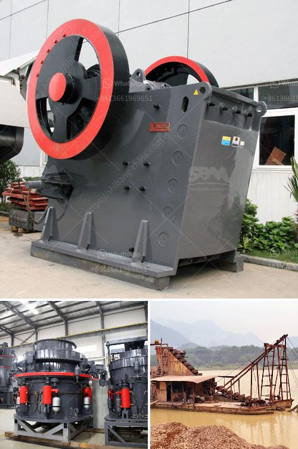

<h3>10 tpd grindig mill manufacturers philippines</h3>
In the Philippines, the demand for agricultural products like rice, corn, and grains is continuously growing. With the increasing population, the need for efficient and reliable 10 TPD grinding mill manufacturers is essential. These mills play a crucial role in processing crops into fine powder, ensuring food security and maximizing profitability for farmers. In this article, we will explore ten reputable grinding mill manufacturers in the Philippines.

1. Victor Rice Mill - With over 60 years of experience in the industry, Victor Rice Mill offers reliable and high-quality grinding mills. Their 10 TPD mills are fitted with advanced technology to ensure efficient and consistent performance.

2. Alcornet Philippines Inc. - Alcornet Philippines Inc. specializes in manufacturing corn mills suitable for small- to medium-scale farming operations. Their mills are designed to maximize productivity while reducing energy consumption.

3. LM Machinery - Known for its innovative milling solutions, LM Machinery offers a wide range of grinding mills, including 10 TPD mills. Their mills are equipped with modern features, such as touch screen controls and automated grain feeding systems.

4. Satake Rice Milling Machines - Satake is a leading manufacturer of rice milling machines in the world. Their 10 TPD grinding mills are renowned for their durability, precision, and efficiency.

5. JFV Rice Mill - JFV Rice Mill is a family-owned business that has been providing quality rice mills to Filipino farmers for over 30 years. Their 10 TPD mills are designed with simplicity and ease of operation in mind.

6. RICE BEAU - RICE BEAU specializes in manufacturing compact rice mills for small-scale farmers. Their mills are known for their excellent milling performance and low energy consumption.

7. ECHOLON Agricultura Corporation - ECHOLON Agricultura Corporation offers a wide range of grinding mills suitable for different crops like rice, corn, and grains. Their 10 TPD mills are designed to meet the specific needs of Filipino farmers.

8. AGMEC Rice & Corn Mill - AGMEC Rice & Corn Mill is a trusted supplier of grinding mills in the Philippines. Their mills are known for their robust construction, reliable performance, and easy maintenance.

9. Bry-Air Philippines - Bry-Air Philippines specializes in manufacturing drying and storage solutions for agricultural products. They offer unique grinding mills that incorporate moisture control systems, ensuring optimum grain quality.

10. JFV Rice Mill and Grain Dryers - JFV Rice Mill and Grain Dryers offer innovative grinding mills that are designed to handle different types of crops. Their mills are built with high-quality materials for long-lasting use.

In conclusion, having access to reliable and efficient grinding mills is crucial for agricultural productivity in the Philippines. These ten reputable manufacturers offer a wide range of 10 TPD grinding mills, ensuring farmers have access to the latest technology and equipment to process rice, corn, and grains. These mills not only enhance food security but also contribute to the economic growth of the farming community.
<h3>Contact us</h3><ul><li><strong>Whatsapp:&nbsp;<a href="https://wa.me/8613661969651">+8613661969651</a></strong></li><li><a href="https://swt.shibang-china.com/?git&amp;zhl&amp;10 tpd grindig mill manufacturers philippines"><strong>Online Service(chat now)</strong></a></li></ul><h3>Related</h3><ul><li><a href='iron ore crushed second hand machines.md'>iron ore crushed second hand machines</a></li><li><a href='raymond mill in collins.md'>raymond mill in collins</a></li><li><a href='limestone grinding raymond mill.md'>limestone grinding raymond mill</a></li><li><a href='cost of starting a quarry business.md'>cost of starting a quarry business</a></li><li><a href='single cylinder hydraulic cone crusher.md'>single cylinder hydraulic cone crusher</a></li></ul>