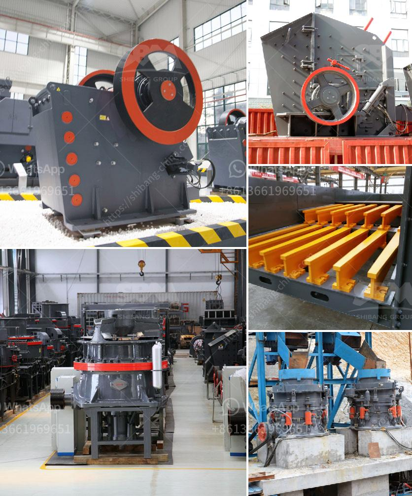

<h3>100 tph hammer mill kenya</h3>
The 100 tph hammer mill in Kenya is an environmentally friendly mill that is suitable for crushing grains and husks of various varieties for animal feed. This hammer mill is built using sturdy materials and operates with a high-speed rotary motion to efficiently grind materials into the desired size.

One of the key features of the 100 tph hammer mill is its low maintenance needs. The mill is designed with reliable components that require minimal servicing, resulting in a cost-effective and efficient machine. Additionally, its compact design allows for easy installation and a small footprint, making it ideal for small-scale operations or limited spaces.

Another advantage of this hammer mill is its versatility. It can effectively crush a wide range of materials, including maize, wheat, barley, and even tubers or roots. Farmers can easily adjust the fineness of the crushed output by manipulating the sieve sizes, ensuring the feed meets the specific requirements of their livestock.

Furthermore, the 100 tph hammer mill is equipped with safety mechanisms to prevent accidents or damage. The mill is fitted with a magnetic separator that removes metal particles from the material flow, preventing damage to the hammer mill and ensuring product purity. It also has an overload protection function that automatically shuts down the machine in case of excessive load, preventing motor burnout and prolonging its lifespan.

In conclusion, the 100 tph hammer mill in Kenya is a reliable and efficient solution for farmers and animal feed producers seeking to crush grains and husks for animal feed. Its low maintenance requirements, versatile capabilities, and built-in safety features make it a practical choice for small-scale operations. By investing in this hammer mill, farmers can enhance their animal nutrition programs and improve overall productivity in a sustainable manner.
<h3>Contact us</h3><ul><li><strong>Whatsapp:&nbsp;<a href="https://wa.me/8613661969651">+8613661969651</a></strong></li><li><a href="https://swt.shibang-china.com/?git&amp;zhl&amp;100 tph hammer mill kenya"><strong>Online Service(chat now)</strong></a></li></ul><h3>Related</h3><ul><li><a href='iron ore crusher for sale.md'>iron ore crusher for sale</a></li><li><a href='mini sand stone crusher price.md'>mini sand stone crusher price</a></li><li><a href='selling cone crusher made in china.md'>selling cone crusher made in china</a></li><li><a href='coal crusher supplier.md'>coal crusher supplier</a></li><li><a href='gypsum machine 100ton price in india.md'>gypsum machine 100ton price in india</a></li></ul>