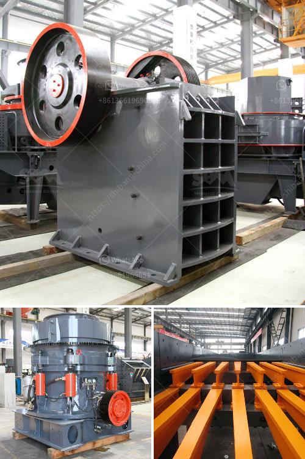

<h3>100tpd cement mill manufacturers</h3>
When it comes to manufacturing cement, a mill plays a crucial role in the process and for this reason, it is equally important to choose reliable cement mill manufacturers that can ensure a high-quality product. As the demand for cement continues to grow, many companies are emerging, claiming to be the best in the industry. However, one name that stands out among them is the 100tpd cement mill manufacturers.

The 100tpd cement mill manufacturers have proven experience in manufacturing cement plants and cement equipment, such as cement ball mills, cement vertical mills, and cement rotary kilns. Their comprehensive know-how and extensive experience in the industry stands testimony to their successful track record in providing cost-effective premium quality equipment globally.

From the very beginning, the 100tpd cement mill manufacturers have focused on technological innovation, which has helped them to continuously improve their manufacturing processes and stay ahead of the competition. They have invested heavily in research and development, ensuring that their products are not only efficient but also environmentally friendly.

One of the key features of the 100tpd cement mill manufacturers is their emphasis on energy efficiency. Today, cement plants have to contend with the challenge of achieving maximum production while reducing energy consumption. This has led to the development of their energy-saving grinding system, which not only reduces electricity consumption but also lowers carbon emissions. By incorporating advanced technology and equipment, the 100tpd cement mill manufacturers have been able to ensure that their mills provide optimal performance while keeping energy costs to a minimum.

Another factor that sets the 100tpd cement mill manufacturers apart is their commitment to customer satisfaction. Customer satisfaction is at the forefront of their business philosophy, and they strive to provide the best possible solutions to meet the unique requirements of each customer. Whether it is the design of the equipment, installation, or after-sales service, the 100tpd cement mill manufacturers ensure that their customers' needs are met efficiently and effectively.

Additionally, the 100tpd cement mill manufacturers prioritize quality control throughout the entire manufacturing process. They have established stringent quality control measures at each stage, ensuring that every product that leaves their factory meets the highest industry standards. This dedication to quality not only guarantees a superior product but also reduces the risk of downtime and maintenance costs for the customers.

In conclusion, choosing the right cement mill manufacturer is essential for the efficient and safe operation of cement plants. With the 100tpd cement mill manufacturers, customers can get the best quality equipment at competitive prices. They also offer turnkey solutions for cement plants, providing everything needed from planning to installation and commissioning. With their extensive experience and commitment to excellence, the 100tpd cement mill manufacturers are undoubtedly the best choice for cement plants.
<h3>Contact us</h3><ul><li><strong>Whatsapp:&nbsp;<a href="https://wa.me/8613661969651">+8613661969651</a></strong></li><li><a href="https://swt.shibang-china.com/?git&amp;zhl&amp;100tpd cement mill manufacturers"><strong>Online Service(chat now)</strong></a></li></ul><h3>Related</h3><ul><li><a href='quarry crusher machine usa.md'>quarry crusher machine usa</a></li><li><a href='types coal ball mill.md'>types coal ball mill</a></li><li><a href='calcite powder lime stone.md'>calcite powder lime stone</a></li><li><a href='harga jaw crusher 400x600.md'>harga jaw crusher 400x600</a></li><li><a href='crusher manufacturers prices.md'>crusher manufacturers prices</a></li></ul>