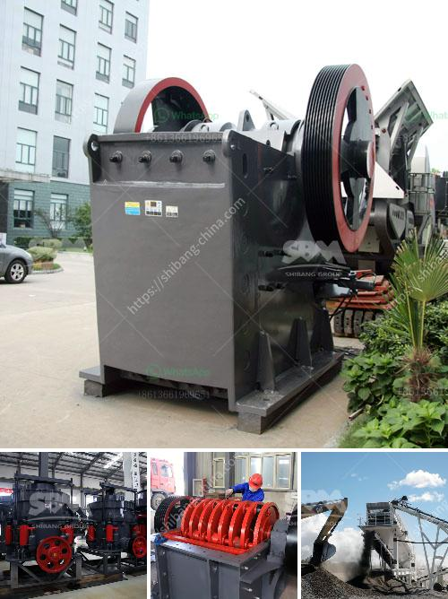

<h3>100tph raw mill specification</h3>
The raw mill plays a vital role in the cement manufacturing process by reducing huge-sized limestone and other materials into fine powdered form. Raw meal, which is the ground material used to produce cement, is fed into the raw mill where it undergoes several processes including crushing, grinding, and drying. The output from the raw mill is then transferred to storage silos for further processing.

When it comes to raw mill specification, one common specification that is widely used in the industry is the 100tph raw mill. The "tph" in 100tph refers to the throughput capacity, meaning that the raw mill can process 100 tons of raw material per hour. This specification is ideal for medium-sized cement plants that produce a significant amount of cement daily.

The 100tph raw mill comes with several key features that ensure efficient and reliable operation. These include a robust design, durable components, and advanced control systems. The robust design of the raw mill ensures long-lasting performance even in harsh operating conditions.

Furthermore, the 100tph raw mill is equipped with durable components such as wear-resistant liners and grinding elements, which minimize maintenance requirements and reduce downtime. This helps in improving the productivity of the cement plant and lowering operational costs.

Additionally, advanced control systems are integrated into the 100tph raw mill to optimize its performance. These control systems constantly monitor various parameters such as temperature, pressure, and feed rate to maintain optimal grinding conditions. This ensures consistent and high-quality output from the raw mill.

In conclusion, the 100tph raw mill specification is designed to meet the requirements of medium-sized cement plants by efficiently processing 100 tons of raw material per hour. Its robust design, durable components, and advanced control systems ensure reliable operation and optimize the performance of the cement manufacturing process.
<h3>Contact us</h3><ul><li><strong>Whatsapp:&nbsp;<a href="https://wa.me/8613661969651">+8613661969651</a></strong></li><li><a href="https://swt.shibang-china.com/?git&amp;zhl&amp;100tph raw mill specification"><strong>Online Service(chat now)</strong></a></li></ul><h3>Related</h3><ul><li><a href='cement plant equipment catalogue pdf.md'>cement plant equipment catalogue pdf</a></li><li><a href='rock salt processing plant.md'>rock salt processing plant</a></li><li><a href='mining crusher plant limestone process.md'>mining crusher plant limestone process</a></li><li><a href='vertically roller mill pakistan.md'>vertically roller mill pakistan</a></li><li><a href='mobile chrushers south africa.md'>mobile chrushers south africa</a></li></ul>