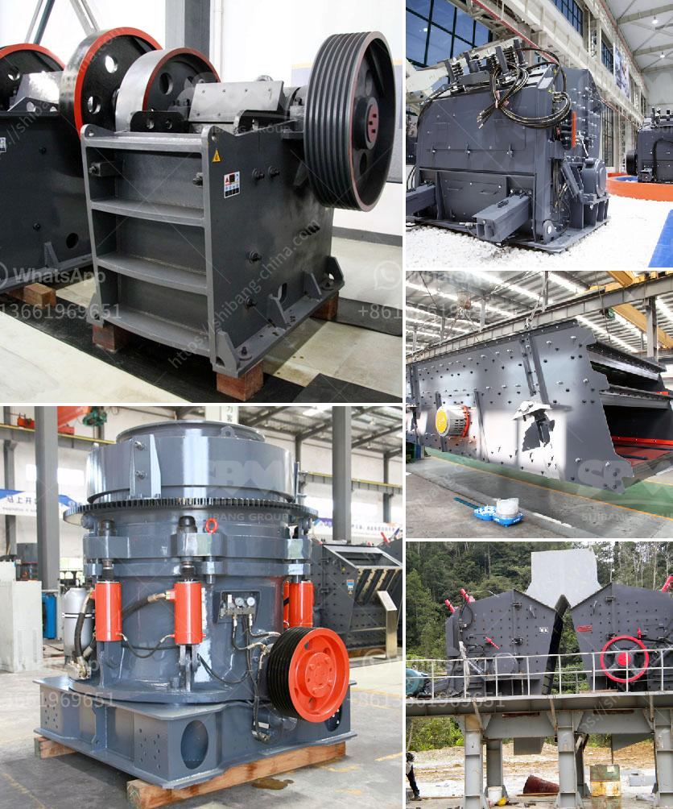

<h3>100tph stone crusher for rent india</h3>
India is rich in mineral resources, with bauxite reserves and coal production both ranking fifth in the world, and mica exports account for 60% of world exports. In addition to bauxite, coal and mica, India’s main mineral resources include iron ore, manganese, bauxite, titanium ore, chromite, limestone, etc.

There are over 2,500 stone quarries and stone crushing units in India and as per the estimates, approximately 75% of them are located in the states of Rajasthan, Gujarat, Haryana, and Madhya Pradesh. The total value of this industry in these states is estimated to be around $500 million.

Thousands of jobs are being created directly or indirectly in this sector. The stone crushers are extracting groundwater illegally. As per norms, one crusher requires around 10,000 liters to ensure dust is controlled during the crushing process. All the crushers together require around 1.5 million liters of water, which is being illegally extracted, through bore wells, without any permission, from various parts of the state.

The rental services of stone crusher not only saves the time of the construction but also avoids the unnecessary hassle of transporting the stone or crushing it manually. Besides these, streamlined service of stone crusher rent and stone crusher on rent is also provided by various agencies, which are known for their excellent and on-time services. These machines are capable of crushing large rocks, and are available in various models and sizes. They are also equipped with advanced technology that helps in increasing productivity at the construction sites.

Stone crusher is available in a variety of configurations, including bottles that are capable of crushing hard materials such as glass and other types of metallic objects. This enables the user to avoid the risk of injury during the crushing process. The crusher is designed to make operations easier and safer. It has been designed to maximize productivity while minimizing maintenance and operating costs.

In conclusion, stone crusher rental services provide the flexibility to attain the desired product sizes at a cost-effective rate. The available crushers are capable of crushing rocks, stone boulders, iron ore, limestone, coal, dolomite, etc. The crushers are available in both stationary and mobile versions, making them highly versatile for different construction applications. Choosing the right crusher is important for optimal results.
<h3>Contact us</h3><ul><li><strong>Whatsapp:&nbsp;<a href="https://wa.me/8613661969651">+8613661969651</a></strong></li><li><a href="https://swt.shibang-china.com/?git&amp;zhl&amp;100tph stone crusher for rent india"><strong>Online Service(chat now)</strong></a></li></ul><h3>Related</h3><ul><li><a href='coal washing plant for sale in south africa.md'>coal washing plant for sale in south africa</a></li><li><a href='cement mills cement from the other.md'>cement mills cement from the other</a></li><li><a href='limestone production mining equipment for sale.md'>limestone production mining equipment for sale</a></li><li><a href='crusher plant for sale in saudi.md'>crusher plant for sale in saudi</a></li><li><a href='open cast mining equipment for sale south africa.md'>open cast mining equipment for sale south africa</a></li></ul>