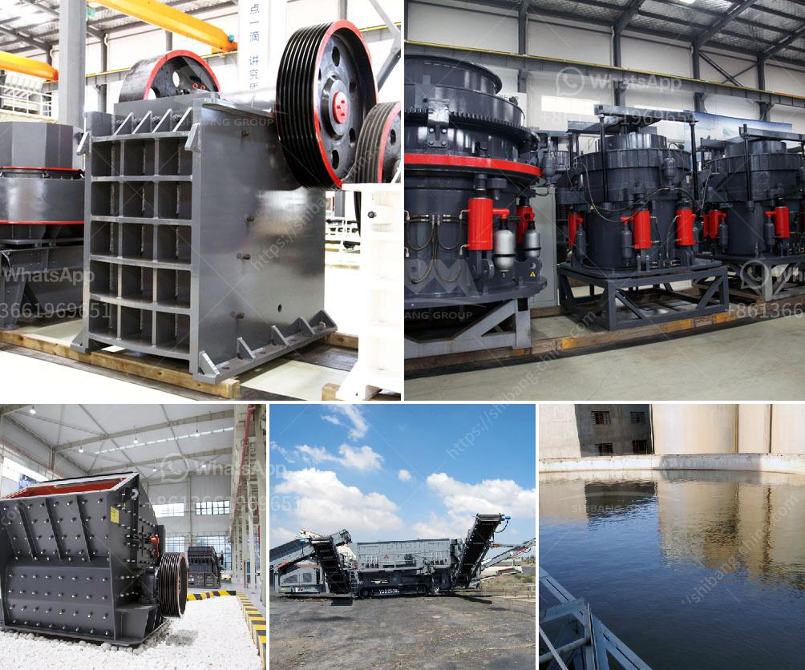

<h3>100tph stone crusher price list</h3>
The stone crusher with the serial number 100TPH is designed to crush large rock into smaller rock sizes. This powerful machine is capable of producing up to 500 tons of material per hour. The materials are fed into the machine through a vibrating feeder, which vibrates the large rocks into smaller pieces that are then crushed by the crusher.

The 100TPH stone crusher is a great investment for any construction or mining company. It not only provides a reliable and efficient way to crush rocks into smaller, more manageable sizes, but it also reduces the overall cost of the construction project. With its high production capacity, the machine can quickly process large quantities of material, saving valuable time and resources.

The price of the 100TPH stone crusher varies depending on several factors. One of the main factors is the size of the machine. Larger machines tend to be more expensive than smaller ones. Another factor that affects the price is the materials used in the construction of the machine. High-quality materials typically result in a higher price.

Additionally, the brand of the stone crusher can also affect the price. Well-known brands tend to have higher prices due to their reputation and reliability. However, it's important to note that higher prices don't always guarantee better quality. It's crucial to do thorough research and read reviews before making a purchase.

Furthermore, the availability of the machine can also impact its price. If the machine is in high demand or only available from a limited number of suppliers, the price may be higher. On the other hand, if the machine is readily available from multiple suppliers, it may be more competitively priced.

In conclusion, the price of the 100TPH stone crusher can vary depending on factors such as the size, materials used, brand, and availability. However, it's important to remember that price should not be the only determining factor when making a purchasing decision. It's essential to consider the machine's quality, reliability, and overall value for money. Conducting thorough research and seeking recommendations from industry professionals can help ensure that you make an informed decision and get the best value for your investment.

In summary, the 100TPH stone crusher is a powerful machine that can crush large rocks into smaller, more manageable sizes. It offers a reliable and efficient solution for construction and mining projects, saving time and resources. The price of the machine can vary depending on factors such as size, materials used, brand, and availability. It's crucial to consider the quality, reliability, and overall value for money when looking to purchase this machine.
<h3>Contact us</h3><ul><li><strong>Whatsapp:&nbsp;<a href="https://wa.me/8613661969651">+8613661969651</a></strong></li><li><a href="https://swt.shibang-china.com/?git&amp;zhl&amp;100tph stone crusher price list"><strong>Online Service(chat now)</strong></a></li></ul><h3>Related</h3><ul><li><a href='wet process of cement production.md'>wet process of cement production</a></li><li><a href='processing of feldspar crushing.md'>processing of feldspar crushing</a></li><li><a href='500tpd stone crushers.md'>500tpd stone crushers</a></li><li><a href='gold stamp mill for sale in china.md'>gold stamp mill for sale in china</a></li><li><a href='milling grinding machines manufacturer europe.md'>milling grinding machines manufacturer europe</a></li></ul>