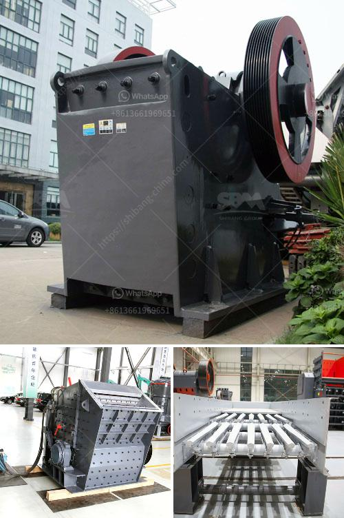

<h3>200 tph mobile crushing plant</h3>
The mobile crusher is one of the innovative rock crushing machines that can greatly expand the application range of coarse crushing. Also, the mobile crusher has a wide selection of models, and it can be equipped with various crushing equipment, screening equipment, etc. During the operation, it is flexible, efficient and powerful.

The 200 tph mobile crushing plant is not limited by the crushing place, and it reduces high material transportation cost. It can crush materials on-site or working nearly. It is widely used in the industry of mining, metallurgy, building materials, traffic, water conservancy and so on.

The mobile crushing plant is designed to crush hard rock and any recycling materials equally effectively. In addition, the screen allows the equipment to screen the crushed materials into the desired, clean end products, meeting the strictest application requirements.

With a capacity range of up to 200 tph, the mobile crushing plant is ideal for contractors with large production capacity requirements. Users can choose different configurations according to specific production requirements, such as primary crushing, secondary crushing, and screening stages.

Mobile crushers can be easily moved from one place to another, greatly reducing the transportation costs of materials. The integrated design of the machine ensures that the machine can be easily installed, dismantled, and transported to the operation site without the need for additional infrastructure construction.

In conclusion, the 200 tph mobile crushing plant can provide new business opportunities for customers, and greatly reduce the production cost, improving the overall efficiency of enterprises.
<h3>Contact us</h3><ul><li><strong>Whatsapp:&nbsp;<a href="https://wa.me/8613661969651">+8613661969651</a></strong></li><li><a href="https://swt.shibang-china.com/?git&amp;zhl&amp;200 tph mobile crushing plant"><strong>Online Service(chat now)</strong></a></li></ul><h3>Related</h3><ul><li><a href='ball mill machine india.md'>ball mill machine india</a></li><li><a href='iron slag crushing ball mill in nagpur.md'>iron slag crushing ball mill in nagpur</a></li><li><a href='biaya conveyor belt per meter instalasi.md'>biaya conveyor belt per meter instalasi</a></li><li><a href='quartz stone powder machine manufacturing in india.md'>quartz stone powder machine manufacturing in india</a></li><li><a href='crushing plant pdf.md'>crushing plant pdf</a></li></ul>