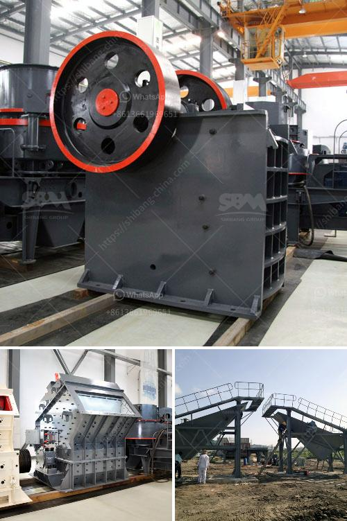

<h3>200tph granite crushing plant for sale</h3>
When it comes to crushing plants, the importance of efficiency and durability cannot be underestimated. Taking granite as an example, we would like to introduce a reliable crushing plant which can be found at a competitive price. Our 200tph granite crushing plant for sale in Nigeria is popular among the local mining investors and operators for its high production capacity, low maintenance costs and diverse applications.

Granite ore crusher is an important crushing equipment in granite quarry mining. Our crushers can crush granite into small pieces to meet the different needs of large-scale granite crushing plants. As a professional crushing equipment manufacturer, we can provide you with a variety of different configurations for you to choose from, including stationary type and mobile type.

The crushing plant has a wide range of applications. It can process various types of granite, such as dolomite, limestone, and iron ore. With its advanced technology, we can provide high-quality granite ore crusher equipment for your granite crushing plant. To help you achieve the highest yields and minimize your operation and maintenance costs, our products have been designed and manufactured to be extremely reliable and easy to operate.

Our 200tph granite crushing plant for sale includes vibrating feeder, jaw crusher, impact crusher, vibrating screen, belt conveyor and centrally electric controlling system, etc. The designed capacity is from 50t/h to 500t/h. To meet customer's specific requirement, we can also add other equipments such as cone crusher, dust catcher on the production line.

Jaw crusher is with advantages of simple structure, easy to manufacture and maintain, reliable working performance, less volume and height, and the history of 140 years in iron ore crushing, so it is widely used in metallurgy, mining, building materials, chemicals, coal and other industries. Impact crusher is a new type of high-efficiency crushing equipment. Its characteristics are small size, simple structure, large crushing ratio, less energy consumption, large production capacity, uniform product size, and selective crushing effect. It is a promising equipment.

In addition, our crushing equipment is equipped with self-lubricating devices to reduce maintenance costs to a minimum. Moreover, the parts of our crushers are made of wear-resistant materials, so as to greatly extend the service life of the equipment. And our crushers have a high crushing ratio, which means that unnecessary crushing processes can be avoided and the investment cost can be greatly reduced.

Overall, our 200tph granite crushing plant for sale in Nigeria adopts advanced technology and high-quality materials. The equipment has the advantages of reliable performance, reasonable design, convenient operation and high work efficiency. If you are interested in our crushing plant, please don't hesitate to contact us. We will provide you with professional service and technical support, and offer you the best solution to meet your needs.
<h3>Contact us</h3><ul><li><strong>Whatsapp:&nbsp;<a href="https://wa.me/8613661969651">+8613661969651</a></strong></li><li><a href="https://swt.shibang-china.com/?git&amp;zhl&amp;200tph granite crushing plant for sale"><strong>Online Service(chat now)</strong></a></li></ul><h3>Related</h3><ul><li><a href='graphite processing machine.md'>graphite processing machine</a></li><li><a href='stone crusher machine for sale ethiopia.md'>stone crusher machine for sale ethiopia</a></li><li><a href='calcium carbonate plant sell in india.md'>calcium carbonate plant sell in india</a></li><li><a href='small quartz appratus for crushing.md'>small quartz appratus for crushing</a></li><li><a href='equipment mining grinding equipment for mezcal price.md'>equipment mining grinding equipment for mezcal price</a></li></ul>