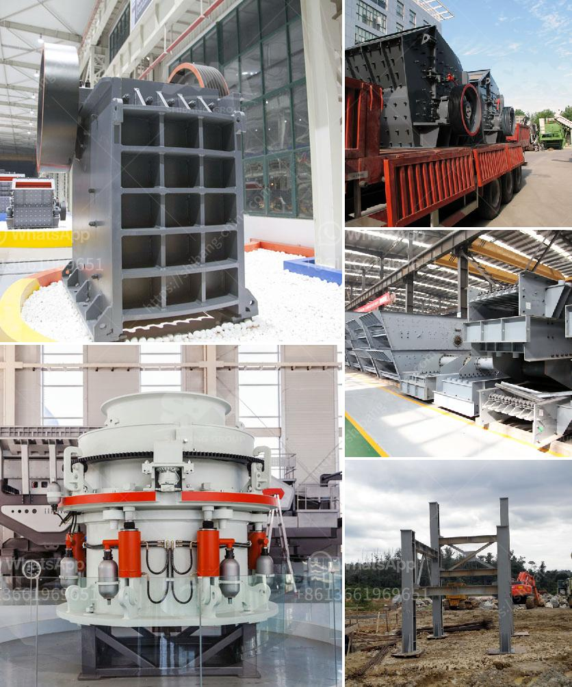

<h3>25 used crushing machine price</h3>
When it comes to industrial or construction projects that require crushing a variety of materials, using a crushing machine is often the most efficient and cost-effective approach. While new crushing machines can be quite expensive, many businesses and contractors opt for used crushing machines to suit their budget without compromising on quality and functionality. In this article, we will explore 25 different types of used crushing machines and their price range, helping you make an informed decision.

A versatile and widely used machine for primary crushing, jaw crushers are available in various sizes and capacities. Used jaw crushers can range from $10,000 to $150,000, depending on the brand, model, condition, and capacity.

Designed for secondary and tertiary crushing applications, cone crushers offer greater efficiency and reduced wear. A used cone crusher may cost between $50,000 and $200,000, depending on the factors mentioned above.

Ideal for processing materials with high abrasiveness, impact crushers can handle various types of rocks and ores. Prices for used impact crushers can range from $30,000 to $100,000, based on the model, condition, and production capacity.

Often used in aggregate production and mineral processing, vertical shaft impact (VSI) crushers require less power and generate less wear compared to other machines. Prices for used VSI crushers can vary between $40,000 and $100,000, depending on the brand, model, and condition.

Suited for large-scale operations, gyratory crushers offer high capacity and cost-effectiveness. Used gyratory crushers can cost anywhere between $500,000 and $2 million, depending on various factors.

Commonly used for grinding or shredding various materials, such as wood, paper, and biomass, used hammer mills can range from $5,000 to $50,000, depending on the brand, model, and size.

A simple yet efficient machine for crushing materials, roller crushers are often used in aggregate and mining industries. The price range for used roller crushers can start from $5,000 and go up to $100,000, based on the type, size, and condition.

Used crushing machines offer businesses and contractors a cost-effective solution to meet their crushing requirements without breaking the bank. The price range for used crushing machines varies significantly based on factors such as brand, model, condition, and production capacity. Whether it is a jaw crusher, cone crusher, impact crusher, VSI crusher, gyratory crusher, hammer mill, or roller crusher, the market offers a wide range of options to suit every budget and need. It is essential to thoroughly research and compare different options to find the best-used crushing machine that fits both your requirements and your pocket.
<h3>Contact us</h3><ul><li><strong>Whatsapp:&nbsp;<a href="https://wa.me/8613661969651">+8613661969651</a></strong></li><li><a href="https://swt.shibang-china.com/?git&amp;zhl&amp;25 used crushing machine price"><strong>Online Service(chat now)</strong></a></li></ul><h3>Related</h3><ul><li><a href='stone crusher 7 tonne per day.md'>stone crusher 7 tonne per day</a></li><li><a href='which way should the ball mill rotate.md'>which way should the ball mill rotate</a></li><li><a href='crushing plants suppliers sales in nigeria.md'>crushing plants suppliers sales in nigeria</a></li><li><a href='stamp mill for sale in south africa.md'>stamp mill for sale in south africa</a></li><li><a href='price of hammer mill in nigeria.md'>price of hammer mill in nigeria</a></li></ul>