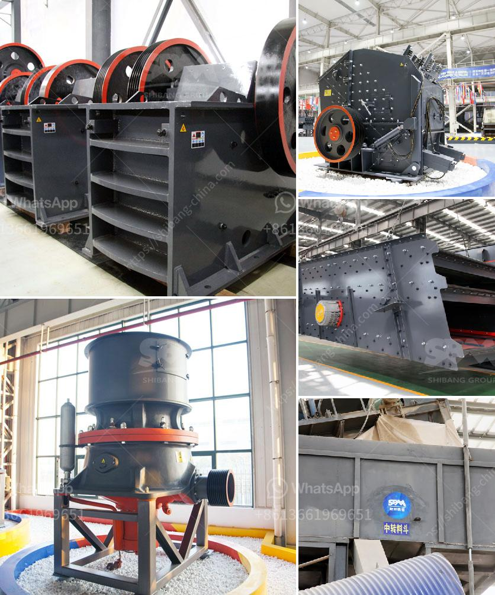

<h3>250 tons per hour crushers</h3>
250 tons per hour crushers are one of the most efficient and cost-effective jaw crushers in the market today. They are reliable, durable, and capable of crushing large quantities of materials every hour. With 250 tons per hour crushers, you can tackle any project, whether it is a large-scale construction site or a smaller residential job.

These crushers are designed to provide maximum productivity and reduce downtime. They have a high-capacity feed opening that allows them to process large-sized materials effortlessly. With a strong and robust construction, they are built to handle heavy-duty applications without any compromise in performance.

The 250 tons per hour crushers are powered by advanced motors that deliver exceptional power and efficiency. This ensures that you can crush materials at a faster rate, saving you time and reducing operating costs. Moreover, these crushers are equipped with a hydraulically adjustable jaw setting, allowing you to control the size of the output material precisely. This feature gives you flexibility in producing different sizes of aggregates, making them suitable for various projects and applications.

In addition to their impressive crushing capacity, these crushers are also known for their fuel efficiency. The advanced engine technology used in these crushers minimizes fuel consumption, ensuring that you can operate them economically and sustainably. This is especially crucial in today's environmentally conscious world, where reducing carbon emissions and ecological impact is a top priority.

Another notable feature of the 250 tons per hour crushers is their ease of maintenance. They are designed with accessibility in mind, making it convenient for technicians to conduct routine servicing and inspections. This helps minimize downtime and ensures that your crusher operates optimally for prolonged periods.

The 250 tons per hour crushers are also equipped with safety features to protect the operator and enhance overall operational security. These include advanced control systems that ensure the crusher operates within safe parameters and automatic emergency shutdown mechanisms in case of any issues. Additionally, the crushers are designed with noise reduction technology, ensuring a quieter working environment for the operator and nearby residents.

With their exceptional capabilities, the 250 tons per hour crushers are commonly used in various industries such as mining, quarrying, construction, and recycling. They can crush a wide range of materials, including hard and abrasive rocks, concrete, asphalt, and demolition waste. Therefore, they are suitable for a variety of applications, from road construction to aggregate production.

In conclusion, 250 tons per hour crushers are highly versatile and efficient machines that can handle heavy-duty crushing tasks effortlessly. With their high-capacity feed openings, fuel efficiency, ease of maintenance, and advanced safety features, these crushers offer a reliable and cost-effective solution for processing large quantities of materials. Whether you are working on a large-scale project or a smaller job, 250 tons per hour crushers are a valuable asset that effectively improves productivity and reduces operating costs.
<h3>Contact us</h3><ul><li><strong>Whatsapp:&nbsp;<a href="https://wa.me/8613661969651">+8613661969651</a></strong></li><li><a href="https://swt.shibang-china.com/?git&amp;zhl&amp;250 tons per hour crushers"><strong>Online Service(chat now)</strong></a></li></ul><h3>Related</h3><ul><li><a href='quick lime hammer crusher.md'>quick lime hammer crusher</a></li><li><a href='crusher plant cost in pakistan.md'>crusher plant cost in pakistan</a></li><li><a href='machines used for mining gypsum.md'>machines used for mining gypsum</a></li><li><a href='barite beneficiation.md'>barite beneficiation</a></li><li><a href='egypt gypsum powder manufacturer.md'>egypt gypsum powder manufacturer</a></li></ul>