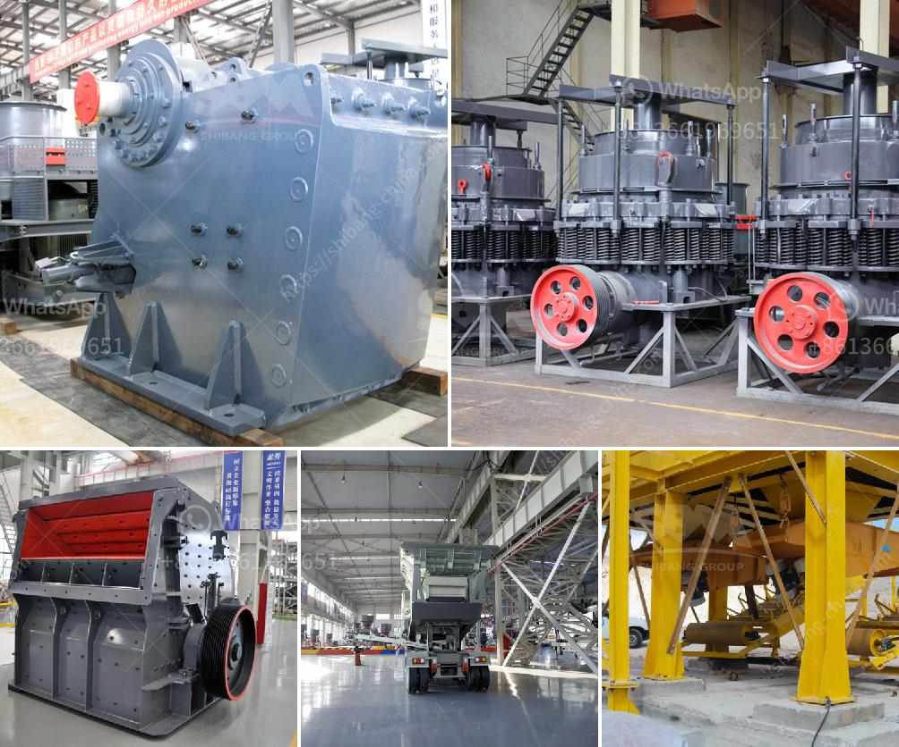

<h3>250tph cone crusher price</h3>
250 TPH cone crusher is the most advanced cone crusher available in the market today. This cone crusher is suitable for crushing various kinds of ores and rocks with medium over hardness and it has the features of reliable structure, high production efficiency, convenient adjustment, and economic use. The spring safety system is the overload protection device that allows the foreign matter and iron ore go through the crushing chamber without damaging it. It adopts two sealing means: dry oil and water to separate stone powders and lubrication grease, thus ensuring reliable work of the machine.

The 250 TPH cone crusher also features an anti-spin mechanism that prevents the head from spinning, reducing wear on the mantle and increasing manganese life. This machine also has a hydraulic setting adjustment that allows the user to easily adjust the output size and product shape.

When it comes to the price of the 250 TPH cone crusher, it varies widely depending on different factors. One of the main factors is the different types of cone crushers available in the market. There are spring cone crushers, hydraulic cone crushers, and compound cone crushers. Each type has its own advantages and disadvantages, and the price will also vary accordingly. Generally, hydraulic cone crushers are more expensive than spring cone crushers, and compound cone crushers are the most expensive of all.

Another factor that affects the price is the capacity of the cone crusher. The higher the capacity, the higher the price. In the case of the 250 TPH cone crusher, its capacity is about 250-300 tph, and the final product size can be adjusted between 0-10mm and 10-20mm. However, different requirements of production lines need different specifications.

The 250 TPH cone crusher also has a wide range of applications, which can not only be used in sand and stone production lines, but also in mineral processing lines. This equipment is an ideal crushing equipment for medium and fine crushing of various hard ores and rocks. Its advantages are reliable structure, high production efficiency, convenient adjustment, and economic use.

In conclusion, the price of the 250 TPH cone crusher is affected by many factors, including the type, capacity, and application of the machine. As a professional manufacturer and supplier of crushing equipment, Zenith can provide customers with high-quality machines and the most competitive prices. Customers are welcome to contact Zenith for more detailed information and get the best price.
<h3>Contact us</h3><ul><li><strong>Whatsapp:&nbsp;<a href="https://wa.me/8613661969651">+8613661969651</a></strong></li><li><a href="https://swt.shibang-china.com/?git&amp;zhl&amp;250tph cone crusher price"><strong>Online Service(chat now)</strong></a></li></ul><h3>Related</h3><ul><li><a href='crusher equipment dubai.md'>crusher equipment dubai</a></li><li><a href='wet process of cement manufacture.md'>wet process of cement manufacture</a></li><li><a href='cement plant machinery manufacturers in coimbatore.md'>cement plant machinery manufacturers in coimbatore</a></li><li><a href='what is the dam ring in vertical rollers mill.md'>what is the dam ring in vertical rollers mill</a></li><li><a href='belt and conveyor distributor in indonesia.md'>belt and conveyor distributor in indonesia</a></li></ul>