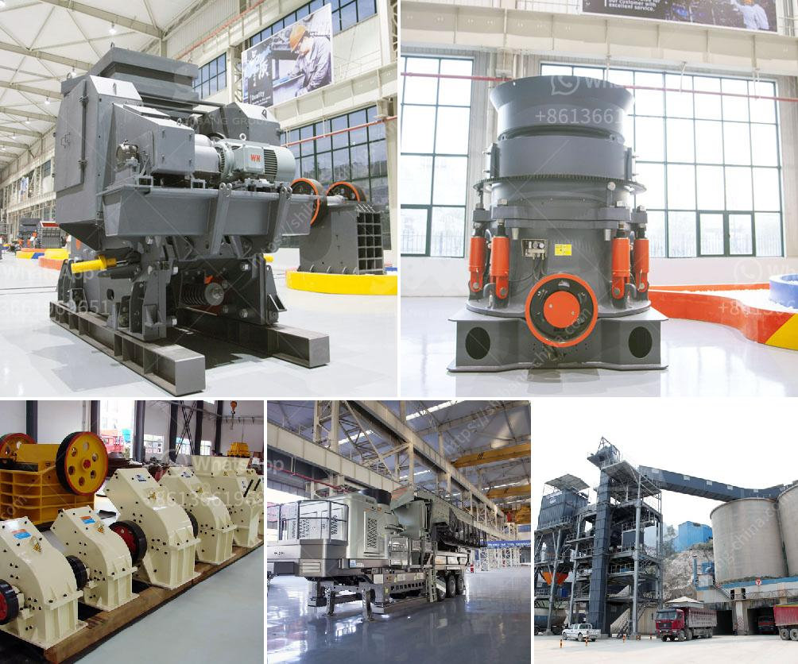

<h3>25kg h high capacity grinder hammer milling machine</h3>
In today's fast-paced world, industries are constantly looking for ways to optimize efficiency and productivity. One such tool that has revolutionized the manufacturing sector is the 25kg H High Capacity Grinder Hammer Milling Machine. With its impressive ability to process large quantities of material, this machine has become a go-to solution for companies seeking to streamline their operations.

Boasting a hefty capacity of 25kg, this grinder hammer milling machine is capable of effortlessly processing vast quantities of materials. Whether it is grains, herbs, or even fibrous substances, the machine can handle it all with ease. This high capacity feature sets it apart from other milling machines on the market, enabling businesses to complete tasks quickly and efficiently.

The true power of the 25kg H High Capacity Grinder Hammer Milling Machine lies in its hammer mill mechanism. The machine is equipped with a set of rotating hammers that pound and crush the materials fed into it. This action not only reduces the size of the particles but also ensures a consistent and uniform grind. With such precision in the grinding process, businesses can achieve the desired particle size and texture for their final products.

Versatility is another key feature of this machine. With adjustable speed and multiple screen sizes, it can cater to various needs and requirements. This flexibility allows businesses to utilize the machine for different applications across different industries. From food processing to pharmaceuticals and even recycling, the 25kg H High Capacity Grinder Hammer Milling Machine can adapt to diverse tasks, making it a valuable investment for any company.

One of the standout advantages of this machine is its efficiency. With a powerful motor and sturdy construction, it can handle prolonged use without compromising performance. The design prevents overheating, ensuring continuous operation even in demanding environments. By minimizing downtime, companies can maximize productivity, resulting in higher output and revenue.

Additionally, the 25kg H High Capacity Grinder Hammer Milling Machine is surprisingly compact and user-friendly. Despite its impressive capacity, it does not occupy excessive space on the factory floor. The straightforward controls and easy maintenance further enhance its usability, enabling operators to quickly learn and operate the machine efficiently.

While the machine offers a myriad of benefits, safety remains a priority. The 25kg H High Capacity Grinder Hammer Milling Machine is equipped with advanced safety features to protect operators and prevent accidents. From emergency stops to safety interlocks, manufacturers have incorporated multiple measures to mitigate risks, reassuring companies of a secure working environment.

In conclusion, the 25kg H High Capacity Grinder Hammer Milling Machine is a game-changer in the manufacturing world. With its impressive capacity, precision grinding mechanism, and versatility, it has quickly become an essential tool for businesses seeking efficiency and productivity. Its efficiency, compact design, and user-friendly controls make it an ideal choice for companies across various industries. By investing in this powerful machine, businesses can significantly streamline their operations and stay ahead in today's competitive market.
<h3>Contact us</h3><ul><li><strong>Whatsapp:&nbsp;<a href="https://wa.me/8613661969651">+8613661969651</a></strong></li><li><a href="https://swt.shibang-china.com/?git&amp;zhl&amp;25kg h high capacity grinder hammer milling machine"><strong>Online Service(chat now)</strong></a></li></ul><h3>Related</h3><ul><li><a href='kaolin crusher manufacturers in uk.md'>kaolin crusher manufacturers in uk</a></li><li><a href='small scale rock crusher.md'>small scale rock crusher</a></li><li><a href='mtm 160 mill spare parts suppliers in india.md'>mtm 160 mill spare parts suppliers in india</a></li><li><a href='functions of gyratory crusher.md'>functions of gyratory crusher</a></li><li><a href='rock crushers for making gravel.md'>rock crushers for making gravel</a></li></ul>