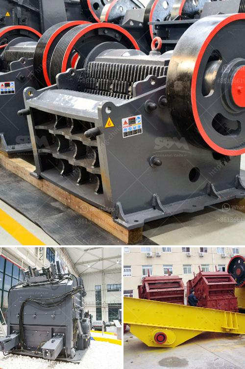

<h3>3 pound ball mill in india</h3>
The industrial revolution has brought about significant advancements in machinery and technology. One such innovation in the field of material processing is the ball mill. This versatile piece of equipment is designed to grind various types of materials into fine powder, making it an essential tool for many industries.

In India, the 3 pound ball mill is a popular option for small-scale grinding projects. This mill weighs only a few pounds and easily fits into tight spaces. It is capable of grinding a variety of materials, including cement, limestone, sand, and even materials with high moisture content. The compact size and easy operation make it an ideal choice for laboratories, research institutes, and small-scale production units.

The 3 pound ball mill operates on the principle of impact and attrition. The material to be ground is fed into the drum along with steel balls. As the drum rotates, the balls cascade and grind the material into a fine powder. The speed of rotation and the size of the balls determine the fineness of the final product.

One of the key advantages of the 3 pound ball mill is its compact and portable design. It can be easily transported and installed in different locations, making it highly versatile. This is particularly advantageous for businesses with limited space or those that require mobility in their grinding operations.

Additionally, the 3 pound ball mill offers highly efficient grinding performance. The ball mill design ensures that the steel balls are evenly distributed and efficiently grind the material, resulting in a consistent particle size distribution. This is important for industries that require precise control over the size and quality of the end product.

In India, the 3 pound ball mill finds application in various industries. For instance, it is commonly used in the construction industry to grind cement and produce high-quality concrete. The pharmaceutical and chemical industries also rely on this equipment to grind raw materials and produce fine powders for drug formulation and chemical synthesis.

Moreover, the 3 pound ball mill is well-suited for research and development purposes. It allows scientists and engineers to experiment with different materials and processes, helping them to optimize their formulations and achieve desired properties. This has a direct impact on the efficiency and quality of the final product.

In conclusion, the 3 pound ball mill has emerged as a reliable and efficient tool for material processing in India. Its compact size, portability, and high grinding performance make it a preferred choice for various industries. Whether it is grinding cement, limestone, or other materials, this equipment provides consistent and precise results. With ongoing advancements in the field of material processing, the 3 pound ball mill is expected to play an increasingly important role in India's industrial landscape.
<h3>Contact us</h3><ul><li><strong>Whatsapp:&nbsp;<a href="https://wa.me/8613661969651">+8613661969651</a></strong></li><li><a href="https://swt.shibang-china.com/?git&amp;zhl&amp;3 pound ball mill in india"><strong>Online Service(chat now)</strong></a></li></ul><h3>Related</h3><ul><li><a href='second hand quarry cruher equipment price south africa.md'>second hand quarry cruher equipment price south africa</a></li><li><a href='stone crushing process.md'>stone crushing process</a></li><li><a href='metal crusher manufacturers in colombia.md'>metal crusher manufacturers in colombia</a></li><li><a href='fuel plant stone crusher.md'>fuel plant stone crusher</a></li><li><a href='hammer mill gauteng.md'>hammer mill gauteng</a></li></ul>