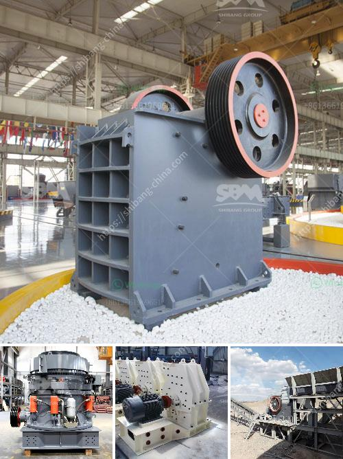

<h3>300tpd cement plant cost in india</h3>
The price of a 300TPD cement plant depends on a variety of factors, including the location, machinery, quantity, and scale of production. The cost estimation for a cement plant with a capacity of 300TPD is dependent on certain critical factors such as:

1. Location: The geographical region and climate conditions can significantly impact the cost of constructing a cement plant. Differences in land prices, availability of raw materials, transportation costs, and labor charges can vary from one location to another.

2. Machinery: The machinery used in the cement manufacturing process plays a vital role in determining the overall cost. Essential equipment like crushers, mills, kilns, conveyors, and dust collectors contribute significantly to the overall investment. The quality, brand, and efficiency of the machinery also influence the price.

3. Quantity: The quantity of cement production influences the cost per tonne of cement produced. A higher capacity plant may require larger machinery and infrastructure, leading to increased costs. However, economies of scale can be achieved with higher production capacities, leading to lower production costs in the long run.

4. Scale of Production: The scale of production desired by a cement plant owner can have a significant impact on the cost. Small-scale plants with a capacity of 300TPD may require less investment compared to larger plants. The need for infrastructure, machinery, and labor will be comparatively lower for smaller plants.

5. Raw Material Availability: The availability of raw materials such as limestone, clay, and gypsum in the vicinity of the plant can affect the overall cost. Transporting these materials over long distances can add to the expenses. Establishing a plant near the source of raw materials will help reduce transportation costs and lower the overall investment.

6. Labor Costs: The availability and cost of skilled labor in a specific region can greatly influence the project's cost. Labor-intensive activities such as construction, plant operation, and maintenance will require a qualified workforce. Areas with low labor costs will contribute to a lesser overall investment.

7. Government Regulations: Compliance with environmental and safety regulations increases the cost of establishing a cement plant. Stringent regulations related to emissions, waste management, and labor rights may require additional investment in the form of pollution control equipment, safety measures, and employee welfare.

Based on these factors, the estimated cost of constructing a 300TPD cement plant in India can range from $1 million to $2 million or above. It is essential to conduct thorough feasibility studies, analyze market conditions, and account for any additional costs before undertaking such a project.

Considering the increasing demand for cement in the rapidly developing Indian construction industry, establishing a cement plant can be a lucrative investment opportunity. However, meticulous planning, cost analysis, and adherence to regulatory requirements are of utmost importance to ensure a successful and profitable venture.
<h3>Contact us</h3><ul><li><strong>Whatsapp:&nbsp;<a href="https://wa.me/8613661969651">+8613661969651</a></strong></li><li><a href="https://swt.shibang-china.com/?git&amp;zhl&amp;300tpd cement plant cost in india"><strong>Online Service(chat now)</strong></a></li></ul><h3>Related</h3><ul><li><a href='indonesia copper processing equipment for sale.md'>indonesia copper processing equipment for sale</a></li><li><a href='cement plant equipment catalogue pdf.md'>cement plant equipment catalogue pdf</a></li><li><a href='stone crushers for sale in south korea.md'>stone crushers for sale in south korea</a></li><li><a href='10 conveyor belt operating.md'>10 conveyor belt operating</a></li><li><a href='cobalt mobile crushing plant.md'>cobalt mobile crushing plant</a></li></ul>