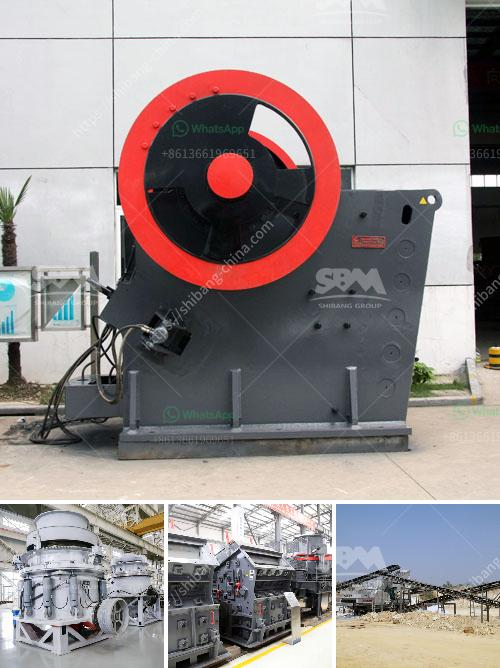

<h3>300tpd mini cement plant cost in india</h3>
The demand for cement in India is constantly increasing. Cement industry plays a pivotal role in the economic development of the country. A mini cement plant is a lucrative investment option for new entrepreneurs. With the continuous growth of the construction industry, especially in infrastructure projects, the demand for cement is expected to increase even further in the coming years. In this article, we will discuss the cost of establishing a 300tpd (tonnes per day) mini cement plant in India.

The cost of a mini cement plant primarily depends on the capacity and machinery requirements. The production capacity determines the overall size of the plant and machinery required. The initial investment cost for a 300tpd mini cement plant is around Rs. 120 crores, which includes the cost of machinery, land, and other miscellaneous expenses.

1. Rotary Kiln: A rotary kiln is a large cylindrical tube-like structure used to heat the raw materials and convert them into clinker during the cement manufacturing process. The cost of a rotary kiln with a capacity of 300tpd is approximately Rs. 60 crores.

2. Raw Material Crushing and Grinding Equipment: The raw materials used in cement production primarily consist of limestone and clay. The cost of the crushing and grinding equipment required for these raw materials is around Rs. 20 crores.

3. Storage Silos and Cement Milling Equipment: The storage silos are used to store the clinker, gypsum, and other additives before they are processed further. The cost of the storage silos and cement milling equipment is approximately Rs. 20 crores.

4. Electrical and Automation Equipment: The electrical and automation equipment is essential for the smooth operation of the mini cement plant. The cost of electrical and automation equipment is around Rs. 10 crores.

5. Land and Infrastructure: The land requirement for a 300tpd mini cement plant is around 3 acres. The cost of land varies depending on the location and can range from Rs. 1-2 crores per acre. The infrastructure cost includes utilities, roads, and other miscellaneous expenses and is estimated to be around Rs. 10 crores.

Apart from the initial investment cost, operating costs include manpower, raw material, power, and other consumables. The overall operating cost for a 300tpd mini cement plant is approximately Rs. 30-35 crores per year.

In conclusion, setting up a 300tpd mini cement plant in India is a highly profitable opportunity for new entrepreneurs due to the rising demand for cement. The initial investment cost for such a plant is around Rs. 120 crores, including machinery, land, and other miscellaneous expenses. The operating cost is estimated to be around Rs. 30-35 crores per year. Proper planning, market analysis, and efficient management are crucial for the successful establishment and operation of a mini cement plant.
<h3>Contact us</h3><ul><li><strong>Whatsapp:&nbsp;<a href="https://wa.me/8613661969651">+8613661969651</a></strong></li><li><a href="https://swt.shibang-china.com/?git&amp;zhl&amp;300tpd mini cement plant cost in india"><strong>Online Service(chat now)</strong></a></li></ul><h3>Related</h3><ul><li><a href='diamond mining equipment companies in usa.md'>diamond mining equipment companies in usa</a></li><li><a href='mining company from india.md'>mining company from india</a></li><li><a href='mini stone jaw crushers.md'>mini stone jaw crushers</a></li><li><a href='project proposal on funding gold mining.md'>project proposal on funding gold mining</a></li><li><a href='stone jaw crusher.md'>stone jaw crusher</a></li></ul>