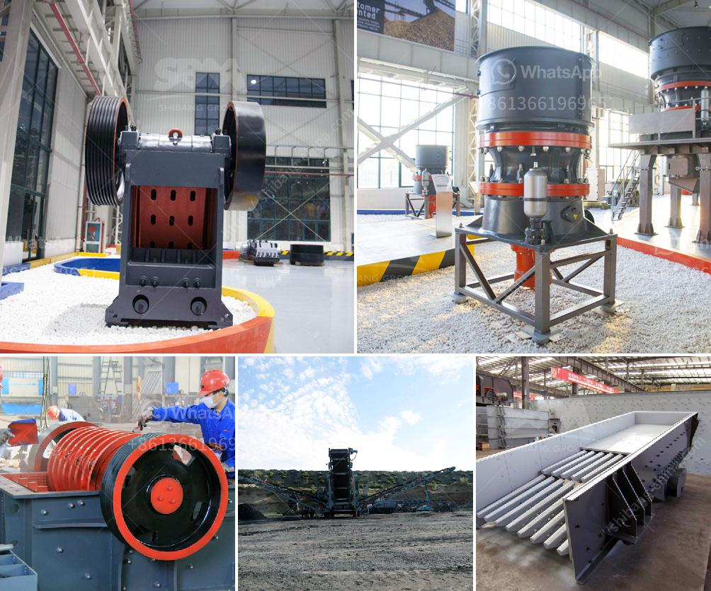

<h3>500tpd stone crushers</h3>
Stone crushing industry plays a vital role in the economy and urban development of any country. The process of crushing stone into various sizes is undertaken by specialized machines, known as stone crushers. In recent years, the magnitude of this industry has grown significantly, primarily due to increased construction activities.

The demand for crushed stone is high, as it is used in the construction of roads, bridges, buildings, and other infrastructural projects. With urbanization on the rise and the need for housing and commercial spaces expanding, the stone crushing industry has become even more crucial. To meet this ever-growing demand, stone crushers with a capacity of 500TPD (tones per day) have emerged as an essential machinery.

The 500TPD stone crushers are a special category of crushers used to break large stones into smaller sizes for specific purposes. These crushers are designed and manufactured to generate high-quality aggregates suitable for various construction applications. They help transform large stones into gravel, sand, or specific rocks, making them suitable for use as a building material.

One of the primary advantages of using 500TPD stone crushers is their high efficiency and productivity. These crushers are engineered to crush stones in a uniform manner, reducing the need for additional processing stages. As a result, the overall time and effort required to complete a project are significantly reduced. Moreover, these crushers allow for automated operation, ensuring a continuous supply of crushed stones, thereby enhancing productivity on construction sites.

The environmental impact of stone crushers has been a topic of concern for the industry and environmentalists alike. However, with the advent of advanced technology, the 500TPD stone crushers have become more eco-friendly. These crushers are equipped with dust suppression systems, reducing dust emissions and the risk of pollution. Additionally, they incorporate noise reduction features, making them less noisy and intrusive to surrounding environments.

Another crucial aspect of using 500TPD stone crushers is their positive impact on the economy. The stone crushing industry provides employment opportunities to a significant number of people, both directly and indirectly. From machine operators to mechanics, these crushers create various job roles, stimulating economic growth. Moreover, the production of high-quality aggregates contributes to the overall value chain of the construction sector, promoting economic development.

As the demand for construction materials continues to rise, the utilization of 500TPD stone crushers becomes even more significant. They not only enhance productivity and efficiency but also promote sustainability in the construction industry. By processing large stones into smaller sizes, these crushers contribute to the reduced extraction of natural resources. Additionally, by incorporating features to minimize pollution and noise, they support the preservation of the environment.

In conclusion, the 500TPD stone crushers have emerged as a game-changer in the stone crushing industry. Their efficiency, productivity, and environmental friendliness make them a preferred choice for construction projects. As we strive for sustainable development, embracing technology and machinery like these crushers is crucial. They break the barrier between construction demands and environmental concerns, ensuring a brighter and better future.
<h3>Contact us</h3><ul><li><strong>Whatsapp:&nbsp;<a href="https://wa.me/8613661969651">+8613661969651</a></strong></li><li><a href="https://swt.shibang-china.com/?git&amp;zhl&amp;500tpd stone crushers"><strong>Online Service(chat now)</strong></a></li></ul><h3>Related</h3><ul><li><a href='hammer mills factories.md'>hammer mills factories</a></li><li><a href='complete crushing for sale with price.md'>complete crushing for sale with price</a></li><li><a href='hydroton pebbles clay manufacturing process.md'>hydroton pebbles clay manufacturing process</a></li><li><a href='talc rock crusher.md'>talc rock crusher</a></li><li><a href='stone crusher mini.md'>stone crusher mini</a></li></ul>