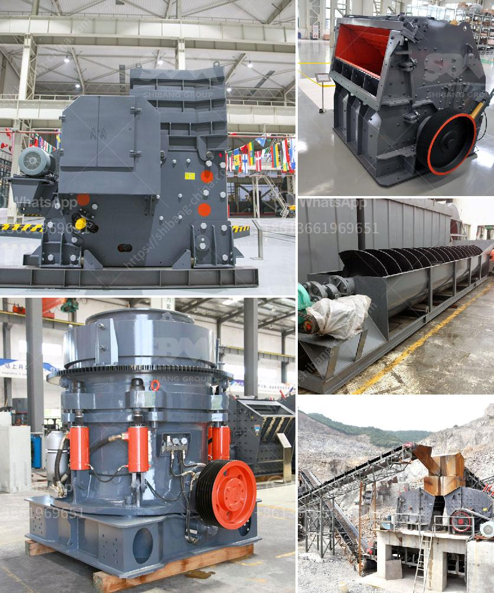

<h3>activated bentonite production line</h3>
Bentonite has many industrial uses, including oil and gas drilling, cement manufacturing, and environmental remediation. It is commonly used as a soil sealant, due to its high swelling capacity and ability to retain water. One of the most effective ways to enhance the properties of bentonite is through the process of activation. Activated bentonite has increased surface area and adsorption capacity, making it suitable for a wide range of applications.

The production of activated bentonite requires specialized equipment to ensure consistent quality and high productivity. A reliable production line is essential for manufacturers looking to meet the growing demand for activated bentonite. This article explores the key components and benefits of an activated bentonite production line.

One of the critical components of a production line is the bentonite drying machine. It is responsible for removing moisture from the raw bentonite, which is typically achieved through a combination of heat and air circulation. The drying machine ensures that the bentonite is free from excess moisture, which can negatively impact the activation process.

Another crucial component is the activation equipment, which includes a reactor and a mixer. The reactor facilitates the chemical reaction between the bentonite and the activating agent, such as sulfuric acid or sodium carbonate. The mixer ensures uniform distribution of the activating agent, resulting in consistent activation throughout the bentonite batch.

Additionally, a grinding mill is employed in the production line to achieve the desired particle size of the activated bentonite. The grinding process enhances the reactivity of the bentonite by increasing its surface area, allowing for better adsorption of contaminants or other substances.

The benefits of an activated bentonite production line are numerous. Firstly, it allows manufacturers to produce activated bentonite with a high degree of consistency, meeting customer requirements and industry standards. Secondly, the production line enables manufacturers to scale their operations, increasing production volume to meet market demand.

In conclusion, an activated bentonite production line is crucial for manufacturers in the bentonite industry, as it provides the necessary equipment and processes to produce activated bentonite with high quality and productivity. By investing in a reliable production line, manufacturers can meet the increasing demand for activated bentonite and expand their market presence.
<h3>Contact us</h3><ul><li><strong>Whatsapp:&nbsp;<a href="https://wa.me/8613661969651">+8613661969651</a></strong></li><li><a href="https://swt.shibang-china.com/?git&amp;zhl&amp;activated bentonite production line"><strong>Online Service(chat now)</strong></a></li></ul><h3>Related</h3><ul><li><a href='mobile coal screen units south africa.md'>mobile coal screen units south africa</a></li><li><a href='barium carbonate manufacturing process.md'>barium carbonate manufacturing process</a></li><li><a href='stone crusher machine factory in china.md'>stone crusher machine factory in china</a></li><li><a href='barite grinding plants in nigeria.md'>barite grinding plants in nigeria</a></li><li><a href='hammer mill stone crusher.md'>hammer mill stone crusher</a></li></ul>