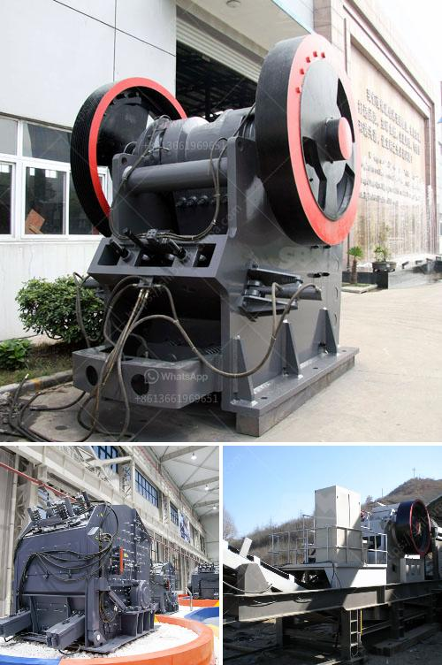

<h3>activated carbon a full set of production equipment</h3>
Activated carbon is a highly versatile material that is widely used in various industries, including water purification, air filtration, and chemical processing. Its unique properties make it an effective adsorbent for removing impurities, odors, and contaminants from different substances. However, the production of activated carbon requires a specialized set of equipment to achieve optimal results.

The process of producing activated carbon involves carbonizing organic materials, such as coconut shells, wood, or coal, at high temperatures in the absence of oxygen. This produces a char, which is then treated with steam or chemicals to create a porous structure, increasing the material's surface area and adsorption capacity.

To achieve this, a full set of production equipment is necessary. This includes carbonization furnaces, activation furnaces, crushing and grinding machines, and air-treatment systems. The carbonization furnace is used to heat the organic material to temperatures of around 600-900 degrees Celsius, transforming it into char. The activation furnace is responsible for the next step, where steam or chemicals are introduced to the char, creating the porous structure of activated carbon.

Crushing and grinding machines are essential for further processing of the activated carbon. The material is crushed into smaller particles to increase its surface area for better adsorption capabilities. Finally, an air-treatment system is required to remove any harmful emissions generated during the production process, ensuring a safe and environmentally friendly operation.

Investing in high-quality activated carbon production equipment is crucial for producing activated carbon with consistent quality and properties. Advanced technologies, such as rotary kilns and fluidized bed reactors, are often employed to achieve efficient and cost-effective production.

In conclusion, activated carbon production requires a full set of specialized equipment to produce high-quality adsorbents. This equipment includes carbonization and activation furnaces, crushing and grinding machines, and air-treatment systems. Investing in quality production equipment is essential to ensure consistent performance and to meet the increasing demand for activated carbon in various industries.
<h3>Contact us</h3><ul><li><strong>Whatsapp:&nbsp;<a href="https://wa.me/8613661969651">+8613661969651</a></strong></li><li><a href="https://swt.shibang-china.com/?git&amp;zhl&amp;activated carbon a full set of production equipment"><strong>Online Service(chat now)</strong></a></li></ul><h3>Related</h3><ul><li><a href='price of grinding machine in bangladesh.md'>price of grinding machine in bangladesh</a></li><li><a href='india crushers association.md'>india crushers association</a></li><li><a href='price of 500 tph stone crusher plant in malaysia.md'>price of 500 tph stone crusher plant in malaysia</a></li><li><a href='crusher equipment dubai.md'>crusher equipment dubai</a></li><li><a href='mobile crushing stone machines from austria.md'>mobile crushing stone machines from austria</a></li></ul>