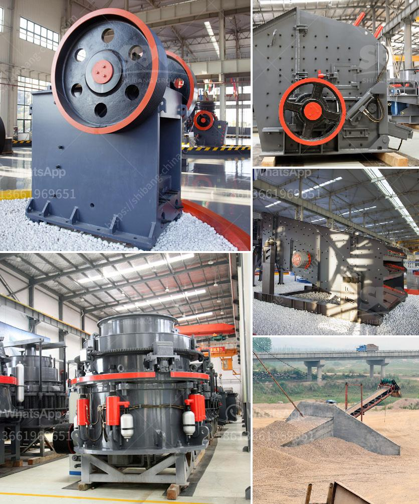

<h3>aggregate crusher machine</h3>
An aggregate crusher machine is often used in the construction industry and provides customers with an efficient and cost-effective solution for making gravel, which can be used as a material for mixing concrete. The machine is capable of crushing large rocks, reducing them to smaller sizes suitable for transport and further processing.

Aggregate crushers are used in mining, quarrying, and recycling operations. Several types of crushers can perform this task, including hammer mills, roller crushers, jaw crushers, and gyratory crushers. An aggregate crusher can be relatively small, like the mobile units used for reclaiming recycled asphalt, or huge machines that can process thousands of tons of material a day.

Aggregate crushers are used to produce crushed stone for landscaping. Another type of crusher used to pulverize softer types of rock like sandstone is the roller mill. The rough pieces of rock are fed into a mechanism consisting of rollers that are usually fitted with teeth that interlock with teeth on an opposite roller as they rotate. The mechanism crushes the pieces into progressively smaller sizes, allowing them to fall through the machine's grates to the collection area beneath.

The primary crushers are power-driven conveyors that break down large rocks by using a compression mechanism. They are used to reduce rock size even further after it has been processed by the secondary crushers. The secondary crushers work similarly to primary crushers, but they have a smaller crushing cavity and a shorter spindle. They are used mainly in the production stage of secondary materials and aggregates.

The purpose of aggregate crushers is to reduce the size of large rocks into smaller pieces and create a more suitable material for use in construction projects. Crushers are commonly categorized by the degree to which they fragment the starting material, with primary crushers being capable of larger reduction ratios than secondary crushers. Crushers can be stationary or portable, making them suitable for both large-scale and small-scale construction projects.

In conclusion, an aggregate crusher machine is necessary for construction industry. Its compact size, mobility, and high efficiency make it a valuable resource for contractors and homeowners. Crushers provide an efficient solution for breaking down large rocks into smaller, more manageable sizes, allowing for easier transportation and further processing. Whether used in mining operations or for landscaping and construction, aggregate crushers play a key role in project success.
<h3>Contact us</h3><ul><li><strong>Whatsapp:&nbsp;<a href="https://wa.me/8613661969651">+8613661969651</a></strong></li><li><a href="https://swt.shibang-china.com/?git&amp;zhl&amp;aggregate crusher machine"><strong>Online Service(chat now)</strong></a></li></ul><h3>Related</h3><ul><li><a href='calcium carbonate plant sell in india.md'>calcium carbonate plant sell in india</a></li><li><a href='rent a rock crusher saudi.md'>rent a rock crusher saudi</a></li><li><a href='diesel engine hammer mill crusher.md'>diesel engine hammer mill crusher</a></li><li><a href='ball mill in copper plant.md'>ball mill in copper plant</a></li><li><a href='processing of feldspar crushing.md'>processing of feldspar crushing</a></li></ul>