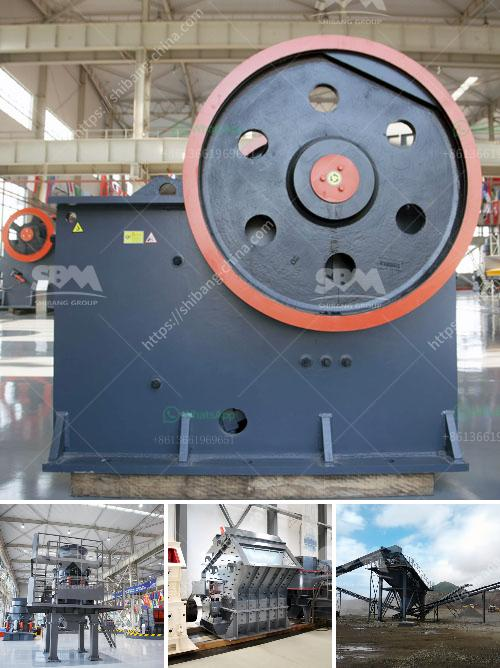

<h3>aggregate crushing plant and processing</h3>
By definition, aggregate is a combination of minerals, such as sand, gravel, and crushed stone, which are used in various applications. One of the key factors that determine the success of a concrete batch plant is the quality of aggregates used in the construction industry. Aggregates should be clean, hard, and strong to ensure optimal mix design.

To achieve the desired quality and consistency, it is essential to choose the right type of aggregate crushing plant. Several factors need to be considered, including the topography, climate, and volume of material being processed. The type of rock and the way it is processed will also affect the final product quality.

The process of aggregate crushing includes feeding the raw material into the jaw crusher where it undergoes a primary crushing. After that, the crushed material is conveyed through a belt conveyor to a cone crusher. The cone crusher further crushes the material into smaller pieces. The crushed material is then sent to a vibrating screen where it is separated into different sizes. The different sizes of aggregate are then stored in separate bins or stockpiles until they are ready to be used in construction projects.

Aggregate crushing plants are used in the production of raw materials in many industries and these crushing plants are the backbone of industrial sector. First of all, it will be much more helpful to explain what is Aggregate and this will give more advantage to us for explaining related questions. 

Aggregate is basically a mixture of minerals, or a mixture of minerals called sand, gravel and crushed stone. To processing of these materials is of great importance because of they are the main use materials of many industries. For example, sectors such as construction, asphalt and concrete plants are sectors where the use of aggregate crushing and screening facilities is highest. Within today's technology, two different species are known for aggregate processing.

Aggregate varieties are evaluated in natural and unnatural aggregates. Ü Natural aggregates: obtained from the ground and crushed stones are obtained by crushing various slices with mechanical crushers. Crusher. 

Ü Artificial aggregates: Use minerals and rocks which are crushed into the products of stone crusher. Aggregates are formed by eliminating the fine materials.

The main differences between all kinds of jaw crusher series are the feed port size, the max feed size and processing capacity. For PE series jaw crusher for sale in Sri Lanka, Aimix has 7 different models and sizes. The smallest size is PE-150*250, and it has 1-3 t/h processing capacity, which is suitable for small project building.
<h3>Contact us</h3><ul><li><strong>Whatsapp:&nbsp;<a href="https://wa.me/8613661969651">+8613661969651</a></strong></li><li><a href="https://swt.shibang-china.com/?git&amp;zhl&amp;aggregate crushing plant and processing"><strong>Online Service(chat now)</strong></a></li></ul><h3>Related</h3><ul><li><a href='rock crushers uk.md'>rock crushers uk</a></li><li><a href='slag powder making.md'>slag powder making</a></li><li><a href='rock sand making machine.md'>rock sand making machine</a></li><li><a href='stone crusher plant price in india.md'>stone crusher plant price in india</a></li><li><a href='granite crushers in germany.md'>granite crushers in germany</a></li></ul>