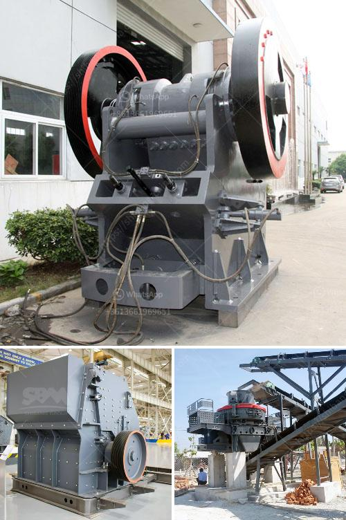

<h3>aggregate crushing plant for sale</h3>
Are you in the construction industry and in need of an aggregate crushing plant for your project? Well, look no further, as we have the perfect solution for you - an aggregate crushing plant for sale.

An aggregate crushing plant is a machine designed to turn large rocks into smaller rocks, gravel, or rock dust. These plants reduce the size of the raw materials to suit the construction industry needs, providing clients with high-quality aggregate materials for construction purposes.

The aggregate crushing plant for sale mainly adopts the two pieces of a closed circuit manufacturing process. The first crushing machine is the jaw crusher, which is used for primary crushing. The second crushing machine is the impact crusher, which can accomplish both primary and secondary crushing tasks. The vibrating screen can be used to separate different sizes of crushed stone materials.

The operator feeds chunks of material into the hopper of the jaw crusher. The jaw crusher operates by compressing the material between two surfaces, one of which opens and closes like a jaw. As the jaw crusher moves, the material becomes progressively smaller and falls out of the bottom once it is small enough to pass through the opening at the bottom of the jaw crusher.

After the jaw crusher, the materials are transported to the impact crusher for secondary crushing. In the impact crusher, the materials are struck by the high-speed rotating rotor and are thrown against the impact plates on the rotor for further crushing. The crushed materials are then screened by the vibrating screen and separated into different sizes.

One of the key advantages of using an aggregate crushing plant for sale is its ease of installation and operation. The plant can be installed on-site in a matter of hours and can be easily operated by a single operator. This saves time and labor costs for construction projects.

Another advantage is the ability to produce different sizes of aggregate materials. A construction project may require various sizes of crushed stone materials. With an aggregate crushing plant, the operator can adjust the size of the final product according to the project requirements. This ensures that the project gets the precise amount of materials needed, reducing waste and optimizing costs.

Additionally, the aggregate crushing plant for sale is more flexible and versatile, with different configurations and specifications available. To meet different crushing needs, the plant can be equipped with various crushing and screening equipment, such as jaw crusher, impact crusher, cone crusher, and vibrating screens.

In conclusion, an aggregate crushing plant for sale has a lot of benefits. The crushing and screening plant offer high productivity and a wide range of applications. It also provides convenient maintenance and safe operation. With the continuous advancement of technology, the aggregate crushing plant is also improving constantly. So if you need an aggregate crushing plant, please don't hesitate to contact us. Let us assist you in finding the perfect crushing plant to meet your construction needs.
<h3>Contact us</h3><ul><li><strong>Whatsapp:&nbsp;<a href="https://wa.me/8613661969651">+8613661969651</a></strong></li><li><a href="https://swt.shibang-china.com/?git&amp;zhl&amp;aggregate crushing plant for sale"><strong>Online Service(chat now)</strong></a></li></ul><h3>Related</h3><ul><li><a href='sand screen machine.md'>sand screen machine</a></li><li><a href='impact crusher equipment manufacturer.md'>impact crusher equipment manufacturer</a></li><li><a href='sand washing machine for sale.md'>sand washing machine for sale</a></li><li><a href='ethiopia stone crushing industry.md'>ethiopia stone crushing industry</a></li><li><a href='mobile rock crusher manufacturers.md'>mobile rock crusher manufacturers</a></li></ul>