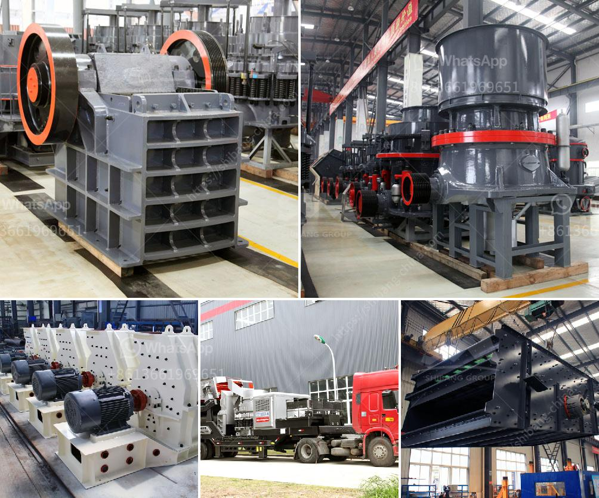

<h3>aggregate crushing plant sale</h3>
An aggregate crushing plant is used to manufacture aggregates such as sand, gravel, crushed stone, and recycled concrete used for building construction. These aggregates are used to make concrete, asphalt, road base, rail track ballast, and other construction materials. With the rapid urbanization process, the demand for aggregates is increasing, which has made aggregate crushing plants highly sought after in the construction industry.

Aggregate crushing plants are designed to crush and grind various materials, which are generally used as a filler or foundation material in construction. These plants can be divided into different categories based on the materials they crush and the screening process they use. Some plants crush and screen the material at the same time, while others separate the crushed materials based on their size.

The main components of an aggregate crushing plant include crushers, screens, feeders, conveyors, control panels, and magnetic separators. Several crushers can be combined to form a complete crushing plant to meet a specific production requirements. Jaw, impact, cone, and VSI crushers are commonly used to manufacture aggregates.

In recent years, the market for aggregates has been rapidly expanding due to the increasing demand for housing and infrastructure. As a result, many aggregate crushing plant manufacturers have emerged, providing a wide range of aggregate crushing plants for sale. They offer crushing plants from small scale to large scale, fulfilling the varied demands of different customers.

These aggregate crushing plants usually save transportation costs, as they can be easily transported to different construction sites. They are equipped with efficient crushers that reduce the size of the materials and separate them from unwanted substances. The aggregate crushing plants are designed with a dust suppression system to prevent the spread of dust and protect the environment.

When choosing an aggregate crushing plant for sale, consider the different types of crushers available and their respective specifications. Some plants are mobile, meaning they can be moved to different locations to maximize production. Others are stationary and stay in one place, suitable for long-term projects.

Before purchasing an aggregate crushing plant, it is essential to evaluate the production capacity, energy consumption, and maintenance requirements. The durability and reliability of the plant should also be considered. Consulting with an experienced aggregate plant manufacturer or engineering firm can help in making an informed decision.

In conclusion, an aggregate crushing plant sale has become a necessity in the construction industry due to the increasing demand for aggregates. These plants crush and grind various materials to manufacture the required construction materials. When choosing a plant, it is important to consider factors such as the type of crushers, mobility, production capacity, and maintenance requirements. By investing in a high-quality aggregate crushing plant, construction companies can ensure that they have a continuous supply of aggregates, enabling them to complete projects on time and within budget.
<h3>Contact us</h3><ul><li><strong>Whatsapp:&nbsp;<a href="https://wa.me/8613661969651">+8613661969651</a></strong></li><li><a href="https://swt.shibang-china.com/?git&amp;zhl&amp;aggregate crushing plant sale"><strong>Online Service(chat now)</strong></a></li></ul><h3>Related</h3><ul><li><a href='jaw crusher south africa used.md'>jaw crusher south africa used</a></li><li><a href='stone crusher plant for sale in pakistan.md'>stone crusher plant for sale in pakistan</a></li><li><a href='aggregates crashing plant in nigeria.md'>aggregates crashing plant in nigeria</a></li><li><a href='feasibility study for cocoa unit processing.md'>feasibility study for cocoa unit processing</a></li><li><a href='ball mills caractecrsistiacs techniques.md'>ball mills caractecrsistiacs techniques</a></li></ul>