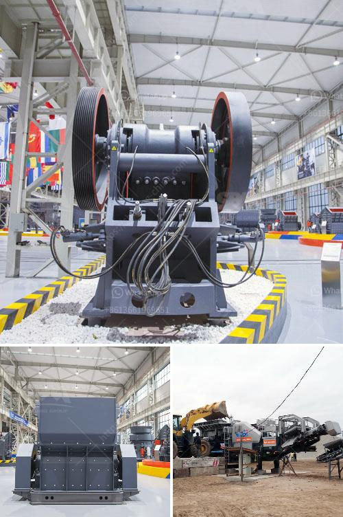

<h3>aggregate quarry plant</h3>
Rocks are an essential resource in the construction industry. They form the foundation of buildings, roads, and various other infrastructure. To meet the ever-increasing demands of the construction sector, aggregate quarry plants play a crucial role. These plants provide the raw materials needed to create aggregates, which are vital for construction.

An aggregate quarry plant is a site where various types of rocks are obtained through blasting and drilling. The rocks are then crushed, sorted, and sieved into different sizes to produce aggregates for various construction purposes. These aggregates include crushed stone, gravel, sand, recycled concrete, and more.

One of the key advantages of quarry plants is that they can provide a consistent and reliable supply of aggregates. Their large-scale operations ensure that there is a continuous production of materials required by the construction sector. This helps prevent shortages and ensures a smooth flow of resources for projects of all sizes.

The utilization of quarry plants is not only limited to supplying aggregates but also extends to recycling. Many quarry plants have recycling systems in place to reuse waste materials and reduce the environmental impact. These systems can process demolished concrete and other construction waste, turning them into valuable recycled aggregates.

Aggregate quarry plants are usually equipped with state-of-the-art machinery and equipment to optimize production efficiency and minimize environmental impacts. This includes heavy-duty crushers, screens, conveyors, and other machinery capable of processing large amounts of rocks. Advanced technologies, such as computerized control systems, are also implemented to ensure precise and safe operations.

The location of an aggregate quarry plant is critical for its operations. Ideally, it should be situated near construction sites to minimize transportation costs and reduce carbon emissions associated with hauling aggregates over long distances. Additionally, quarry plants should be located in areas with abundant rock resources to ensure a sustainable and long-term supply.

While quarry plants provide essential resources, they also need to prioritize environmental preservation. Quarries are typically required to obtain permits and adhere to strict regulations to minimize their impact on ecosystems, water sources, and nearby communities. This includes implementing measures to control dust emissions, noise levels, and water pollution.

Community engagement is another important aspect of aggregate quarry plant operations. Quarry managers should establish open lines of communication with neighboring communities to address any concerns and ensure mutual understanding. This can include regular meetings, public consultations, and educational initiatives to promote transparency and responsible quarrying practices.

In conclusion, aggregate quarry plants are crucial for the construction industry as they provide the necessary materials for building infrastructure. These plants not only supply aggregates but also play a role in recycling construction waste, reducing environmental impact. With their advanced machinery and strategic locations, quarry plants are able to meet the demands of the construction sector while minimizing transportation costs and environmental degradation. Through responsible quarrying practices and community engagement, quarry plants can contribute to sustainable development and ensure the continued availability of resources for future generations.
<h3>Contact us</h3><ul><li><strong>Whatsapp:&nbsp;<a href="https://wa.me/8613661969651">+8613661969651</a></strong></li><li><a href="https://swt.shibang-china.com/?git&amp;zhl&amp;aggregate quarry plant"><strong>Online Service(chat now)</strong></a></li></ul><h3>Related</h3><ul><li><a href='hammer mill in malaysia.md'>hammer mill in malaysia</a></li><li><a href='quick lime powder making machine.md'>quick lime powder making machine</a></li><li><a href='company where they sell industrial mills.md'>company where they sell industrial mills</a></li><li><a href='philippines crusher manufacturers in pakistan.md'>philippines crusher manufacturers in pakistan</a></li><li><a href='equipo del molino de bolas 750 hp precio del motor.md'>equipo del molino de bolas 750 hp precio del motor</a></li></ul>