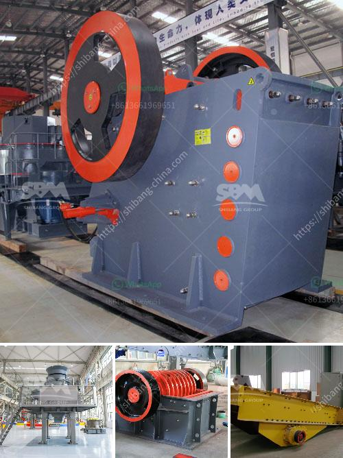

<h3>aggregate roller crushing mill malaysia</h3>
Aggregate roller crushing mill Malaysia is widely used in cement, electric power, metallurgy, chemical industry, non-metallic mineral industries, and combines crushing, drying, grinding, classifying and conveying all together.

Aggregate roller crushing mill is designed with roller tires and ring-shaped table liners which are utilized to pulverize and dry the coal, limestone, clay, iron ore and other materials needed for the cement manufacturing process. These roller crushing mills are also capable of grinding clinker and other mineral materials.

The roller crushing mill has been proven to be highly efficient for grinding certain types of clinker and related materials. It is known for its high grinding capacity and versatility. This mill is suitable for both dry and wet processing, and can be operated in open or closed circuit configurations.

One of the key advantages of the aggregate roller crushing mill is its low energy consumption. This is achieved through the use of advanced grinding technology and optimized airflow patterns within the mill. The roller crushing mill also features a low noise level, providing a comfortable working environment for operators.

Additionally, the aggregate roller crushing mill Malaysia has a modular design, allowing for easy installation and maintenance. Its compact size and flexible layout make it suitable for both new installations and retrofitting of existing facilities. The mill can be adjusted to different operating conditions, ensuring optimal performance and longevity.

In addition to its energy efficiency and ease of maintenance, the roller crushing mill is known for its high reliability. The components of the mill are made from high-quality materials, ensuring a long service life and minimal downtime. Furthermore, it is equipped with advanced safety features to protect against potential accidents.

The aggregate roller crushing mill Malaysia can be used as a standalone unit, or combined with other equipment to form a complete aggregate crushing and grinding system. It is suitable for grinding various materials such as limestone, gypsum, coal, slag, and cement clinker into desired particle sizes.

In conclusion, aggregate roller crushing mill Malaysia is a versatile and efficient grinding solution that is suitable for a wide range of applications in the cement and mineral industries. Its low energy consumption, high grinding capacity, and modular design make it a cost-effective option for both new installations and retrofitting of existing facilities. With its advanced grinding technology and high reliability, this mill ensures optimal performance and longevity.
<h3>Contact us</h3><ul><li><strong>Whatsapp:&nbsp;<a href="https://wa.me/8613661969651">+8613661969651</a></strong></li><li><a href="https://swt.shibang-china.com/?git&amp;zhl&amp;aggregate roller crushing mill malaysia"><strong>Online Service(chat now)</strong></a></li></ul><h3>Related</h3><ul><li><a href='difference between residual and transported soil.md'>difference between residual and transported soil</a></li><li><a href='mobile coal screen units south africa.md'>mobile coal screen units south africa</a></li><li><a href='grinding mill machine in sri lanka.md'>grinding mill machine in sri lanka</a></li><li><a href='jaw crusher shaft parts diagram.md'>jaw crusher shaft parts diagram</a></li><li><a href='ton day cement clinker grinding plant.md'>ton day cement clinker grinding plant</a></li></ul>