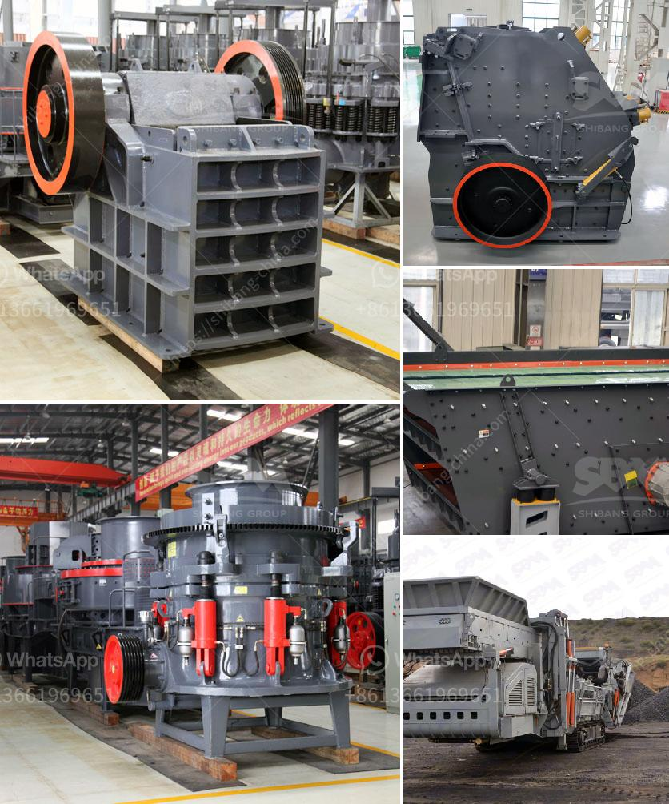

<h3>aggregate screening plants</h3>
Aggregate screening plants are an essential tool for construction companies and mining operations. These plants play a crucial role in processing various types of stones, rocks, and raw materials required for constructing roads, buildings, and other infrastructure projects. They are designed to efficiently separate different sizes and types of aggregate materials, ensuring the final product meets the specific requirements for construction purposes.

One of the key advantages of using aggregate screening plants is their ability to process a large volume of materials in a short amount of time. These plants are equipped with vibrating screens, which easily separate different sizes of aggregate. The larger pieces of aggregate are retained on the top screen and discharged onto a conveyor belt, while the smaller materials fall through the screens and onto separate conveyors for further processing.

Different types of screening plants are available in the market, each designed for specific purposes. Some plants are portable and can be easily moved from one location to another, making them ideal for temporary construction sites. Mobile screening plants can also be used to efficiently process aggregate in remote areas where transportation costs would be prohibitive.

When it comes to choosing the right aggregate screening plant, several factors need to be considered. Firstly, the plant should have the capacity to handle the projected volume of materials. It should be able to process the desired output efficiently without causing any bottlenecks in the production process.

Secondly, the plant should have screens that are designed to handle the specific types of materials that will be processed. Different aggregate materials have different characteristics, such as size, shape, and moisture content. The screens in the screening plant should be able to handle these variations and efficiently separate the materials.

Thirdly, the plant should be equipped with proper dust control measures. Aggregate screening plants generate a significant amount of dust during the screening process. This dust can be a health hazard for the workers and can also cause environmental pollution. The plant should be equipped with dust collectors and suppression systems to minimize dust emissions and provide a safe working environment.

Lastly, the plant should be easy to maintain and operate. Regular maintenance is essential to ensure the plant operates at its optimum capacity. The plant should also have user-friendly controls and interfaces to facilitate efficient operation.

In conclusion, aggregate screening plants are vital for construction companies and mining operations to efficiently process aggregate materials. These plants enable the separation of different sizes of aggregate, ensuring the final product meets the specific requirements for construction purposes. The right screening plant should have the capacity to handle the projected volume, be equipped with screens that can handle the specific types of materials, have proper dust control measures, and be easy to maintain and operate. By considering these factors, companies can select the ideal aggregate screening plant to meet their business needs.
<h3>Contact us</h3><ul><li><strong>Whatsapp:&nbsp;<a href="https://wa.me/8613661969651">+8613661969651</a></strong></li><li><a href="https://swt.shibang-china.com/?git&amp;zhl&amp;aggregate screening plants"><strong>Online Service(chat now)</strong></a></li></ul><h3>Related</h3><ul><li><a href='bauxite processing plant kenya.md'>bauxite processing plant kenya</a></li><li><a href='copper crushing machines manufacturers in china.md'>copper crushing machines manufacturers in china</a></li><li><a href='differences with gyratory crusher cone crusher.md'>differences with gyratory crusher cone crusher</a></li><li><a href='ball mill italia.md'>ball mill italia</a></li><li><a href='grinding ball mill equipment.md'>grinding ball mill equipment</a></li></ul>