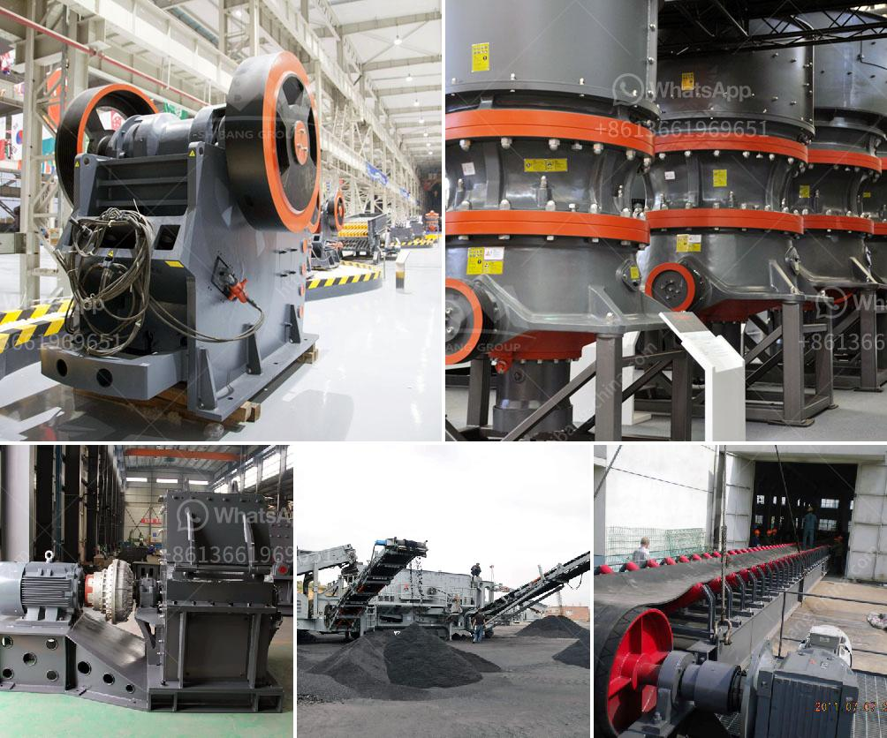

<h3>aggregate washing machine cost</h3>
When it comes to construction projects, the importance of aggregate washing machines cannot be overstated. These machines play a vital role in ensuring the quality and durability of the final product. The cost of an aggregate washing machine is an essential factor to consider when planning a construction project. In this article, we will delve into the various aspects of aggregate washing machine cost and why it is a necessary investment.

To begin with, what exactly is an aggregate washing machine? It is a machine designed to remove impurities, such as dust, dirt, and other unwanted materials from construction aggregates, including sand, gravel, crushed stone, and recycled concrete. The machine accomplishes this by using water to wash the aggregates thoroughly, ultimately producing cleaner and higher-quality materials.

One of the main factors affecting the cost of an aggregate washing machine is its size and capacity. The larger the machine, the more expensive it tends to be. The capacity of the machine also plays a crucial role in determining its cost. Machines with higher capacities are generally costlier due to the advanced technology and materials required to handle larger amounts of aggregates efficiently.

Another aspect that affects the cost of an aggregate washing machine is the brand and reputation of the manufacturer. Well-established and reputable manufacturers often produce high-quality and more reliable machines, which can come at a higher cost. Investing in a reputable brand guarantees durability, performance, and long-term cost-effectiveness, as the machine will require minimal repairs and maintenance.

Moreover, the type of aggregate washing machine also influences its cost. There are various types of machines available in the market, including screw washers, log washers, and cyclone-based units. Each type offers different features, advantages, and efficiency levels. The cost may vary based on the specific requirements of the construction project and the efficiency provided by the machine type.

The technological advancements incorporated in the design of aggregate washing machines also impact their cost. Machines equipped with state-of-the-art technologies tend to be more expensive. However, these advanced features often result in increased efficiency, reduced water consumption, and better overall performance, leading to long-term cost savings.

It is vital to consider the after-sales services and warranty offered by the manufacturer when evaluating the cost of an aggregate washing machine. A reliable manufacturer will provide comprehensive customer support, regular maintenance, and spare parts availability, ensuring minimal downtime and maximum efficiency. Additionally, a warranty will protect the investment and provide peace of mind for the buyer.

While the initial cost of an aggregate washing machine may seem significant, its long-term benefits far outweigh this expense. Investing in a high-quality machine leads to improved aggregate quality, enhanced durability of the end product, and reduced maintenance and replacement costs over time. Moreover, the overall efficiency and productivity gained from using a reliable washing machine can lead to substantial financial savings in the long run.

In conclusion, aggregate washing machines are an essential investment for construction projects. The cost of these machines is influenced by factors such as size, capacity, brand reputation, type, and technological advancements. Despite the initial investment, the benefits of using a reliable washing machine include improved aggregate quality, enhanced project durability, and long-term cost savings. Therefore, it is crucial to carefully evaluate the cost and features of various machines before making a purchase, ensuring that the selected machine meets the specific requirements of the construction project.
<h3>Contact us</h3><ul><li><strong>Whatsapp:&nbsp;<a href="https://wa.me/8613661969651">+8613661969651</a></strong></li><li><a href="https://swt.shibang-china.com/?git&amp;zhl&amp;aggregate washing machine cost"><strong>Online Service(chat now)</strong></a></li></ul><h3>Related</h3><ul><li><a href='industrial uses of white marble powder.md'>industrial uses of white marble powder</a></li><li><a href='stone crusher made in italy.md'>stone crusher made in italy</a></li><li><a href='silica sand crusher in ghana.md'>silica sand crusher in ghana</a></li><li><a href='mobile aggregate plant for sale in the philippines.md'>mobile aggregate plant for sale in the philippines</a></li><li><a href='crusher machine for marble and granite.md'>crusher machine for marble and granite</a></li></ul>