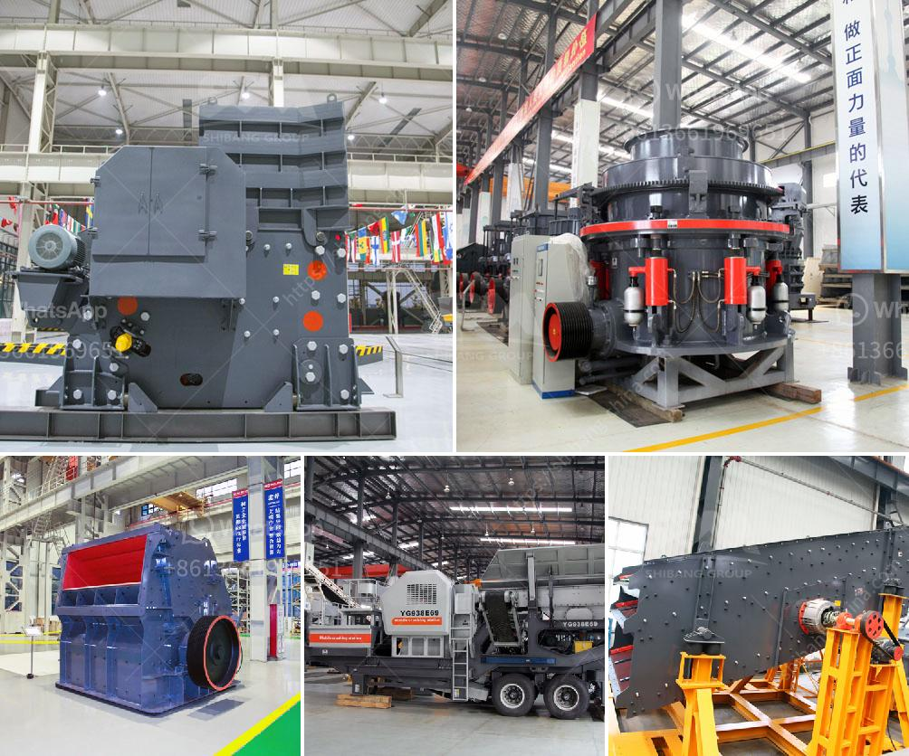

<h3>aggregate washing plant manufacturers usa</h3>
Aggregate washing plants are essential for ensuring the cleanliness and quality of materials used in construction. These plants remove unwanted particles and debris from aggregates, such as sand, gravel, crushed stone, and recycled concrete, before they are used in various applications. In the United States, there are several top-notch manufacturers that specialize in producing high-quality aggregate washing plants.

One prominent manufacturer is ABC Company, known for its state-of-the-art machinery and innovative technology. They offer a wide range of washing plants that are highly efficient and designed to meet the specific needs of the construction industry. These plants are capable of washing large quantities of aggregates within a short period, making them ideal for major construction projects.

Another notable manufacturer is XYZ Equipment, with a reputation for producing durable and reliable machinery. Their range of aggregate washing plants is designed to withstand the harsh conditions of the construction site and deliver exceptional performance. With innovative features such as adjustable water pressure and multiple screening options, their plants ensure the removal of even the smallest impurities from the aggregates.

Furthermore, DEF Industries has made a name for itself by producing environmentally-friendly washing plants. Their designs prioritize water conservation and reduction of waste by utilizing advanced water recycling systems. These plants not only offer outstanding cleaning capabilities but also contribute to sustainable construction practices.

It is worth mentioning that all these manufacturers prioritize customer satisfaction and offer excellent after-sales support. They understand that investing in an aggregate washing plant is a significant decision for construction companies, and provide comprehensive guidance and assistance throughout the process.

In conclusion, the United States boasts top-notch manufacturers of aggregate washing plants. These manufacturers offer a wide range of innovative and efficient machinery designed to ensure the cleanliness and quality of construction materials. By investing in these plants, construction companies can enhance their operations and deliver high-quality projects.
<h3>Contact us</h3><ul><li><strong>Whatsapp:&nbsp;<a href="https://wa.me/8613661969651">+8613661969651</a></strong></li><li><a href="https://swt.shibang-china.com/?git&amp;zhl&amp;aggregate washing plant manufacturers usa"><strong>Online Service(chat now)</strong></a></li></ul><h3>Related</h3><ul><li><a href='south africa ballast crushing companies.md'>south africa ballast crushing companies</a></li><li><a href='marble granite stone grinding machine price.md'>marble granite stone grinding machine price</a></li><li><a href='gypsum machine 100ton price in india.md'>gypsum machine 100ton price in india</a></li><li><a href='stone crusher machine japan.md'>stone crusher machine japan</a></li><li><a href='business plan for a quarry crusher.md'>business plan for a quarry crusher</a></li></ul>