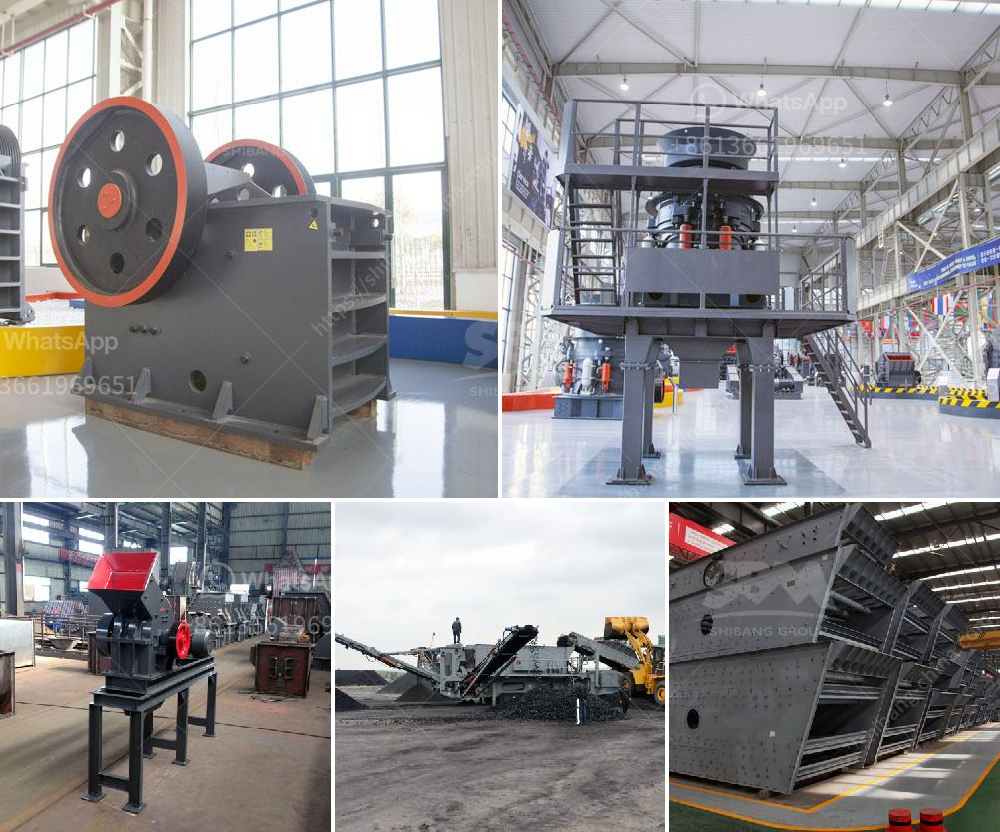

<h3>aggregates crashing plant in nigeria</h3>
Nigeria, the most populous country in Africa, is experiencing a surge in construction projects. From building roads and bridges to constructing commercial and residential buildings, the demand for construction materials is at an all-time high. One crucial element in the construction process is aggregates, which are crushed stones used as a base material in concrete production. To meet this growing demand, Nigeria has invested in aggregates crashing plants, which are specialized facilities that crush rocks into various sizes for construction purposes. This development is set to revolutionize the country's construction industry.

Aggregates crashing plants play a vital role in infrastructure development. Nigeria, like many developing countries, has been witnessing rapid urbanization in recent years. This trend has placed immense pressure on existing infrastructure, resulting in a dire need for upgrades and new construction projects. The success of these endeavors heavily relies on the availability of quality construction materials. By investing in aggregates crashing plants, Nigeria is taking a significant step towards achieving self-sufficiency in the supply of aggregates, reducing dependence on imports, and driving down construction costs.

One key benefit of having aggregates crashing plants in Nigeria is the impact on the economy. These facilities create job opportunities for the local population, contributing to poverty reduction and economic growth. As the demand for aggregates increases, more crashing plants will be set up across the country, leading to a rise in employment rates. Additionally, the establishment of such plants spurs related industries, such as transportation and manufacturing. This multiplier effect boosts economic activities in the region, generating revenue for the government and improving the overall standard of living for the Nigerian people.

Furthermore, having aggregates crashing plants in the country fosters technological advancement. The construction industry heavily relies on innovation to streamline processes and improve efficiency. With crashing plants, Nigeria gains access to state-of-the-art equipment and machinery, allowing for faster and more accurate rock crushing. This not only speeds up the construction timeline but also enhances the quality of construction materials. High-quality aggregates result in more durable infrastructure, reducing maintenance costs and ensuring the longevity of buildings and roads.

Moreover, the presence of aggregates crashing plants helps Nigeria reduce its carbon footprint. Historically, Nigeria has imported aggregates from other countries, leading to increased transportation emissions and environmental impact. By localizing the production of aggregates, the carbon emissions associated with material transportation are significantly reduced. This move aligns with global efforts to combat climate change and supports the country's commitment to environmental sustainability.

While the establishment of aggregates crashing plants in Nigeria brings immense benefits, there are challenges to overcome. Adequate investment in infrastructure and support services is necessary to ensure the smooth operation of these facilities. The government must prioritize road networks and energy supply, guaranteeing easy transportation of rocks and a stable power source for the crashing plants.

In conclusion, the investment in aggregates crashing plants in Nigeria is a game-changer for the construction industry. It boosts the economy, creates employment opportunities, and promotes technological advancements. Moreover, it contributes to environmental sustainability by reducing carbon emissions associated with material transportation. As more crashing plants are established, the country is well-positioned to meet the demand for aggregates, fueling the growth and development of Nigeria's infrastructure.
<h3>Contact us</h3><ul><li><strong>Whatsapp:&nbsp;<a href="https://wa.me/8613661969651">+8613661969651</a></strong></li><li><a href="https://swt.shibang-china.com/?git&amp;zhl&amp;aggregates crashing plant in nigeria"><strong>Online Service(chat now)</strong></a></li></ul><h3>Related</h3><ul><li><a href='stone crusher machine for sale in kenya.md'>stone crusher machine for sale in kenya</a></li><li><a href='cone crusher price in china.md'>cone crusher price in china</a></li><li><a href='marchine stone crusher cost in kenya.md'>marchine stone crusher cost in kenya</a></li><li><a href='talc powder crushers.md'>talc powder crushers</a></li><li><a href='barium carbonate manufacturing process.md'>barium carbonate manufacturing process</a></li></ul>