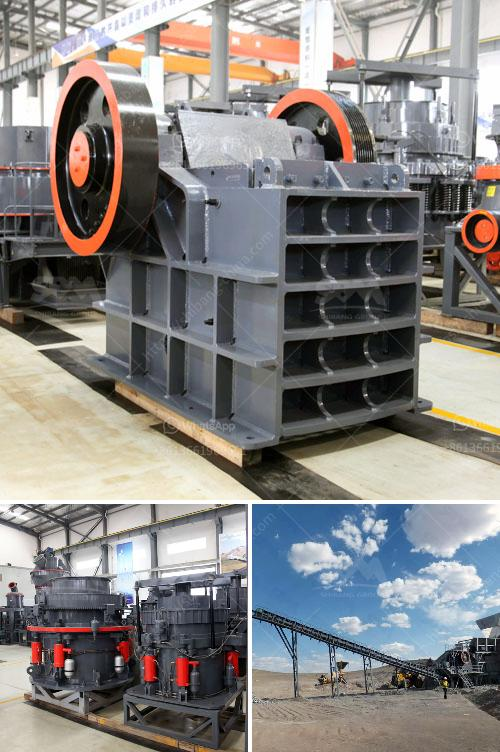

<h3>aggregates crusher plant near in manila</h3>
Aggregates are an essential component in construction, as they act as the foundation and structural support for various infrastructure projects. From roads and bridges to buildings and stadiums, aggregates play a crucial role in the development of cities and urban areas. In the bustling capital city of Manila, there is a growing demand for aggregates due to the rapid urbanization and infrastructure development taking place. To cater to this demand, several aggregates crusher plants have been established near Manila, ensuring a steady supply of this essential material.

One of the key players in the aggregates industry near Manila is XYZ Aggregates. Situated just a few kilometers away from the city, their crusher plant has a capacity to produce around 1000 tons of aggregates per day. With this large production capacity, XYZ Aggregates aims to meet the needs of various construction projects in Manila and its surrounding areas.

The location of XYZ Aggregates' crusher plant near Manila provides them with several advantages. First and foremost, their proximity to the city ensures efficient and timely delivery of aggregates to the project sites. Since aggregates are heavy and bulky, transportation costs can be significant. Having the crusher plant near Manila reduces these costs, ultimately benefiting the customers who require a reliable and cost-effective supply of aggregates for their construction projects.

Furthermore, XYZ Aggregates' crusher plant follows strict quality control measures to ensure that the aggregates produced meet the required standards. They employ advanced technology and equipment to crush, screen, and wash the raw materials, resulting in high-quality aggregates that are free from impurities. This commitment to quality has helped XYZ Aggregates establish a reputation as a reliable supplier of aggregates in the Manila area.

In addition to XYZ Aggregates, there are several other crusher plants near Manila that contribute to the supply of aggregates. These plants are strategically positioned to cater to different areas and sectors within the city. With multiple options available, construction companies and contractors can choose the nearest crusher plant based on their project requirements, saving time and transportation costs.

The establishment of crusher plants near Manila also creates employment opportunities for the local community. These plants require a skilled workforce to operate and maintain the equipment, as well as to carry out quality control checks. By providing jobs, these crusher plants contribute to the economic development of the area and improve the livelihoods of its residents.

In conclusion, the presence of aggregates crusher plants near Manila plays a crucial role in meeting the growing demand for construction materials in the city. These plants ensure a steady supply of high-quality aggregates, reducing costs and saving time for construction companies and contractors. Moreover, the establishment of these plants contributes to the economic development of the area and provides employment opportunities for the local community. As Manila continues to witness rapid urbanization and infrastructure development, the aggregates industry will play a vital role in shaping the city's landscape and supporting its growth.
<h3>Contact us</h3><ul><li><strong>Whatsapp:&nbsp;<a href="https://wa.me/8613661969651">+8613661969651</a></strong></li><li><a href="https://swt.shibang-china.com/?git&amp;zhl&amp;aggregates crusher plant near in manila"><strong>Online Service(chat now)</strong></a></li></ul><h3>Related</h3><ul><li><a href='roll crusher kenya.md'>roll crusher kenya</a></li><li><a href='open cast mining equipment for sale south africa.md'>open cast mining equipment for sale south africa</a></li><li><a href='egypt gypsum powder manufacturer.md'>egypt gypsum powder manufacturer</a></li><li><a href='artificial sand production line.md'>artificial sand production line</a></li><li><a href='quartz manufacturing process from mineral.md'>quartz manufacturing process from mineral</a></li></ul>