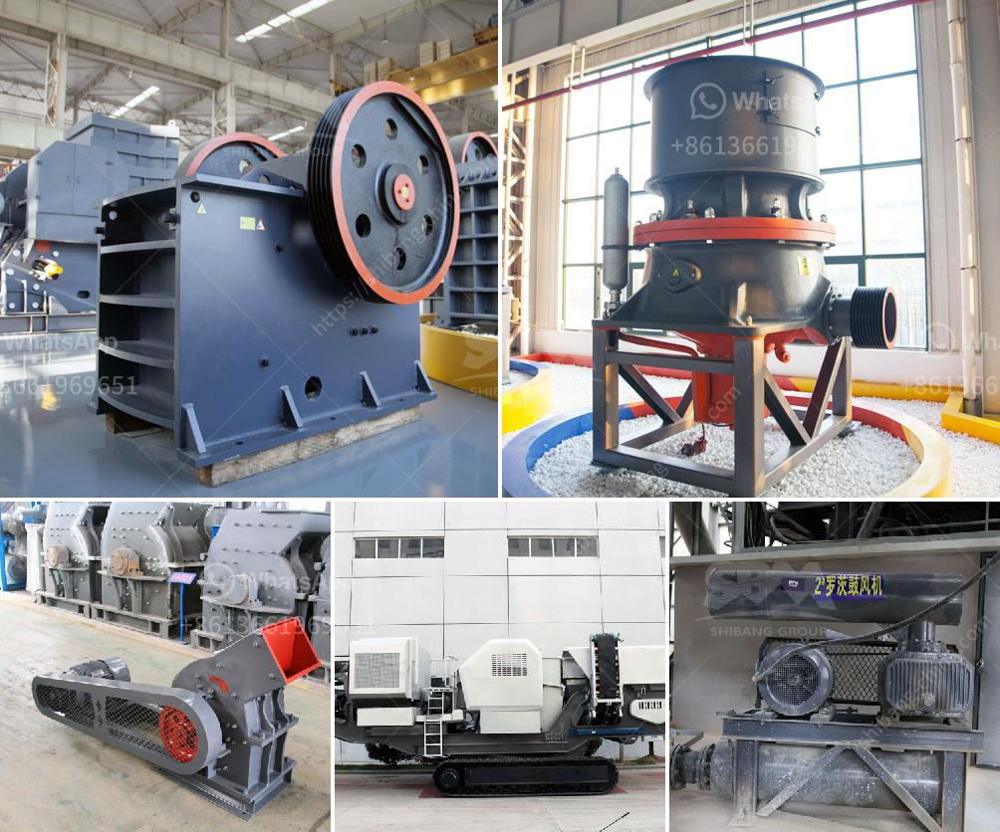

<h3>aggregates crushing plant assembly in china</h3>
Aggregates are the most basic building materials used in construction. They offer strength, stability, and durability to the structures. To meet the growing demand for aggregates, various industries have set up crushing plants. These plants use equipment to crush or grind rocks and convert them into small granules of the required size. Stone crushing is one of the major activities in these plants, as raw material for various construction activities.

With the rapid development of China's infrastructure, the demand for aggregates has been increasing. To meet this demand efficiently, many aggregates crushing plants have been established in China. These plants have necessary equipment such as crushers, screens, conveyors, and control systems to efficiently crush and separate various sizes of rock aggregates.

The assembly of aggregates crushing plants follows a well-planned layout design. The plant should be set up in a way that it reduces the distance the raw materials have to travel before being processed. This will reduce transportation costs and increase productivity. The crushing plant should also have adequate space for trucks to offload their materials easily.

China has many manufacturers specializing in building aggregates crushing plants. These manufacturers provide high-quality equipment that meets the national and international standards for safety and efficiency. Some of the popular manufacturers in China include Great Wall Company, Henan Hongxing Mining Machinery Co., Ltd., and Shanghai Shibang Machinery Co., Ltd. These manufacturers provide a complete range of equipment required in the aggregates crushing process.

The process of aggregates crushing involves multiple stages. The raw materials are first extracted from the quarries and transported to the crushing plant in dump trucks. After being unloaded, the materials are fed into the crushers, which break them into smaller pieces. The crushed materials then pass through screens to separate them into different sizes. The fine aggregates are sent to storage silos, while the larger ones are further crushed or sent for final processing.

The assembly of a crushing plant typically takes several weeks. It involves the installation of the crushers, screens, conveyors, and other equipment. The assembly process requires skilled workers and proper coordination to ensure that everything is installed correctly. The plant should also be connected to a reliable power source and have appropriate water supply for dust control and washing the aggregates.

Once the assembly is complete, the crushing plant should be regularly maintained to ensure its smooth operation. Regular inspection and maintenance of the equipment will help prolong its lifespan and reduce downtime. Additionally, the plant should adhere to environmental regulations by implementing proper dust control measures and wastewater treatment systems.

In conclusion, the assembly of aggregates crushing plants in China plays a crucial role in meeting the ever-increasing demand for construction materials. These plants are equipped with high-quality equipment that efficiently crushes and separates rocks to produce various sizes of aggregates. The process involves multiple stages and requires skilled workers for smooth assembly and operation. By adhering to proper maintenance and environmental regulations, these crushing plants contribute to the sustainable development of China's construction industry.
<h3>Contact us</h3><ul><li><strong>Whatsapp:&nbsp;<a href="https://wa.me/8613661969651">+8613661969651</a></strong></li><li><a href="https://swt.shibang-china.com/?git&amp;zhl&amp;aggregates crushing plant assembly in china"><strong>Online Service(chat now)</strong></a></li></ul><h3>Related</h3><ul><li><a href='price of hammer mill in nigeria.md'>price of hammer mill in nigeria</a></li><li><a href='concrete aggregate recycle machine.md'>concrete aggregate recycle machine</a></li><li><a href='crusher for sale in nigeria.md'>crusher for sale in nigeria</a></li><li><a href='differences with gyratory crusher cone crusher.md'>differences with gyratory crusher cone crusher</a></li><li><a href='crusher plant cost estimation.md'>crusher plant cost estimation</a></li></ul>