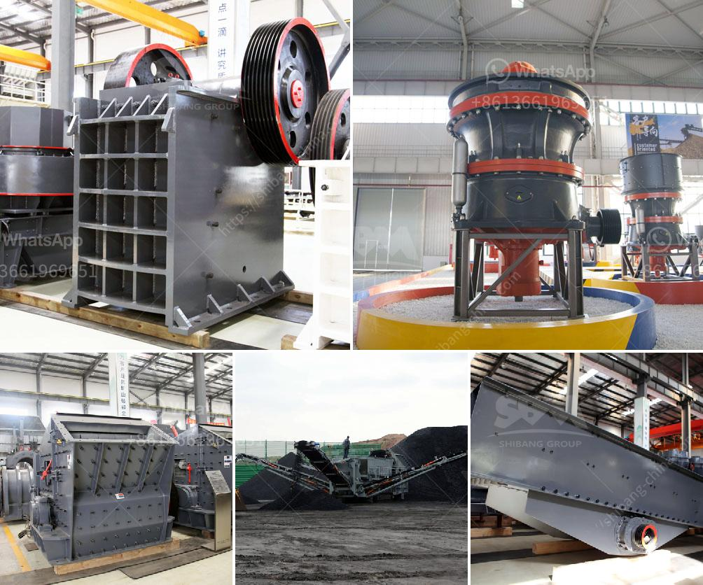

<h3>alluvial gold mining methods in zimbabwe</h3>
Alluvial gold mining is a type of gold mining that occurs in riverbeds and floodplains. It is a traditional method of extracting gold from sedimentary materials. These materials are deposited in the bed of a river or on its floodplains, and the extraction of gold from them is done through the use of gravity, rather than chemical processes.

In Zimbabwe, alluvial gold mining is carried out by individuals and small-scale miners who work with rudimentary tools and equipment. Most of these miners rely on physical labor to extract gold from gravel and sand deposits in riverbeds and floodplains. This type of mining is characterized by its simplicity and low cost.

One of the main methods used in alluvial gold mining is the use of water. By washing and panning the material extracted, miners are able to separate gold particles from other sediments. Gold particles can be easily distinguished due to their heavier weight, as they sink to the bottom while other lighter particles are carried away by the water.

Panning is one of the oldest and simplest methods used in alluvial gold mining. It involves placing a small amount of sediment in a pan and agitating it with water. As the material is swirled around, the heavier gold particles settle at the bottom of the pan, while lighter materials are washed away. This process is repeated until only the gold remains in the pan.

Another method commonly used in alluvial gold mining is sluicing. Sluice boxes are long, narrow troughs that are placed in streams or rivers. Water is directed into the sluice box, and the current carries the sediment through it. As the water flows over riffles or grooves in the sluice box, gold particles become trapped. Miners then collect the gold by carefully washing the sediments out of the sluice box.

Dredging is another method used in alluvial gold mining. This method involves using a machine called a dredge, which is similar to a floating vacuum cleaner. The dredge sucks up sediment from the riverbed or floodplain, and the gold particles are separated from the other materials onboard the dredge. Dredges can be operated by a single person or a small team of miners.

Alluvial gold mining has a long history in Zimbabwe, dating back to the pre-colonial era. Zimbabwean alluvial gold miners carried out mining activities in the country for centuries before the arrival of the Europeans. Some of the oldest alluvial gold mining artifacts were discovered in the eastern areas of Zimbabwe, dated to around the 9th century.

In recent years, alluvial gold mining has faced challenges due to environmental concerns and changes in regulations. The use of mercury in gold extraction has been banned in Zimbabwe due to its detrimental effects on human health and the environment. Miners now need to find alternative methods that are safer and more sustainable.

Despite these challenges, alluvial gold mining remains an important source of livelihoods for many people in Zimbabwe. The simplicity and low cost of the methods used make it an accessible option for small-scale miners. With proper regulations and support, alluvial gold mining can continue to contribute to the country's economy and the well-being of its communities.
<h3>Contact us</h3><ul><li><strong>Whatsapp:&nbsp;<a href="https://wa.me/8613661969651">+8613661969651</a></strong></li><li><a href="https://swt.shibang-china.com/?git&amp;zhl&amp;alluvial gold mining methods in zimbabwe"><strong>Online Service(chat now)</strong></a></li></ul><h3>Related</h3><ul><li><a href='aggregates crusher plant near in manila.md'>aggregates crusher plant near in manila</a></li><li><a href='types of equipments used in cement industry.md'>types of equipments used in cement industry</a></li><li><a href='cost of clinker grinding and cement plant.md'>cost of clinker grinding and cement plant</a></li><li><a href='metal crusher manufacturers in colombia.md'>metal crusher manufacturers in colombia</a></li><li><a href='dry ball mill for silica powder.md'>dry ball mill for silica powder</a></li></ul>