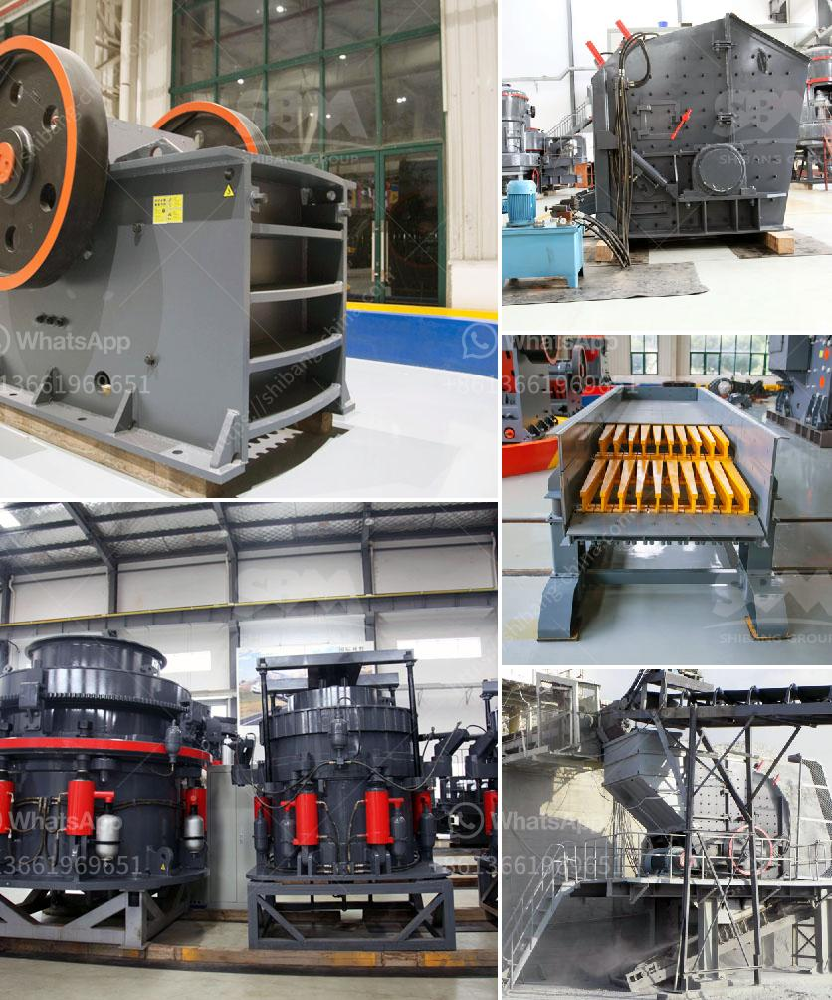

<h3>almada crusher machine in mumbai</h3>
The metropolitan city of Mumbai is famous for its bustling streets, towering skyscrapers, and vibrant culture. In the midst of this fast-paced lifestyle, there is a growing need for construction projects and building renovations. These projects require heavy-duty equipment and machinery to ensure efficiency and productivity. This is where the Almada Crusher Machine comes into play, making a significant impact on the construction industry in Mumbai.

The Almada Crusher Machine is a powerful and efficient machine designed to crush bricks and concrete efficiently. It is the brainchild of Suresh Almada, a visionary entrepreneur with an engineering background. He identified the need for a reliable crusher machine that could efficiently break down solid materials, significantly reducing the effort and time required for construction purposes.

One of the main reasons why the Almada Crusher Machine stands out from its competitors is its technology. The machine incorporates cutting-edge features that ensure streamlined operations and high-quality output. It boasts a robust crushing chamber that can process large volumes of materials with ease. The powerful motor and hydraulic system enable swift and efficient crushing, making it an ideal choice for construction companies.

Safety is a paramount concern in the construction industry, and the Almada Crusher Machine excels in this aspect. It is equipped with advanced safety features, including a safety switch that immediately shuts off the machine if any abnormalities are detected. This ensures the well-being of the operators and prevents accidents in the workplace. Additionally, the machine is designed to minimize noise and vibration, creating a more comfortable working environment.

Apart from its technological advancements, the Almada Crusher Machine also stands out for its versatility. It can crush a wide range of materials, including bricks, reinforced concrete, tiles, and asphalt. This versatility makes it an asset for various construction projects in Mumbai, from demolitions to road repairs. Moreover, the machine can be easily transported from one site to another, eliminating the need for multiple machines and reducing overall costs.

In terms of maintenance, the Almada Crusher Machine offers convenience and durability. The machine is constructed using high-quality materials that can withstand heavy usage and harsh conditions. Regular maintenance and servicing are minimal, ensuring maximum uptime for construction projects. Additionally, the Almada Crusher Machine comes with a comprehensive warranty, giving customers peace of mind and assurance of its reliability.

Recognizing the significance of sustainable development, the Almada Crusher Machine is designed with eco-consciousness in mind. It incorporates energy-efficient components that reduce power consumption without compromising its performance. Furthermore, the machine produces minimal dust and noise emissions, aligning with Mumbai's commitment to environmental preservation.

The Almada Crusher Machine has quickly gained popularity in Mumbai's construction industry, earning the trust and confidence of numerous contractors and builders. Its efficiency, safety features, versatility, and sustainability make it indispensable for any construction project. As the city continues to thrive and expand, the demand for such cutting-edge machinery will only increase, solidifying its place as an invaluable asset for construction companies in Mumbai.
<h3>Contact us</h3><ul><li><strong>Whatsapp:&nbsp;<a href="https://wa.me/8613661969651">+8613661969651</a></strong></li><li><a href="https://swt.shibang-china.com/?git&amp;zhl&amp;almada crusher machine in mumbai"><strong>Online Service(chat now)</strong></a></li></ul><h3>Related</h3><ul><li><a href='kaolin crusher manufacturers in uk.md'>kaolin crusher manufacturers in uk</a></li><li><a href='portable cement plant for sale in usa.md'>portable cement plant for sale in usa</a></li><li><a href='stone crusher discount.md'>stone crusher discount</a></li><li><a href='german made stone crushers.md'>german made stone crushers</a></li><li><a href='bauxite ore processing equipment price.md'>bauxite ore processing equipment price</a></li></ul>