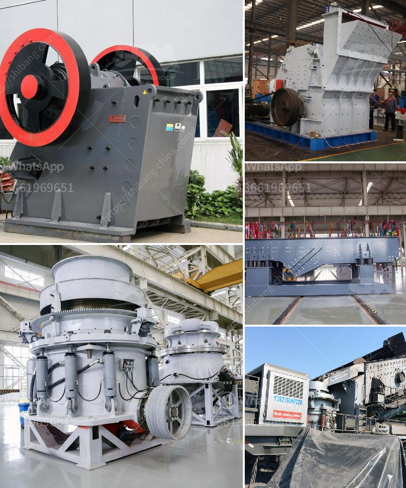

<h3>almeida stone crusher</h3>
For over 90 years, Almeida stone crushers have been an ideal choice for crushing materials from soft to medium-hard rocks. With their extensive experience in the field, Almeida crushers have proven their proficiency in delivering consistent crushing results. Whether it is the toughest of quarry stones or hard granite materials, these stone crushers are built to handle it all.

Almeida stone crushers are leading manufacturers and suppliers of crush and grind granites, quartz, stone, river gravel, iron ore, manganese ore and other hard materials. Based on years of industry experience and customer feedback, Almeida Crushers are built to deliver low cost per ton crushing with reliable performance.

The rugged and robust design of Almeida stone crushers makes them capable of handling heavy-duty applications. With high capacity and reliability, they are capable of breaking down even the toughest of materials. The crushers are equipped with heavy-duty double-row spherical roller bearings, ensuring continuous and efficient crushing.

Almeida stone crushers facilitate proper crushing of aggregates into finer particles, ensuring the desired end product. It can be used for a variety of applications, including road construction projects, railway ballast, concrete production, and other similar activities. These crushers are also widely used in the mining industry for crushing different types of ores and minerals.

One distinctive feature of Almeida stone crushers is that the closure and opening of the jaws are synchronized to reduce the surging of material and prevent jamming. In addition, the crushers are equipped with hydraulic systems that provide quick and easy adjustment of the crusher settings. This ensures maximum productivity and a consistent end product size.

The availability of different jaw plate designs and materials allows Almeida stone crushers to be customized according to specific requirements. This versatility makes them suitable for a wide range of applications, as different materials require different crushing approaches.

The low operating costs of Almeida stone crushers make them an affordable option for stone crushing operations. The crushers consume less energy compared to other models available in the market, which translates into a higher ROI (Return on Investment) for the operators.

Almeida Stone Crushers pride themselves on their exceptional after-sales service and support. They offer comprehensive maintenance and spare parts programs, ensuring that their crushers are running optimally for extended periods. With a strong commitment to customer satisfaction, Almeida Crushers have gained a reputation as reliable and trusted partners in the stone crushing industry.

In conclusion, Almeida stone crushers have proved their mettle as dependable and efficient stone crushing machines. They offer remarkable performance and can handle even the most challenging materials. With their robust build, versatility, and low operating costs, Almeida stone crushers are an ideal choice for crushing applications in various industries. Whether for road construction projects or mining operations, Almeida crushers deliver consistent and reliable crushing results.
<h3>Contact us</h3><ul><li><strong>Whatsapp:&nbsp;<a href="https://wa.me/8613661969651">+8613661969651</a></strong></li><li><a href="https://swt.shibang-china.com/?git&amp;zhl&amp;almeida stone crusher"><strong>Online Service(chat now)</strong></a></li></ul><h3>Related</h3><ul><li><a href='quarry aggregate crusher manufacturing process ppt.md'>quarry aggregate crusher manufacturing process ppt</a></li><li><a href='production grinding mill europe.md'>production grinding mill europe</a></li><li><a href='crushing plant pdf.md'>crushing plant pdf</a></li><li><a href='granite quarry organisation chart.md'>granite quarry organisation chart</a></li><li><a href='aggregate quarry plant.md'>aggregate quarry plant</a></li></ul>