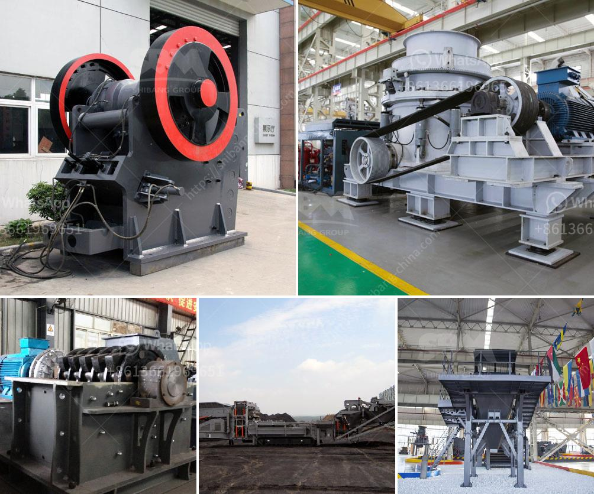

<h3>almond sand stone crusher price</h3>
Almond sand stone crusher refers to a machine used for crushing almandine sand stones. With the rapid development of construction industry, more and more investors start to invest in almond sand stone crushing. Many clients pay attention to the price when choosing a crusher, and the price of crushed stone equipment is often high due to the high cost of transportation, complex logistics, expensive technology, and equipment investment.

The price of almond sand stone crusher is affected by many factors. The first factor is the manufacturer. Many manufacturers produce different crusher equipment, and their prices are also different. The quality and performance of the equipment produced by different manufacturers are also different. As a result, the prices will vary. Therefore, when selecting a manufacturer, clients should not only pay attention to the price, but also consider the quality and after-sales service of the equipment.

The second factor that affects the price of almond sand stone crusher is the model of the equipment. Different models have different processing capacities, feeding sizes, and power requirements. Therefore, the prices of different models are also different. Clients should choose the appropriate model according to their actual needs and budget.

The third factor is the market demand and supply. When the demand for almond sand stone crusher is high, the price will also increase. Conversely, when the demand is low, the price will decrease. In addition, the supply of raw materials affects the price. If the supply is abundant, the price will decrease, and vice versa.

Apart from these factors, there are other influencing elements such as the cost of labor, transportation, and raw materials. All these factors contribute to the final price of almond sand stone crusher.

To get a reasonable price for almond sand stone crusher, clients can compare prices from different manufacturers and choose the one that offers the best quality and reasonable price. They can also negotiate with the manufacturer to get a better price or explore the possibility of buying used equipment at a lower price.

Overall, the price of almond sand stone crusher varies depending on multiple factors. Clients should consider these factors and their budget before making a purchase. It is also recommended to choose a reliable manufacturer that offers good after-sales service and a warranty period. By doing so, clients can ensure the best value for their investment and have a durable and efficient crusher for their almond sand stone crushing needs.
<h3>Contact us</h3><ul><li><strong>Whatsapp:&nbsp;<a href="https://wa.me/8613661969651">+8613661969651</a></strong></li><li><a href="https://swt.shibang-china.com/?git&amp;zhl&amp;almond sand stone crusher price"><strong>Online Service(chat now)</strong></a></li></ul><h3>Related</h3><ul><li><a href='thailand for stone crusher plant.md'>thailand for stone crusher plant</a></li><li><a href='vertical shaft impact crusher design.md'>vertical shaft impact crusher design</a></li><li><a href='gypsum crusher machine for sale.md'>gypsum crusher machine for sale</a></li><li><a href='hp ball mill motors.md'>hp ball mill motors</a></li><li><a href='screen for iron ore pellets.md'>screen for iron ore pellets</a></li></ul>