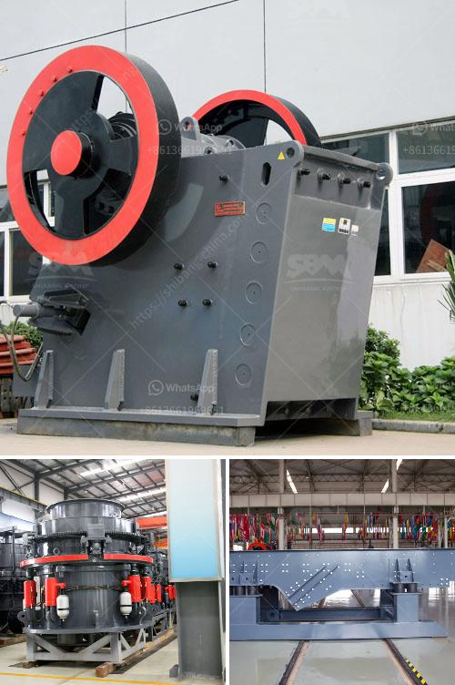

<h3>artificial sand production line</h3>
The artificial sand production line is a synthetic material produced by crushing rocks and quarry stones to create sand that helps improve the quality of construction projects. The sand is manufactured using state-of-the-art technology, consisting of jaw crushers, cone crushers, and vertical shaft impactors (VSI). This innovative process provides high-quality sand that is stronger, more durable, and consistent in size and shape compared to natural sand.

One of the significant advantages of using artificial sand is its consistency. Unlike natural sand, which can have varying qualities due to factors such as weather and environmental changes, synthetic sand ensures uniformity in its composition. This uniformity leads to better structural integrity, making it an ideal choice for construction purposes. The consistent texture of the artificial sand also aids in the smooth and efficient application of concrete, reducing the likelihood of cracks or imperfections in the finished product.

Another key benefit of the artificial sand production line is its eco-friendly nature. With the increasing demand for sand in construction projects, natural sand extraction has reached unsustainable levels, leading to significant environmental impacts. Mining of sand from riverbeds and beaches disrupts ecosystems, alters natural water flow, and degrades habitats for plants and animals. In contrast, artificial sand is produced by crushing and refining existing rocks and stones, minimizing the need to extract sand from sensitive areas. By opting for artificial sand, we help reduce the ecological footprint associated with traditional sand production.

Furthermore, the artificial sand production process is highly efficient, resulting in cost savings and increased productivity. Natural sand needs to be processed and screened to remove impurities, a time-consuming and labor-intensive task. In contrast, the artificial sand production line produces sand with consistent quality directly from the crushing process, eliminating the need for additional processing steps. The automated machinery involved in the production line ensures higher output and reduced human errors, contributing to enhanced productivity in construction projects.

The use of artificial sand also provides greater control over the characteristics of the sand used in construction. Depending on the project requirements, different types of sand can be produced by adjusting the crushing parameters and blending different rocks and stones. This flexibility allows developers and contractors to choose specific types of sand with desired properties, such as strength, coarseness, and permeability, to suit various applications.

In conclusion, the artificial sand production line presents a worthwhile investment for construction projects. Its consistency, eco-friendly nature, cost-effectiveness, and flexibility make it a superior alternative to natural sand. By adopting this technology, we can minimize the environmental impact caused by traditional sand mining and ensure the availability of high-quality sand for sustainable construction.
<h3>Contact us</h3><ul><li><strong>Whatsapp:&nbsp;<a href="https://wa.me/8613661969651">+8613661969651</a></strong></li><li><a href="https://swt.shibang-china.com/?git&amp;zhl&amp;artificial sand production line"><strong>Online Service(chat now)</strong></a></li></ul><h3>Related</h3><ul><li><a href='vertical mill ireland.md'>vertical mill ireland</a></li><li><a href='hammer mill malaysia.md'>hammer mill malaysia</a></li><li><a href='almada crusher machine in mumbai.md'>almada crusher machine in mumbai</a></li><li><a href='raymond mill company.md'>raymond mill company</a></li><li><a href='aggregates crusher plant near in manila.md'>aggregates crusher plant near in manila</a></li></ul>