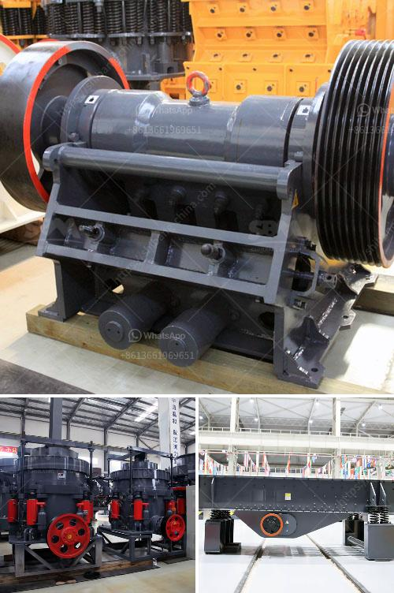

<h3>artificial sand vs natural sand</h3>
The construction industry relies heavily on sand, as it is used in various applications, including concrete production, road construction, and land reclamation. However, with the increasing demand for sand, concerns about its availability and environmental impact have arisen. This has led to the introduction of artificial sand as a potential alternative to natural sand. While both options have their advantages and drawbacks, understanding their differences and applications is essential for making an informed choice.

Natural sand, as the name suggests, is obtained from natural deposits like riverbeds, beaches, and deserts. It is primarily composed of finely divided rock and mineral particles, which are usually sorted by size. Its composition and gradation make it suitable for construction purposes, facilitating the movement and bonding of cement particles in concrete production. Furthermore, natural sand has a rounded shape, enabling good workability during construction activities.

However, the extraction of natural sand has raised concerns due to its environmental impact. The process often involves dredging riverbeds, leading to habitat destruction and increased vulnerability to flooding. Additionally, sand mining contributes to erosion and sedimentation, thereby altering river channels and reducing biodiversity. Moreover, the limited availability of natural sand in some regions, as well as its irregular particle shape, resulting in less cohesive concrete, have led to the exploration of artificial alternatives.

Artificial sand, also known as manufactured sand, is produced by crushing rocks, quarry stones, or larger aggregates into smaller grain sizes. It offers several advantages over natural sand when used in construction. For starters, it is free from impurities such as clay, silt, and organic matter, which can adversely affect the durability of concrete. Additionally, artificial sand has a more consistent particle size, resulting in a more uniform mix and better workability during concrete production.

Another advantage of artificial sand is its availability. Unlike natural sand, which is limited by geological formations, artificial sand can be produced in large quantities, meeting the growing demand of the construction industry. This reduces the reliance on natural resources and minimizes the need for sand extraction, potentially mitigating environmental damage caused by sand mining.

However, despite these advantages, artificial sand also has certain drawbacks worth considering. The process of producing artificial sand requires significant energy, typically by crushing and shaping hard rocks or aggregates. This results in higher production costs and a larger carbon footprint compared to natural sand. Furthermore, the sharp and angular particles of artificial sand may reduce workability, increase water demand, and affect the strength of concrete, especially in higher volumes.

In conclusion, the choice between artificial sand and natural sand depends on the specific needs and priorities of a construction project. While natural sand offers better workability and cohesion, its extraction and environmental impact are major concerns. Artificial sand, on the other hand, provides a consistent particle size, is readily available, and reduces the reliance on natural resources. However, its production process requires more energy and may impact the strength of concrete. Ultimately, striking a balance between these factors is crucial for achieving sustainable construction practices and minimizing environmental degradation.
<h3>Contact us</h3><ul><li><strong>Whatsapp:&nbsp;<a href="https://wa.me/8613661969651">+8613661969651</a></strong></li><li><a href="https://swt.shibang-china.com/?git&amp;zhl&amp;artificial sand vs natural sand"><strong>Online Service(chat now)</strong></a></li></ul><h3>Related</h3><ul><li><a href='tonne stone crusher cost sale.md'>tonne stone crusher cost sale</a></li><li><a href='delhi ball mill ceramic lining.md'>delhi ball mill ceramic lining</a></li><li><a href='sand washing plant in turkey.md'>sand washing plant in turkey</a></li><li><a href='total gypsum mill production in india.md'>total gypsum mill production in india</a></li><li><a href='secondary jaw crusher.md'>secondary jaw crusher</a></li></ul>