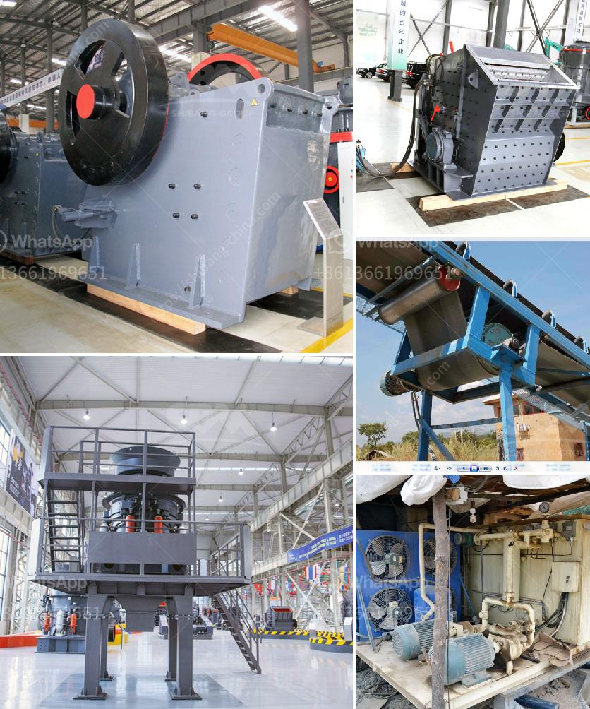

<h3>as selecting a hammer mill</h3>
A hammer mill is a versatile machine used in various industries for grinding, crushing, and reducing materials into smaller particles. It is a vital piece of equipment that plays a crucial role in many processing operations. However, with numerous options available in the market, selecting the right hammer mill can be a daunting task. This article aims to guide you through the process of choosing a hammer mill that suits your specific needs.

The first step in selecting a hammer mill is to determine your processing requirements. Consider the type of material you will be processing, as different materials have different characteristics and require specific machines. If you are dealing with softer materials such as grains or biomass, a less powerful mill may suffice. However, if you are working with harder materials like minerals or rocks, you will need a more robust mill.

Next, assess the size and capacity requirements. Hammer mills come in various sizes, ranging from small laboratory models to large industrial mills. The capacity of the mill is determined by the size and speed of the rotor, as well as the size of the screen openings. Smaller models are suitable for lower volumes, while larger models are better suited for high-capacity production lines. Carefully consider your production needs to ensure you choose a mill that can handle your desired output.

Another important factor to consider is the maintenance and operational costs associated with the hammer mill. Look for mills that are easy to maintain, with accessible parts and clear instructions for maintenance procedures. Additionally, consider the power requirements of the machine and whether it aligns with your available power source. Opting for an energy-efficient mill can help reduce operational costs in the long run.

The durability and construction of the mill should also be taken into account. Look for mills made from high-quality materials that can withstand the demands of your application. Stainless steel mill constructions are preferable for industries dealing with food processing or corrosive materials, as they offer better resistance to rust and contamination. Furthermore, check for features such as reversible rotors or easily replaceable wear parts, which can extend the lifespan of the mill and save you costs in the long term.

Lastly, but equally important, is evaluating the reputation and support provided by the manufacturer. Choose a reputable manufacturer with a proven track record of producing reliable and efficient machines. Research customer reviews, seek recommendations from industry peers, and inquire about warranty and after-sales support. Working with a trusted manufacturer ensures that you have access to technical support and spare parts whenever needed.

In conclusion, selecting the right hammer mill requires careful consideration of your processing requirements, capacity needs, maintenance costs, construction materials, and manufacturer reputation. By thoroughly analyzing these factors, you can make an informed decision and choose a hammer mill that is best suited for your specific application. Remember, investing in the right equipment will enhance your operational efficiency, reduce downtime, and contribute to the overall success of your business.
<h3>Contact us</h3><ul><li><strong>Whatsapp:&nbsp;<a href="https://wa.me/8613661969651">+8613661969651</a></strong></li><li><a href="https://swt.shibang-china.com/?git&amp;zhl&amp;as selecting a hammer mill"><strong>Online Service(chat now)</strong></a></li></ul><h3>Related</h3><ul><li><a href='jaw crusher price in china.md'>jaw crusher price in china</a></li><li><a href='crushing plant cost.md'>crushing plant cost</a></li><li><a href='how to start a sand mining business in south africa.md'>how to start a sand mining business in south africa</a></li><li><a href='quote for vsi crusher.md'>quote for vsi crusher</a></li><li><a href='calcium carbonate mill equipment.md'>calcium carbonate mill equipment</a></li></ul>