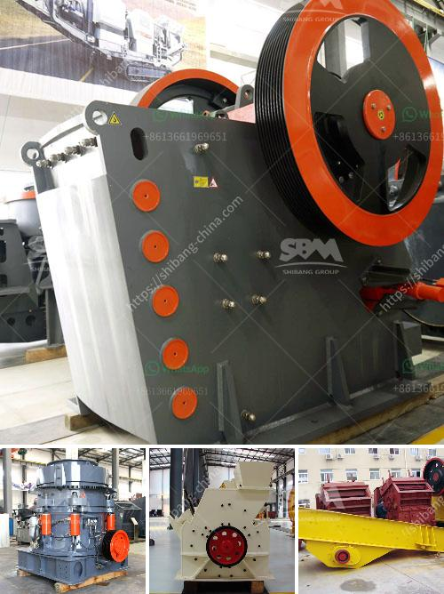

<h3>ball coal crusher industries</h3>
Ball coal crusher is widely used in the mining and coal industry. It plays an important role in the processing of raw coal and is favored by major coal mining companies. But due to the diversification of mining technology and the increasing of the types of coal mined, the ball coal crusher industry is gradually expanding its scope and enriching its categories.

The ball coal crusher industry has grown steadily in recent years and is diversifying its products and applications. Along with the development of technology, there are various types of crushing equipment for different applications. To meet the needs of different industries, crushers are also evolving and improving.

The ball coal crusher industry has developed into a mature industry, and there are a variety of ball coal crushers such as jaw crusher, impact crusher, cone crusher, hammer crusher, and roller crusher. Among them, ball coal crushers are the most widely used due to their high crushing efficiency and large production capacity.

Ball coal crushers are mainly used to crush coal, while crushers like jaw crushers, impact crushers, and cone crushers are mainly used to crush stones. The ball coal crusher has become a popular option for coal crushing, with its large crushing ratio, high production capacity, and low energy consumption.

However, the ball coal crusher has its own drawbacks. The main disadvantages are its relatively large size and high power consumption when compared to other types of crushers. It is also not suitable for crushing hard materials like iron ore and quartz. Therefore, in some mining industries, ball coal crushers are gradually being replaced by other types of crushers.

In order to ensure the normal operation of the ball coal crusher, it is necessary to carry out regular maintenance. The maintenance includes inspection, lubrication, and cleaning of the equipment. Regular maintenance can effectively extend the service life of the ball coal crusher and improve its efficiency.

In addition, the development of technology is also driving innovation in the ball coal crusher industry. For example, the emergence of hydraulic control systems and electronic intelligent control systems has greatly improved the automation level and production efficiency of the ball coal crusher. In the future, with the continuous advancement of technology, the ball coal crusher industry will continue to innovate and develop.

Overall, the ball coal crusher industry has made great progress in recent years. It has become an indispensable part of the coal mining industry and plays an important role in the processing of raw coal. Although there are still some challenges and limitations, the ball coal crusher industry is continuously improving and expanding its scope to meet the growing demands of the industry.
<h3>Contact us</h3><ul><li><strong>Whatsapp:&nbsp;<a href="https://wa.me/8613661969651">+8613661969651</a></strong></li><li><a href="https://swt.shibang-china.com/?git&amp;zhl&amp;ball coal crusher industries"><strong>Online Service(chat now)</strong></a></li></ul><h3>Related</h3><ul><li><a href='cost of crusher machine for grinding mica.md'>cost of crusher machine for grinding mica</a></li><li><a href='aggregates crashing plant in nigeria.md'>aggregates crashing plant in nigeria</a></li><li><a href='cement plant equipment from china.md'>cement plant equipment from china</a></li><li><a href='ball mills machine.md'>ball mills machine</a></li><li><a href='stone crusher machine for sale ethiopia.md'>stone crusher machine for sale ethiopia</a></li></ul>