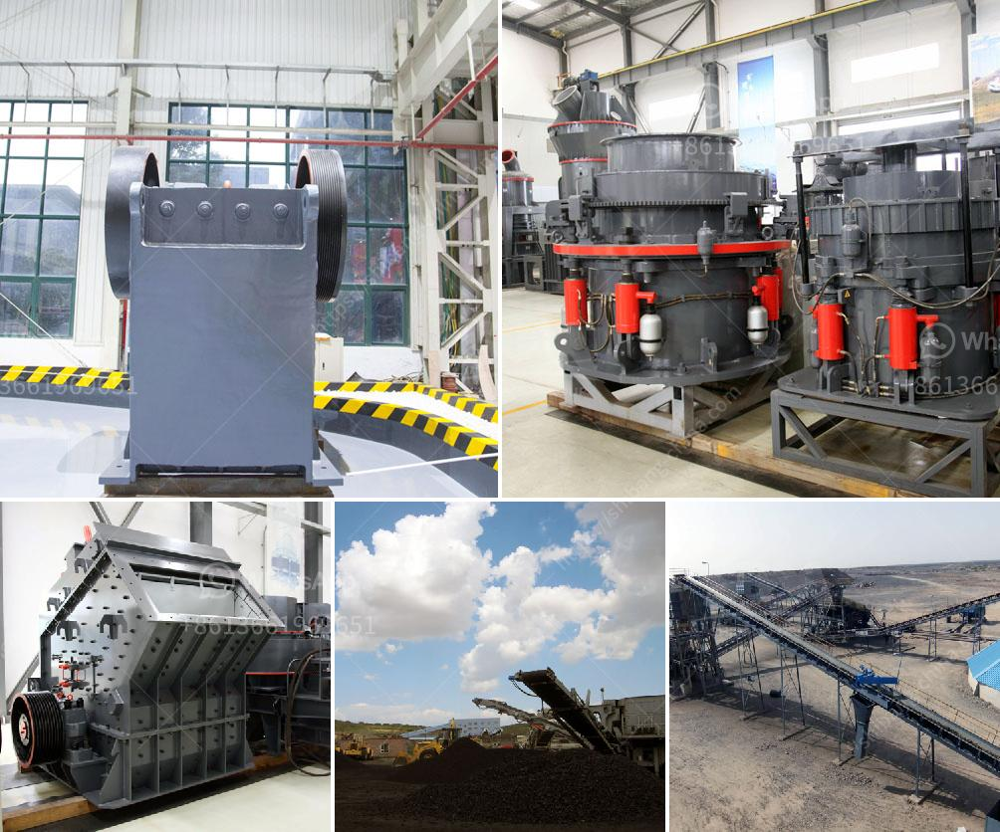

<h3>ball grinder machine</h3>
A ball grinder machine is a type of grinding equipment used to grind and blend materials for use in mineral dressing processes, paints, pyrotechnics, ceramics, and selective laser sintering. It works on the principle of impact and attrition: size reduction is done by impact as the grinding media (usually steel balls) collide with the material to be ground. 

With the ability to grind materials into fine powder or a fine paste, the ball grinder machine is widely used in industrial sectors such as cement, silicate products, new building materials, refractory materials, fertilizers, ferrous and non-ferrous metals beneficiation, and glass ceramics. It can grind various ores and other materials dry or wet, making it suitable for both conventional and wet grinding.

The ball grinder machine consists of a cylindrical drum, sometimes tapered at one end, and usually has a charge of steel balls (up to 40% by volume) ranging in size up to 125mm for larger mills. The larger the diameter, the slower the rotation. The ball grinder also features a hollow shaft which is equipped with an inner sleeve to prevent wear and tear from the abrasive materials being ground.

When the ball grinder machine is in operation, the materials are fed into the drum through the hollow shaft, and the grinding media rotate along with the drum. The material is crushed and ground by the impact and grinding action of the steel balls as they fall back into the hollow shaft.

The advantages of using a ball grinder machine include its high grinding efficiency, low energy consumption, and the ability to grind various materials. Additionally, it offers a smooth operation and requires minimal maintenance. However, it is essential to choose the right size of steel balls and adjust the grinding media based on the type of material being ground to achieve the desired results.

In conclusion, a ball grinder machine is an indispensable tool for grinding and polishing materials in various industrial applications. With its efficient grinding action, it provides a cost-effective solution for processing materials into fine powders or pastes. By selecting the appropriate grinding media and adjusting the machine parameters, users can achieve the desired grinding efficiency and obtain high-quality end products.
<h3>Contact us</h3><ul><li><strong>Whatsapp:&nbsp;<a href="https://wa.me/8613661969651">+8613661969651</a></strong></li><li><a href="https://swt.shibang-china.com/?git&amp;zhl&amp;ball grinder machine"><strong>Online Service(chat now)</strong></a></li></ul><h3>Related</h3><ul><li><a href='limestone plant and machinery.md'>limestone plant and machinery</a></li><li><a href='ball mill for gold in south africa.md'>ball mill for gold in south africa</a></li><li><a href='simple grinding mill type in ethiopia.md'>simple grinding mill type in ethiopia</a></li><li><a href='ethiopia unused cone crusher for sale.md'>ethiopia unused cone crusher for sale</a></li><li><a href='new quartz plant cost in india.md'>new quartz plant cost in india</a></li></ul>