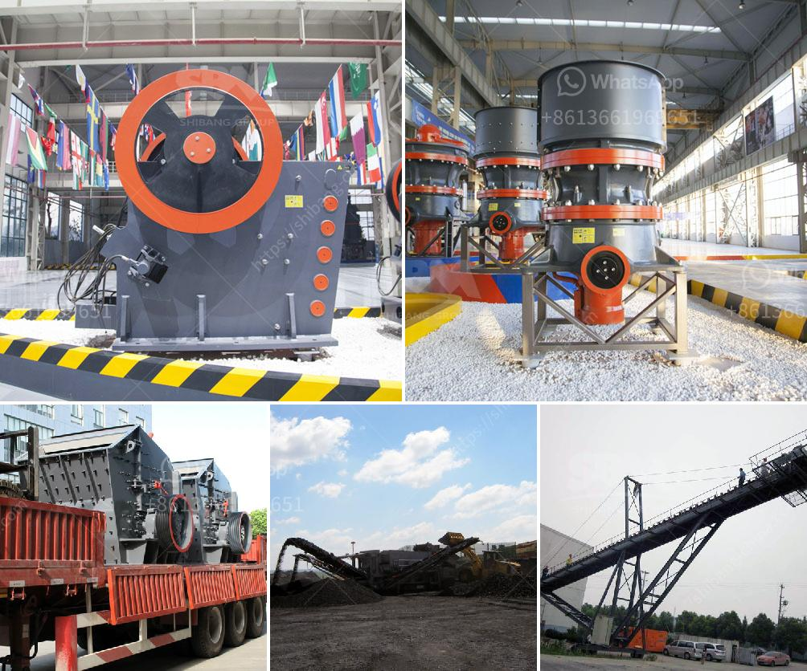

<h3>ball grinding mill india</h3>
India is rich in mineral resources and has a strong mining industry, which has been attracting various global players to the country. In recent years, the grinding mill market has witnessed a significant growth in India. The demand for ball mills has been increasing rapidly, owing to their versatility and efficiency in grinding bulk materials.

Ball grinding mills are widely used in the mining industry, cement industry, chemical industry, pharmaceutical industry, construction materials industry, and many other sectors. Ball mills are popular due to their simple structure, easy maintenance, and reliable operation.

A ball mill consists of a hollow cylindrical shell rotating about its axis. The axis of the shell may be horizontal or at a small angle to the horizontal. It is partially filled with balls. The grinding media are the balls, which may be made of steel, stainless steel, ceramic, or rubber. The inner surface of the cylindrical shell is usually lined with an abrasion-resistant material such as manganese steel or rubber.

The grinding media in a ball mill can be either steel balls or ceramic ones. Steel balls are heavier and stronger, whereas ceramic balls are lighter and more chemically inert. Ceramic balls are especially suitable for grinding explosive materials due to their low reaction with the material being ground.

The size, diameter, and length of a ball mill depend on the hardness, grindability, and moisture content of the material to be ground. The feed size, the mill speed, and the ball filling ratio also have a significant impact on the efficiency of the grinding operation.

Ball mills are available in various designs and sizes, ranging from laboratory scale to industrial scale. Among them, planetary ball mills and agitated media mills are commonly used for grinding applications.

In India, the grinding mill market has immense potential and is expected to grow at a significant pace in the coming years. With increasing investments in the mining industry and a constructive government approach, India is witnessing a steady rise in demand for grinding mills.

Several leading players in the industry are expanding their operations in India to cater to the growing market. Companies from overseas are also establishing their presence in the country to tap into the promising opportunities. This trend is primarily driven by factors such as increasing urbanization, infrastructure development projects, and the rising demand for quality products.

In conclusion, India's ball grinding mill market is witnessing remarkable growth. The demand for ball mills has been increasing rapidly due to their versatility and efficiency in grinding bulk materials. The grinding mill industry in India is expected to witness significant growth, driven by increasing investments in the mining industry and the government's initiatives to promote various sectors. With the presence of both domestic and international players, the market is expected to provide abundant opportunities for growth and innovation.
<h3>Contact us</h3><ul><li><strong>Whatsapp:&nbsp;<a href="https://wa.me/8613661969651">+8613661969651</a></strong></li><li><a href="https://swt.shibang-china.com/?git&amp;zhl&amp;ball grinding mill india"><strong>Online Service(chat now)</strong></a></li></ul><h3>Related</h3><ul><li><a href='operation of stone crushing plant.md'>operation of stone crushing plant</a></li><li><a href='aggregate crushing plant and processing.md'>aggregate crushing plant and processing</a></li><li><a href='10 tpd grindig mill manufacturers philippines.md'>10 tpd grindig mill manufacturers philippines</a></li><li><a href='setting up a stone quarry crusher business.md'>setting up a stone quarry crusher business</a></li><li><a href='closed of all crushing plant.md'>closed of all crushing plant</a></li></ul>