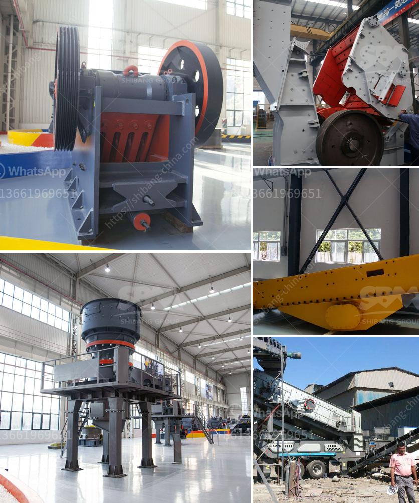

<h3>ball india ball mills 220 tph</h3>
Ball mills are widely used in the mining industry for grinding various ores and other materials, and have become an essential part of the mining industry in India. With the growing need for efficient grinding solutions, ball mills are increasingly being used for grinding raw materials to a finer particle size, thereby improving the overall efficiency of the grinding process.

One of the leading manufacturers of ball mills in India is Ball India. They specialize in designing and manufacturing ball mills with different capacities to meet the diverse grinding requirements of their clients. One of their popular models is the Ball India Ball Mills 220 TPH.

The Ball India Ball Mills 220 TPH is a versatile grinding mill, designed to grind and blend materials for use in various industries such as cement, power generation, and mining. With its compact design and high grinding efficiency, this mill can be used for both dry and wet grinding applications, making it ideal for a wide range of materials.

One of the key features of the Ball India Ball Mills 220 TPH is its advanced control system, which allows for precise control over the grinding process. This ensures a consistent and uniform product quality, thereby reducing the possibility of product variations. The control system also helps in optimizing the mill's performance and energy consumption, resulting in significant cost savings for the user.

In addition to its advanced control system, the Ball India Ball Mills 220 TPH also features a robust construction that ensures long-lasting performance even under the toughest operating conditions. The mill is equipped with high-quality grinding media, which ensures efficient grinding and reduces wear and tear, thereby extending the mill's service life.

Another notable feature of the Ball India Ball Mills 220 TPH is its low maintenance requirements. The mill is designed with easily accessible parts, making it easy to perform routine maintenance tasks. This not only saves valuable time but also reduces downtime, ensuring continuous and uninterrupted operation.

Furthermore, the Ball India Ball Mills 220 TPH can be customized to meet specific grinding requirements. The mill can be equipped with different liners and grinding media, allowing for precise control over the grinding process and ensuring optimal grinding efficiency. This makes the mill an ideal choice for industries with specialized grinding needs.

In conclusion, the Ball India Ball Mills 220 TPH are an excellent choice for those looking to enhance their grinding efficiency. With its advanced control system, robust construction, and low maintenance requirements, this mill offers exceptional performance and reliability. Whether used in cement, power generation, or mining, the Ball India Ball Mills 220 TPH deliver efficient and precise grinding results, making them a valuable asset for any grinding operation in India.
<h3>Contact us</h3><ul><li><strong>Whatsapp:&nbsp;<a href="https://wa.me/8613661969651">+8613661969651</a></strong></li><li><a href="https://swt.shibang-china.com/?git&amp;zhl&amp;ball india ball mills 220 tph"><strong>Online Service(chat now)</strong></a></li></ul><h3>Related</h3><ul><li><a href='ball mill manufacturer in philippines.md'>ball mill manufacturer in philippines</a></li><li><a href='coal washing plant for sale in south africa.md'>coal washing plant for sale in south africa</a></li><li><a href='small scale copper refining equipment.md'>small scale copper refining equipment</a></li><li><a href='components for cone crusher major.md'>components for cone crusher major</a></li><li><a href='crushing stones for gold.md'>crushing stones for gold</a></li></ul>