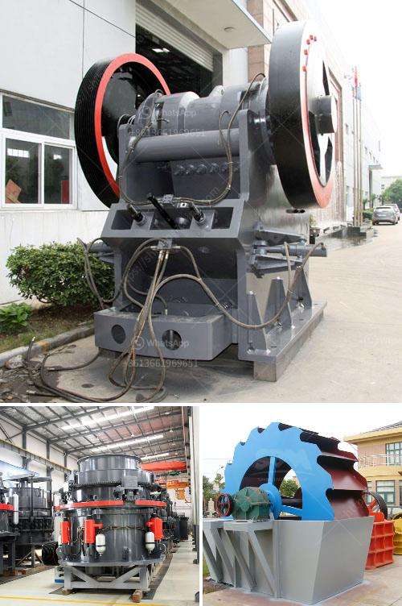

<h3>ball mill 35 ton price</h3>
The ball mill is a commonly used grinding equipment in the mineral processing industry. It is widely applied in the grinding of cement, silicate products, new building materials, refractory materials, fertilizers, black and non-ferrous metal dressings, and glass ceramics, dry or wet grinding of various ores and other grindable materials.

The ball mill consists of a cylindrical drum, sometimes tapered at one end, and usually has a charge of steel balls ranging in size up to 125mm for larger mills. Product size can be as small as 0.005mm, but product size is dependent upon the time the charge spends in the grinding zone and therefore the reduction rate is a function of the throughput. The ball mill is designed to accept a ball charge in accordance with F. C Bond's standard. This ball charge consists of 286 balls as follows: 44 x 35mm balls; 67 x 30mm balls; 10 x 25.4mm balls, 71 x 19.05mm balls and 94 x 12.7mm balls. Fully automated version of the Bond Index Ball Mill has been developed. It comprises a 7.5L drum with a back and forth movement capable of varying its rotation speed. The ball mills are known for their excellent performance.

The ball mill 35 ton price is positively correlated with the ball mill's cost price, product quality, and performance. The ball mill price in our company is reasonable and favorable. Our company insists on the principle of "quality first" and has established a strong quality management system, from raw material procurement, production, and manufacturing to finished product inspection. We strictly control every link to ensure that each ball mill leaving the factory meets the international standards. The high-quality ball mill usually has a long service life and stable performance. Investing in our ball mills won't let you down.

The price of the ball mill also depends on the models. The price of different models of ball mills ranges from tens of thousands to hundreds of thousands. The higher the purity and uniformity of the raw materials, the higher the price of the final product. In addition, the price of ball mills also depends on their production capacity. Generally, the larger the production capacity, the higher the cost. You can choose the appropriate ball mill according to your actual needs and budget.

To conclude, the ball mill is an essential grinding equipment in the mineral processing industry. The ball mill 35 ton price varies depending on the models, specifications, and quality. Investing in the ball mill will not only ensure its excellent performance but also minimize the overall production cost. Our company offers a reasonable and favorable price for different models and specifications to meet your needs. Choose our high-quality ball mills and bring more value to your mineral processing plants.
<h3>Contact us</h3><ul><li><strong>Whatsapp:&nbsp;<a href="https://wa.me/8613661969651">+8613661969651</a></strong></li><li><a href="https://swt.shibang-china.com/?git&amp;zhl&amp;ball mill 35 ton price"><strong>Online Service(chat now)</strong></a></li></ul><h3>Related</h3><ul><li><a href='cement factory equipment list.md'>cement factory equipment list</a></li><li><a href='mining equipment manufacturers colombia.md'>mining equipment manufacturers colombia</a></li><li><a href='small concrete crusher.md'>small concrete crusher</a></li><li><a href='gypsum crusher plant pdf.md'>gypsum crusher plant pdf</a></li><li><a href='copper ore machine in china.md'>copper ore machine in china</a></li></ul>