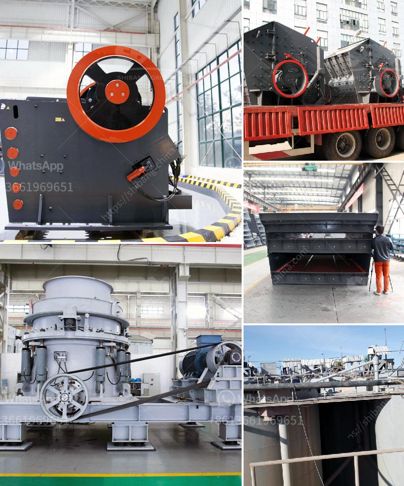

<h3>ball mill 5kg capacity price</h3>
The ball mill is a commonly used grinding equipment in the production of chemical fertilizers, ceramics, glass, and other industries. It plays an important role in the grinding and dispersing of various materials. The capacity of ball mills can vary significantly, ranging from a few kilograms to several tons. When choosing a ball mill, its capacity is an important factor to consider.

The capacity of a ball mill is determined by its size, with factors such as the diameter and length of the mill influencing its capacity. The larger the diameter and length, the higher the capacity. In addition to size, the material of construction also plays a role in determining the capacity. Ball mills made of durable materials such as steel or ceramic are able to withstand harsh conditions and have a longer lifespan.

One of the ball mills available in the market is a 5kg capacity ball mill. This ball mill is specifically designed for small-scale production and is capable of grinding materials in batches. It consists of a cylinder that rotates on its horizontal axis and is filled with steel balls of varied sizes depending on the desired fineness of the final product.

The price of a ball mill with a 5kg capacity can vary depending on the specifications and features offered by different manufacturers. However, a basic ball mill is relatively affordable, with prices ranging from $500 to $1000. More advanced models with higher capacity and additional features may have higher price tags.

When considering the price of a ball mill, it is essential to weigh the benefits it offers. A ball mill with a 5kg capacity can be a valuable investment for laboratories, research institutions, and small-scale production facilities. The ability to grind a range of materials in small batches can be advantageous for testing and optimizing various processes.

Another factor to consider is the cost-efficiency of the ball mill. While the initial price may seem significant, a durable and reliable ball mill can save costs in the long run. Its efficient grinding capabilities can reduce energy consumption and minimize maintenance and replacement expenses.

Furthermore, the versatility of a ball mill with a 5kg capacity can make it a valuable asset in various industries. It can be used for grinding and blending materials in the production of pigments, ceramics, and chemicals. The ability to control the grinding process and obtain precise fineness can lead to higher-quality products.

In conclusion, a ball mill with a 5kg capacity can be a cost-effective and efficient solution for small-scale production and testing purposes. Its price may vary depending on the specifications and features offered by different manufacturers. However, considering the benefits it offers in terms of versatility, cost-efficiency, and product quality, it can be a valuable investment for various industries.
<h3>Contact us</h3><ul><li><strong>Whatsapp:&nbsp;<a href="https://wa.me/8613661969651">+8613661969651</a></strong></li><li><a href="https://swt.shibang-china.com/?git&amp;zhl&amp;ball mill 5kg capacity price"><strong>Online Service(chat now)</strong></a></li></ul><h3>Related</h3><ul><li><a href='marble granding machine.md'>marble granding machine</a></li><li><a href='copper crusher manufacturer in turkey.md'>copper crusher manufacturer in turkey</a></li><li><a href='crusher manufacturers prices.md'>crusher manufacturers prices</a></li><li><a href='brand of conveyor belts.md'>brand of conveyor belts</a></li><li><a href='vertical grinding machine manufacturers.md'>vertical grinding machine manufacturers</a></li></ul>