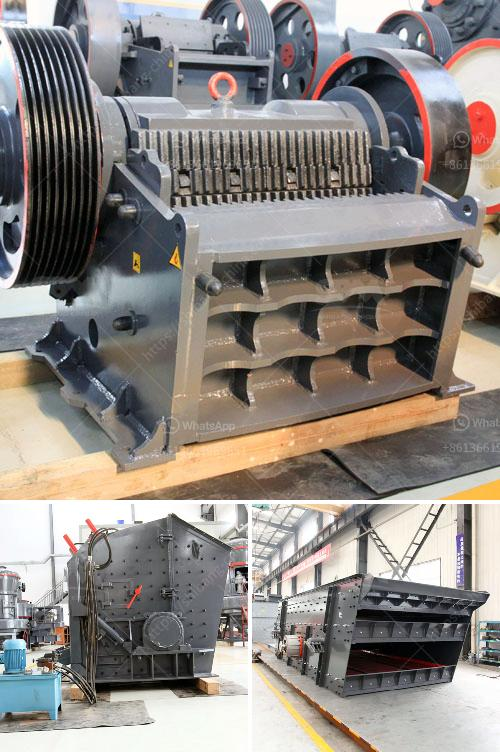

<h3>ball mill feed spout seal</h3>
The ball mill feed spout seal is installed in the feeding system of the ball mill, which effectively prevents the dust from entering the grinding drum to pollute the grinding media and the atmosphere.

3. The sealing system is reliable and easy to operate, ensuring the smooth operation of the ball mill.

The feed spout seal is an important component of the ball mill. It plays an important role in preventing dust pollution and reducing the generation of noise. It is also necessary for the normal operation of the ball mill. However, due to the complex structure of the feed spout seal, various problems will inevitably occur during use, such as leakage, blockage, and wear.

One of the common problems of the ball mill feed spout seal is that it is prone to leakage. This problem is mainly caused by the poor sealing performance of the labyrinth seal structure. When the ball mill is in operation, dust and moisture in the grinding drum will enter the feed spout, affecting the sealing effect of the labyrinth seal. Once the seal is damaged or aging, it will cause serious leakage, resulting in dust and moisture entering the grinding drum, polluting the grinding media, and reducing the efficiency of the grinding process. Therefore, it is necessary to regularly check and maintain the feed spout seal to ensure its sealing performance.

Another problem of the ball mill feed spout seal is blockage. This problem is mainly caused by the accumulation of dust and particles in the feed spout. When the ball mill is in operation, the feed spout will be blocked due to the accumulation of materials, affecting the normal feeding of the ball mill. To solve this problem, it is necessary to regularly clean the feed spout and remove the accumulated materials to ensure the smooth operation of the ball mill.

In addition, wear is also a common problem of the ball mill feed spout seal. During the grinding process, the friction between the grinding media and the feed spout seal will cause wear and tear, resulting in a decrease in the sealing performance of the seal. Therefore, it is necessary to regularly check the wear condition of the feed spout seal and replace it in time if necessary to ensure the sealing effect.

In conclusion, the ball mill feed spout seal is an important component that plays a significant role in preventing dust pollution, reducing noise, and ensuring the smooth operation of the ball mill. However, it is prone to various problems during use, such as leakage, blockage, and wear. Therefore, it is necessary to regularly check and maintain the feed spout seal to ensure its sealing performance and prolong its service life.
<h3>Contact us</h3><ul><li><strong>Whatsapp:&nbsp;<a href="https://wa.me/8613661969651">+8613661969651</a></strong></li><li><a href="https://swt.shibang-china.com/?git&amp;zhl&amp;ball mill feed spout seal"><strong>Online Service(chat now)</strong></a></li></ul><h3>Related</h3><ul><li><a href='cone crusher price in china.md'>cone crusher price in china</a></li><li><a href='quotations for stone crushers.md'>quotations for stone crushers</a></li><li><a href='rock crushers for making gravel.md'>rock crushers for making gravel</a></li><li><a href='milling machine grinding mill.md'>milling machine grinding mill</a></li><li><a href='products mobile cone crusher.md'>products mobile cone crusher</a></li></ul>