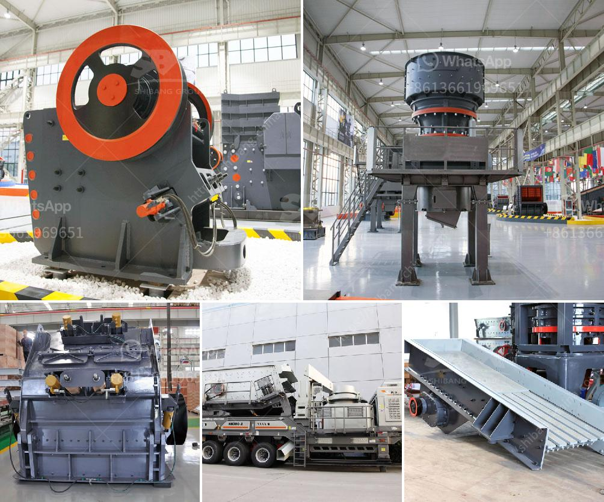

<h3>ball mill feldspar 200 mesh output</h3>
Ball mill is commonly used to grind material 1/4 inch and finer, down to the particle size of 20 to 75 microns. To achieve a reasonable efficiency with ball mills, they must be operated in a closed system, with oversize material continuously being recirculated back into the mill to be reduced. Various classifiers, such as screens, spiral classifiers, cyclones, and air classifiers, are used for classifying the discharge from ball mills.

Ball mill is an essential machine in mining industry and it is widely used in the further breaking of stones and rocks. Most grinding mill are high-cost, so prolong the service life will bring your cost down. But many ball mill users complain that some parts of ball mill are with short service life and high maintenance cost, which reduces the economic benefits of the plant.

Due to the wide range of applications, the demand for feldspar has increased significantly in recent years. Feldspar is a common raw material used in glassmaking, ceramics, and to some extent, as a filler and extender in paint, plastics, and rubber. In glassmaking, alumina from feldspar improves product hardness, durability, and resistance to chemical corrosion.

To obtain the desired feldspar product, the ore is crushed, subjected to grinding, and then classification. Ball mill is widely used in the grinding process of potassium feldspar, and it has a wide range of applications in the industry. It can grind all kinds of ores and other grindable materials.

The operation principle of the ball mill machine is as follows: When the potash feldspar crushing plant is in normal operation, the material and the steel ball collide and rub each other, lowering the wear of the steel ball and the lining plate. The steel ball and the material continuously roll and grind during the rotation of the mill, resulting in the crushing and grinding of the material.

The mesh size is related to the product fineness, and it can be customized according to the customer's needs. It is worth noting that when the ball mill is running, the fineness of the product will affect the discharge capacity. Therefore, when encountering a higher fineness requirement, it is necessary to reduce the feed size or increase the grinding time, or even further improve the grinding system.

Regarding the output size, there are two types of ball mills: grid type and overflow type. The difference lies in the structure of the discharging device. For the grid type, the material is discharged through the hollow shaft neck. For the overflow type, the material overflows from the discharge end.

In conclusion, ball mill is an essential grinding tool for the production of feldspar, and it plays a crucial role in the quality and uniformity of the final product. With the increasing demand for feldspar, the market's demand for ball mills is also growing. There are many models and specifications of ball mills available, and different models may have different output sizes. Therefore, it is important to choose the right ball mill according to your specific requirements to achieve the desired fineness and output.
<h3>Contact us</h3><ul><li><strong>Whatsapp:&nbsp;<a href="https://wa.me/8613661969651">+8613661969651</a></strong></li><li><a href="https://swt.shibang-china.com/?git&amp;zhl&amp;ball mill feldspar 200 mesh output"><strong>Online Service(chat now)</strong></a></li></ul><h3>Related</h3><ul><li><a href='used iron ore jaw crusher price nigeria.md'>used iron ore jaw crusher price nigeria</a></li><li><a href='rock crusher gravel production.md'>rock crusher gravel production</a></li><li><a href='ball mill manufacturer in bhayander.md'>ball mill manufacturer in bhayander</a></li><li><a href='tons hour gold wash plant.md'>tons hour gold wash plant</a></li><li><a href='stone crusher equipment manufacturer.md'>stone crusher equipment manufacturer</a></li></ul>