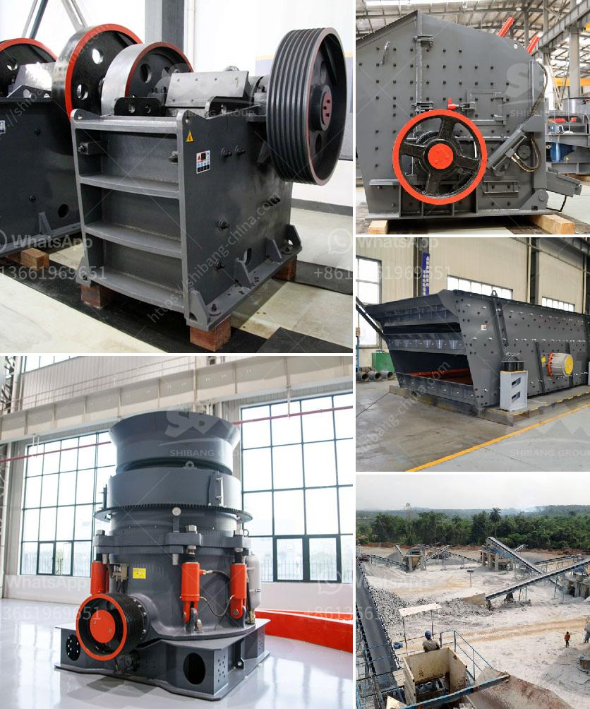

<h3>ball mill for 15tphr capacity</h3>
A ball mill is a cylindrical machine, generally used for mashing and crushing paints, ceramic materials, ores, and other hard materials. By rotating on horizontal axis, the ball mill effectively turns hard materials into fine powder. There are different ball mills on the market, but all of them use the same working principle and are comprised of the same elements.

The capacity of such a mill can vary from 3 to 15 tons per hour, depending on the model and the conditions of the ore being processed. Ball mills are generally used to grind material 1/4 inch and finer, down to the particle size of 20 to 75 microns. To achieve a reasonable efficiency with ball mills, they must be operated in a closed system, with oversize material continuously being recirculated back into the mill to be reduced.

One significant advantage of the ball mill is its minimal maintenance needs. Unlike other methods, which involve additional machinery and manpower, ball mills require minimal input throughout the entire process. This means reduced costs, as you don't need to invest in additional resources to maintain the mill.

Additionally, ball mills have a small footprint and require less space in your production area. This is especially advantageous for small-scale businesses or laboratories with limited space. The compact design of the ball mill also ensures that it can easily fit into existing equipment such as reactors or tanks, making it a versatile option for various applications.

However, there are some drawbacks to using a ball mill for certain applications. For example, fine grinding and mixing of different materials may require a long processing time. Additionally, ball mills are relatively inefficient at grinding materials with high hardness, such as quartz or garnet. This means that for certain applications, a different grinding method may be more suitable.

Furthermore, the initial investment cost of a ball mill is relatively high. This is due to the substantial machinery and equipment required to operate the mill. However, these costs can be offset by the long-term benefits and cost savings achieved through increased efficiency and reduced maintenance.

Overall, a ball mill with a capacity of 15TPH is a cost-effective solution for various industrial applications. It enables manufacturers to achieve consistent and reliable results for their products, while minimizing maintenance and operating costs. However, it is essential to carefully consider your specific requirements, materials, and desired outcomes before investing in a ball mill. By understanding the pros and cons of this machinery, you can make an informed decision that aligns with your production goals.
<h3>Contact us</h3><ul><li><strong>Whatsapp:&nbsp;<a href="https://wa.me/8613661969651">+8613661969651</a></strong></li><li><a href="https://swt.shibang-china.com/?git&amp;zhl&amp;ball mill for 15tphr capacity"><strong>Online Service(chat now)</strong></a></li></ul><h3>Related</h3><ul><li><a href='simple formula for belt conveyor.md'>simple formula for belt conveyor</a></li><li><a href='stone crushing equipment zenith.md'>stone crushing equipment zenith</a></li><li><a href='buy a cement blending plant in south africa.md'>buy a cement blending plant in south africa</a></li><li><a href='new trends in concrete technology slide presentation.md'>new trends in concrete technology slide presentation</a></li><li><a href='new quartz plant cost in india.md'>new quartz plant cost in india</a></li></ul>