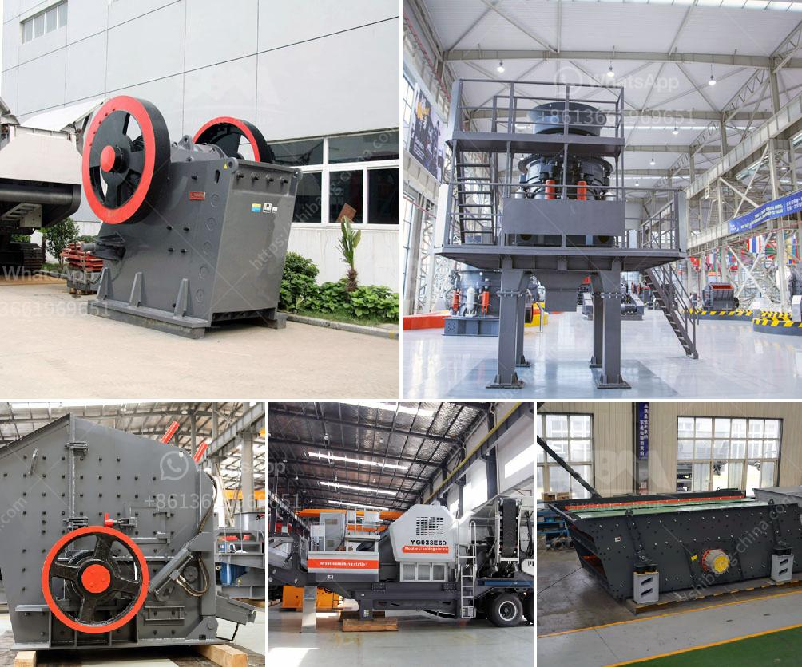

<h3>ball mill for gold in south africa</h3>
Ball mill for gold ore grinding is an essential equipment in the gold mining process. Today, high-quality ball mill for gold in South Africa plays a significant role in gold processing plants. With the rapid development of mining industry in South Africa, gold ore mining equipment play an important role in the gold mining industry.

Ball mill for gold ore grinding has a long history in South Africa, and can offer top quality ball mill for gold ore beneficiation. As a professional manufacturer of mining equipment, we have been devoted to producing ball mill for over 20 years. In addition to the gold ball mill, we also provide other beneficiation equipment, such as spiral chute, shaking table, flotation machine, and classifier, etc.

The ball mill for gold ore grinding is mainly used for crushing and grinding gold ores into small particles. Then, these gold particles are sent into spiral classifier for grading. Weight of ball (t): 5; Processible materials: Quartz, iron ore, copper ore, gold ore, river pebbles, concrete aggregate, asphalt aggregate, etc. Many materials can be processed in the ball mill for gold ore grinding.

There are two grinding ways of the ball mill: dry process and wet process. Customers can choose the suitable type according to the production requirements. Gratery scale board, and discharging grate of gold ball mill are provided with wear-resistant components. Bamboo-shaped lining plate is mainly used for protecting the cylinder body, and it can be replaced. Rotating lining plate in accordance with the different grinding methods can be divided into ladder lining plate, corrugated lining plate, and diverse lining plate, etc.

South Africa is rich in gold ore resources, and long been producing gold with various mineral beneficiation methods. In South Africa, the gold ores are mainly distributed in the Eastern Transvaal Basin, which is a famous gold mining zone, as well as in the Pietersburg Gold Fields.

With years of experience in mining industry, XSM has manufactured various gold ore grinding mills to meet different customers' production requirements. Our ball mill for gold ore grinding in South Africa can process the gold ore with capacity 2.5tph, 10tph, 20tph, 50tph, 80tph, 100tph, 120tph, etc. Ball mill is widely used in mining, smelting, road, building material and chemical industry, etc.

With its high efficiency and reliable operation, XSM's ball mill is welcomed by clients from South Africa, Zambia, Australia, Ghana, South Korea, etc. If you are interested in our ball mill for gold ore grinding, please contact us. Our experts will suggest you the suitable type and model for you according to your requirements, and provide the quotation according to your request. We also provide installation, commissioning and training service, etc. Contact us now and get the best quality ball mill for gold ore grinding in South Africa!
<h3>Contact us</h3><ul><li><strong>Whatsapp:&nbsp;<a href="https://wa.me/8613661969651">+8613661969651</a></strong></li><li><a href="https://swt.shibang-china.com/?git&amp;zhl&amp;ball mill for gold in south africa"><strong>Online Service(chat now)</strong></a></li></ul><h3>Related</h3><ul><li><a href='jaw crusher 200 tph parts details.md'>jaw crusher 200 tph parts details</a></li><li><a href='crushing plant turkey.md'>crushing plant turkey</a></li><li><a href='sand washing plant for sale in south africa.md'>sand washing plant for sale in south africa</a></li><li><a href='vertical roller mill suppliers.md'>vertical roller mill suppliers</a></li><li><a href='quick lime hammer crusher.md'>quick lime hammer crusher</a></li></ul>