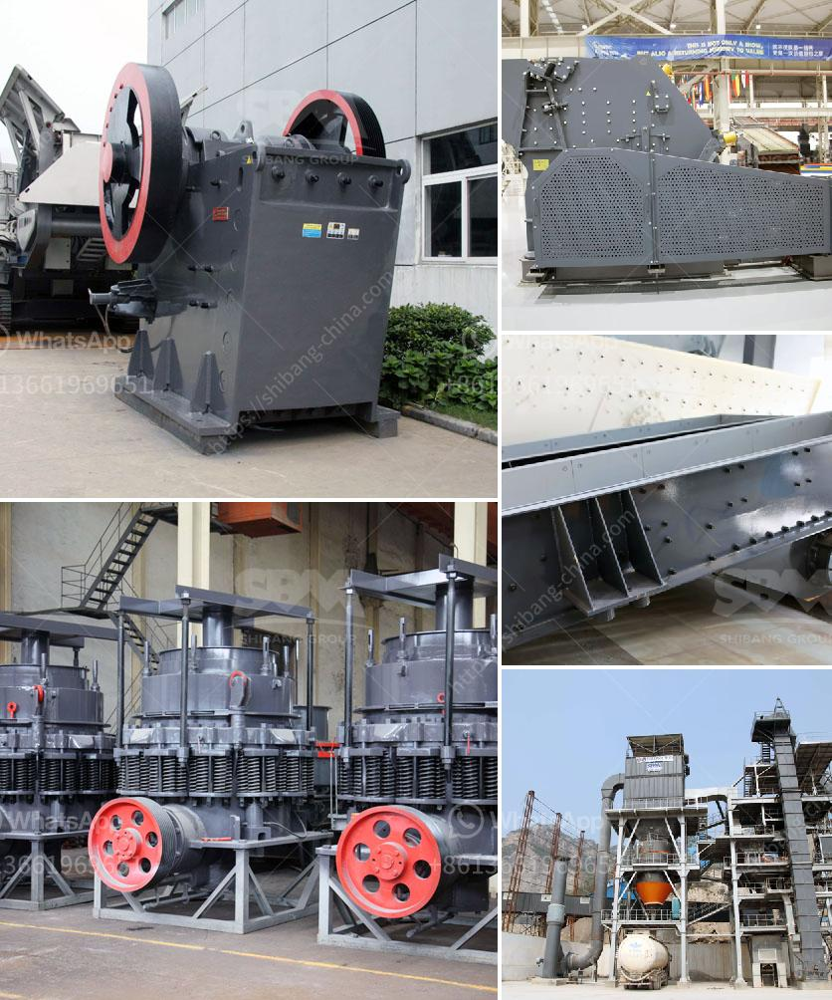

<h3>ball mill for silica sand</h3>
Ball mill is a critical equipment in the quartz sand production. In the processing of quartz sand for glass and ceramics industry, raw materials needed to avoid contamination by other substances, usually with silica liner or white alundum liner, grinding media also need to use White alundum ball or silica ball. As a good catalyst carrier, silica liner or white alundum liner has high hardness and can control the particle size and shape of quartz sand effectively.

Silica sand ball mill is a high-efficiency grinding equipment designed to grind silica sand into fine powder. It can grind various materials, such as quartz sand, river pebbles, granite, limestone, slag, ceramics, etc. It has the advantages of less wear, large processing capacity, adjustable fineness, low noise, and energy saving. Especially for grinding silica sand, it has higher yield and efficiency compared with other types of ball mills. This is due to the high hardness and sharpness of silica sand particles, which can be quickly and effectively ground through the ball mill.

The ball mill plays an important role in the silica sand grinding process. Firstly, raw materials are evenly sent to the ball mill for grinding by the vibrating feeder. In the grinding process, materials are sent to the grinding chamber through the quill shaft uniformly. The ground materials are then discharged through the discharging board, thus the grinding process is finished.

The grinding efficiency of ball mill also depends on many factors, including the size and quantity of grinding media, the filling rate of grinding media, the ratio of grinding media to materials, etc. To a certain extent, these factors will affect the grinding effect of ball mill. Therefore, it is necessary to select suitable grinding media and control the appropriate grinding media filling rate. Generally, the filling rate of grinding media should be 30%-35% of the effective volume of the ball mill.

In the silica sand grinding process, the final grinding size of ball mill can be down to 0.074 mm, the trapezium mill can grind the silica sand into 0.3-0.15mm powder, and the vertical mill can grind the silica sand into 325 mesh powder.

There are also other types of grinding mills specifically designed for silica sand grinding. These include Raymond mill, super fine grinding mill, high pressure grinding mill, and ultrafine grinding mill. Each type of grinding mill has its own unique features and advantages, suitable for different grinding applications.

In summary, ball mill for silica sand is an indispensable equipment in the quartz sand production line. Whether the quartz sand is refined or unrefined, it needs to be ground. The main purpose of the ball mill is to grind the quartz sand to a certain particle size, so that it can meet the production requirements of the next process. Silica sand ball mill is widely used in various grinding operations, such as grinding of large quantities of quartz sand, slag, limestone, ceramic, etc. It has the advantages of high production capacity, low energy consumption, and stable operation.
<h3>Contact us</h3><ul><li><strong>Whatsapp:&nbsp;<a href="https://wa.me/8613661969651">+8613661969651</a></strong></li><li><a href="https://swt.shibang-china.com/?git&amp;zhl&amp;ball mill for silica sand"><strong>Online Service(chat now)</strong></a></li></ul><h3>Related</h3><ul><li><a href='price of grinding machine in bangladesh.md'>price of grinding machine in bangladesh</a></li><li><a href='quarry crushing machine.md'>quarry crushing machine</a></li><li><a href='gold mining project cost.md'>gold mining project cost</a></li><li><a href='sand washing plant for sale in south africa.md'>sand washing plant for sale in south africa</a></li><li><a href='vertical ball mill with price.md'>vertical ball mill with price</a></li></ul>