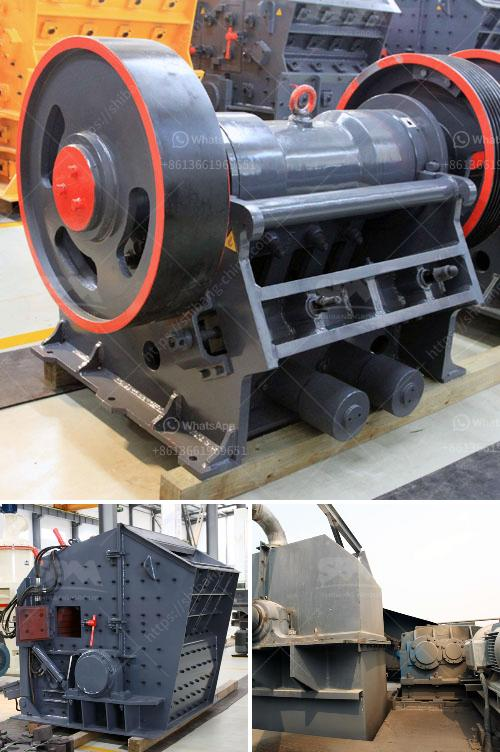

<h3>ball mill ghana in zambia</h3>
Ghana and Zambia are striving to enhance their mining industries in a sustainable manner, as the two countries seek to capitalize on their mineral-rich resources. Ghana, known for its abundant gold deposits, and Zambia, known for its vast copper reserves, are prime examples of African countries that are achieving remarkable progress in their mining sectors. One vital equipment supporting these efforts is the ball mill, which enables grinding and mixing of materials to produce a fine powder used in various industrial applications.

The ball mill is a cylindrical device used to grind a variety of materials, such as minerals, ores, chemicals, and paints. It rotates around a horizontal axis, partially filled with the material to be ground plus the grinding medium. Different materials are used as media, including ceramic balls, flint pebbles, and stainless steel balls, depending on the application.

In Ghana and Zambia, the ball mill is widely used in the mining sector for grinding various ores and other materials. Ball milling is a crucial process in many industries, especially in mineral processing plants. This process consumes significant amounts of energy, and optimizing the grinding process is therefore crucial in reducing energy consumption and improving efficiency.

The mining industry in Ghana and Zambia has been making significant strides in adopting sustainable practices. Both countries are keen to ensure that mining activities are carried out responsibly and in a manner that minimizes their impacts on the environment and local communities. The ball mill plays a pivotal role in this journey towards sustainability.

By optimizing the grinding process, operators can reduce energy consumption, resulting in lower greenhouse gas emissions and decreased environmental impact. Additionally, optimizing the ball mill can lead to higher recovery rates of valuable minerals, ultimately enhancing resource efficiency. This is of utmost importance, as sustainable mining practices aim to maximize resource utilization and reduce waste generation.

Moreover, the ball mill has the potential to create employment and support economic development. In Ghana and Zambia, where unemployment rates may be high, the mining sector holds the promise of opportunities for employment and economic growth. By employing local labor and supporting local businesses, the ball mill can contribute to local and regional prosperity.

It should be noted that there are challenges to be overcome in maximizing the potential of the ball mill in Ghana and Zambia. These challenges include the availability of appropriate technology, skilled labor, and access to finance. Addressing these challenges requires the collaboration of various stakeholders, including governments, mining companies, and technical experts.

In conclusion, the ball mill plays a crucial role in the sustainable development of the mining sector in Ghana and Zambia. It offers an opportunity to optimize energy consumption, improve resource efficiency, and create employment opportunities. To fully realize these benefits, it is essential to address the challenges faced by the industry and promote collaboration among stakeholders. Embracing sustainable mining practices ensures that Ghana and Zambia can harness their mineral resources in a way that benefits not only their economies but also the environment and local communities.
<h3>Contact us</h3><ul><li><strong>Whatsapp:&nbsp;<a href="https://wa.me/8613661969651">+8613661969651</a></strong></li><li><a href="https://swt.shibang-china.com/?git&amp;zhl&amp;ball mill ghana in zambia"><strong>Online Service(chat now)</strong></a></li></ul><h3>Related</h3><ul><li><a href='hammer mill for sale in zimbabwe.md'>hammer mill for sale in zimbabwe</a></li><li><a href='mobile granite crusher.md'>mobile granite crusher</a></li><li><a href='coal handling plant maintenance pdf.md'>coal handling plant maintenance pdf</a></li><li><a href='kaolin crusher processing in china.md'>kaolin crusher processing in china</a></li><li><a href='stone crushers for sale in south korea.md'>stone crushers for sale in south korea</a></li></ul>